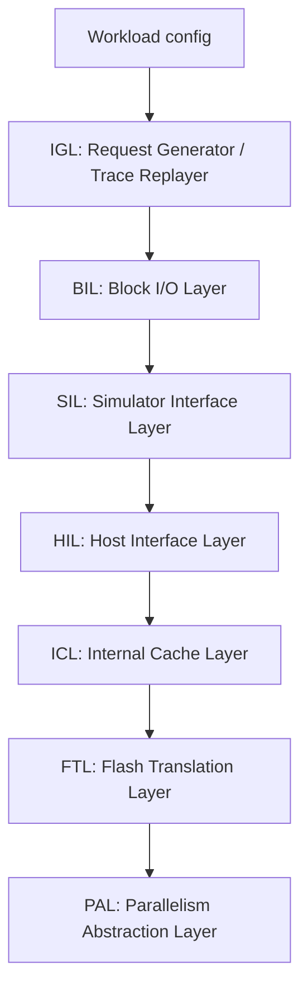

# Tutorial 1: Introduction and Architecture

Welcome to the SimpleSSD-Standalone tutorial series! In this first lesson, we will cover the high-level architecture of the simulator, what kind of simulator it is, and the core components that make it work.

## What Kind of Simulator is This?

SimpleSSD is a **discrete-event simulator**. 

> [!IMPORTANT]
> A discrete-event simulator does not run according to real wall-clock time. Instead, it maintains a variable called **simulated time** (measured in **picoseconds** in this project).

The simulator has an event engine that maintains a queue of future events. For example:
- `tick 0`: start simulation
- `tick 1,492,500`: submit first read into HIL
- `tick 7,094,420`: cache/NAND/DRAM action finishes
- `tick 9,874,420`: request completion callback

The simulator jumps directly from event to event without wasting real CPU time waiting. This allows it to simulate events that take milliseconds (like NAND erase) or nanoseconds (like DRAM access) efficiently.

What is a real wall clock time?

## The Big Mental Model: The Pipeline

Think of the simulator as a pipeline. Every request flows down from the workload generator, through various layers, into the simulated physical NAND flash, and back up.

### Layer Breakdown

1. **IGL (I/O Generation Layer):** Decides what I/O requests exist. It either generates synthetic workloads (random reads, sequential writes) or replays traces.
2. **BIL (Block I/O Layer):** Wraps requests into block I/Os (`BIL::BIO`) and measures latency. It records when a request was submitted and when it completed.
3. **SIL (Simulator Interface Layer):** Converts standalone requests into SSD-facing requests. It can be a simple pass-through (`None` interface) or simulate complex protocol overhead (`NVMe` interface).
4. **HIL (Host Interface Layer):** The first layer *inside* the SSD firmware model. It schedules CPU jobs for reads/writes.
5. **ICL (Internal Cache Layer):** Handles read caching, write buffering, prefetching, and DRAM interactions. It can split a single host request into multiple internal page requests.
6. **FTL (Flash Translation Layer):** The brain of the SSD. It maps logical pages to physical flash pages (Page Mapping) and triggers Garbage Collection (GC) when space is low.
7. **PAL (Parallelism Abstraction Layer):** Models the physical NAND geometry (Channels, Dies, Planes, Blocks, Pages) and enforces realistic timings for reads, programs, and erases.

## Core Rule of the Simulator

> [!TIP]
> Every layer either **transforms** the request, **delays** it (charges CPU time), records **statistics**, or **schedules** the next event. When reading any code file, ask yourself which of those four jobs it is doing.

In the next tutorial, we will explore how to configure workloads and the SSD hardware, and how to run experiments!
