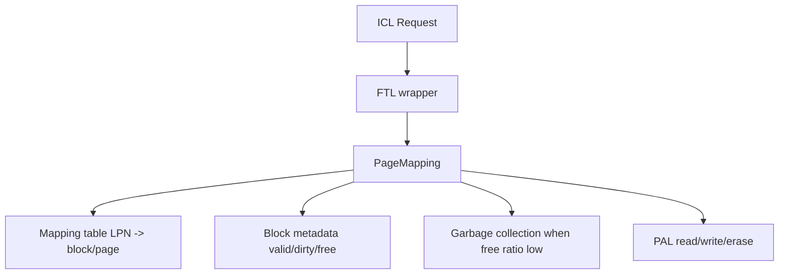

# FTL Line-by-Line Notes

> [!info] Reading target
> This note covers `simplessd/ftl/`: FTL wrapper, page-mapping implementation, FTL configuration, and block metadata.

Related notes: [[HIL Line-by-Line Notes]] | [[ICL Line-by-Line Notes]]

## Quick Mental Model

FTL is the mapping layer. It converts logical page numbers from ICL into physical NAND locations handled by PAL. Because NAND cannot overwrite in place, FTL writes new data to free physical pages, invalidates old physical pages, and later performs garbage collection to reclaim blocks.



> [!summary] Meeting wording
> "FTL is the SSD translation layer. In this standalone tree, the active implementation is page mapping: each logical page maps to a physical block/page, writes are out-of-place, old pages are invalidated, and garbage collection reclaims blocks."

## File Map

| File | Lines | Role |
|---|---:|---|
| `ftl.hh` | 73 | Declares FTL wrapper and geometry `Parameter`. |
| `ftl.cc` | 123 | Creates PAL, computes FTL geometry, selects PageMapping, and delegates operations. |
| `abstract_ftl.hh` | 64 | Declares interface implemented by concrete FTLs. |
| `page_mapping.hh` | 102 | Declares page-mapping state and private helpers. |
| `page_mapping.cc` | 981 | Implements warmup, mapping, writes, trim, GC, victim selection, erase, and stats. |
| `common/block.hh` | 80 | Declares block/page metadata container. |
| `common/block.cc` | 367 | Implements valid/dirty page accounting, writes, invalidation, and erase. |
| `config.hh` | 104 | Declares FTL config enums and typed reader API. |
| `config.cc` | 202 | Parses and exposes FTL configuration. |

## Core FTL Flow

```text
ICL calls FTL::read/write/trim/format
  -> FTL wrapper logs and applies CPU latency
  -> PageMapping does real mapping logic
  -> mapping table finds or updates physical block/page
  -> PAL models NAND read/write/erase timing
  -> if freeBlockRatio < GCThreshold, PageMapping selects victims and GC runs
```

## `ftl.hh`

#### Lines 1-27

Code role: license, include guard, dependencies, namespace.

What it means: FTL needs DRAM, PAL, and common utility types.

#### Lines 31-40: `Parameter`

Code role: FTL geometry summary.

What it means: stores physical/logical block counts, pages per block, mapping page size, I/O units per page, and how many pages are needed to use full internal parallelism.

#### Lines 42-68: `FTL` class

Code role: wrapper declaration.

What it means: `FTL` owns PAL and one concrete `AbstractFTL` implementation. Public methods simply expose read/write/trim/format, info, mapped page count, and stats.

## `ftl.cc`

#### Lines 1-24

Code role: license, includes, namespaces.

What it means: includes `ftl/ftl.hh` and the concrete page-mapping implementation.

#### Lines 28-61: `FTL::FTL`

Code role: constructor and geometry setup.

What it means: creates PAL, asks PAL for hardware geometry, computes logical blocks using over-provisioning ratio, sets page size and parallelism fields, selects `PageMapping` when mapping mode is `PAGE_MAPPING`, validates over-provisioning, logs geometry, and initializes the concrete FTL.

Meeting wording: "The FTL wrapper translates PAL geometry into FTL geometry and then instantiates PageMapping."

#### Lines 63-66: destructor

What it means: deletes PAL and concrete FTL.

#### Lines 68-90: read/write/trim wrappers

What it means: logs the LPN, calls the concrete FTL, then applies FTL CPU latency for the operation.

#### Lines 92-100: format and info

What it means: delegates format to concrete FTL, applies format latency, and returns `Parameter`.

#### Lines 102-121: mapped-page and stats methods

What it means: used page count comes from concrete status; stats are gathered from both concrete FTL and PAL.

## `abstract_ftl.hh`

#### Lines 1-29

Code role: license, guard, includes, namespace.

What it means: prepares the abstract interface for FTL implementations.

#### Lines 31-35: `Status`

What it means: reports total logical pages, mapped logical pages, and free physical blocks.

#### Lines 37-60: `AbstractFTL`

What it means: stores shared geometry, PAL pointer, DRAM pointer, and status. Any concrete FTL must implement initialization, read, write, trim, format, and status reporting.

## `page_mapping.hh`

#### Lines 1-34

Code role: license, guard, includes, namespace.

What it means: page mapping needs hash maps, vectors, block metadata, FTL/PAL types, and abstract FTL interface.

#### Lines 36-59: mapping state

Code role: `PageMapping` private fields.

What it means: `table` maps each LPN to physical block/page pairs. `blocks` stores active block metadata. `freeBlocks` stores erased/free blocks. `lastFreeBlock` tracks active write blocks across parallel I/O units.

```cpp
std::unordered_map<uint64_t, std::vector<std::pair<uint32_t, uint32_t>>> table;
std::unordered_map<uint32_t, Block> blocks;
std::list<Block> freeBlocks;
```

#### Lines 61-68: behavior flags and stats

What it means: stores GC behavior flags, random I/O tweak state, bitset size, and counters for GC and valid page copies.

#### Lines 70-85: private helpers

What it means: helpers allocate free blocks, choose victim blocks, run GC, compute wear leveling, and perform internal read/write/trim/erase.

#### Lines 87-99: public API

What it means: constructor/destructor, initialize, read/write/trim/format, status, and stats.

## `page_mapping.cc`

### Construction And Warmup

#### Lines 33-64: `PageMapping::PageMapping`

Code role: constructor.

What it means: stores config/PAL/DRAM references, creates `Block` objects for all physical blocks, fills the free-block list, initializes active free-block trackers, reads GC/random-tweak settings, and resets stats.

#### Lines 65-65: destructor

What it means: empty because STL containers and owned values clean themselves.

#### Lines 67-183: `initialize`

Code role: optional initial fill and invalidation.

What it means: computes how many logical pages should start as valid and how many should start invalid based on configured filling mode/ratio. It writes warmup pages without necessarily sending every operation to PAL, invalidates selected pages, and ensures the initial state does not violate GC threshold constraints.

> [!tip] Meeting wording
> "FTL warmup lets experiments start from a partially filled SSD instead of an empty device."

### External Operations

#### Lines 186-202: `read`

What it means: if request I/O flags indicate work, calls `readInternal`.

#### Lines 204-220: `write`

What it means: if request I/O flags indicate work, calls `writeInternal`.

#### Lines 222-233: `trim`

What it means: if request I/O flags indicate work, calls `trimInternal`.

#### Lines 235-276: `format`

What it means: iterates mapping entries in the formatted logical range, invalidates physical pages in their blocks, erases affected blocks through GC-style reclamation, and updates mapping/status.

#### Lines 278-295: `getStatus`

What it means: reports global status or counts mapped logical pages in a requested range.

### Free Block Management

#### Lines 297-299: `freeBlockRatio`

What it means: returns free blocks divided by total physical blocks. This is the GC trigger metric.

#### Lines 301-303: `convertBlockIdx`

What it means: maps a block index to an internal parallel I/O group by modulo.

#### Lines 305-347: `getFreeBlock`

What it means: selects a free block matching a requested parallel index, removes it from `freeBlocks`, adds it to active `blocks`, decreases `nFreeBlocks`, and returns the physical block index.

#### Lines 349-380: `getLastFreeBlock`

What it means: chooses or refreshes the current active write block for an I/O bitmap. If the current block is full, it gets a new free block.

### Victim Selection And Garbage Collection

#### Lines 382-419: `calculateVictimWeight`

What it means: computes each block's victim weight based on configured policy. Greedy/random/d-choice mostly look at invalid page count; cost-benefit also considers age and valid data.

#### Lines 421-491: `selectVictimBlock`

What it means: decides how many blocks to reclaim, builds weights, samples or sorts depending on policy, and returns selected block indexes.

#### Lines 493-619: `doGarbageCollection`

Code role: GC engine.

What it means: for each victim block, it scans pages, gathers valid LPNs, creates read requests for valid data, writes valid data to new locations, updates mapping table entries, records copy stats, schedules PAL reads/writes, and erases victim blocks.

```text
victim block
  -> find valid pages
  -> read valid pages
  -> write them elsewhere
  -> update mapping table
  -> erase old block
  -> return erased block to free list
```

Meeting wording: "Garbage collection copies still-valid data away from victim blocks before erasing them, which is why GC contributes to write amplification and tail latency."

### Internal Read, Write, Trim, Erase

#### Lines 621-672: `readInternal`

What it means: looks up the LPN in the mapping table. If mapped, it builds PAL read requests for the requested I/O units and updates block read timestamps. If unmapped, no NAND read is needed.

#### Lines 674-812: `writeInternal`

Code role: out-of-place write path.

What it means: invalidates any old physical mapping for the LPN, gets an active free block, writes new mapping information into the table and block metadata, optionally handles read-before-write for partial pages, sends PAL writes, and triggers GC when `freeBlockRatio() < gcThreshold`.

```text
write LPN
  -> find old mapping
  -> invalidate old physical page(s)
  -> choose free block/page
  -> update mapping table
  -> PAL write new physical page
  -> if free blocks low, run GC
```

#### Lines 814-842: `trimInternal`

What it means: invalidates mapped physical pages for the LPN and removes logical mapping information.

#### Lines 844-894: `eraseInternal`

What it means: validates that the block has no valid pages, calls PAL erase, resets block metadata, increments erase count, and reinserts the block into the free list with wear-aware ordering.

### Wear And Stats

#### Lines 896-927: `calculateWearLeveling`

What it means: computes a fairness-style wear-leveling metric from erase counts. It returns `-1` if no erase count exists yet.

#### Lines 929-937: `calculateTotalPages`

What it means: totals valid and invalid page counts across active blocks.

#### Lines 939-979: stat methods

What it means: exposes GC count, reclaimed block count, valid page copy counts, wear-leveling score, and valid/invalid page totals.

## `common/block.hh`

#### Lines 1-30

Code role: license, guard, includes, namespace.

What it means: block metadata uses vectors and bitsets to track logical pages and validity.

#### Lines 32-75: `Block`

Code role: physical block metadata.

What it means: tracks block index, erase count, last access time, next write page, per-page valid/dirty state, and stored LPNs. Public methods read/write/invalidate/erase pages and report counts.

## `common/block.cc`

#### Lines 29-116: constructors and destructor

What it means: allocates page metadata for each page and I/O unit, supports copy/move construction, and frees owned arrays.

#### Lines 139-175: assignment operators

What it means: copy/move assignment preserve block metadata while avoiding memory leaks.

#### Lines 177-239: getters and page counters

What it means: returns block index, last accessed time, erase count, valid page count, raw valid count, dirty page count, and next write page.

#### Lines 240-254: next write page helpers

What it means: reports the next programmable page globally or for a specific I/O unit.

#### Lines 256-272: `getPageInfo`

What it means: returns LPN and validity bitmap for a page so GC can know which logical data must be copied.

#### Lines 274-292: `read`

What it means: records access time for a page read and validates that the requested page/unit exists.

#### Lines 294-335: `write`

What it means: writes LPN metadata into a free page/unit, marks it valid, updates next write pointer, and records access time.

#### Lines 337-354: `erase`

What it means: clears all page metadata, resets validity/dirty state, increments erase count, and resets write position.

#### Lines 356-365: `invalidate`

What it means: marks a page/unit invalid/dirty so old physical data is no longer live.

## `config.hh` and `config.cc`

#### Header lines 29-70

Code role: FTL enums.

What it means: declares mapping mode, GC mode, filling mode, eviction policy, and config key indexes.

#### Header lines 72-100

Code role: `Config` class declaration.

What it means: exposes parser/update methods and typed readers.

#### Implementation lines 42-57: constructor

What it means: initializes default FTL config values.

#### Lines 58-106: `setConfig`

What it means: parses text config keys such as mapping mode, over-provisioning, GC threshold, fill ratio, and eviction policy.

#### Lines 107-200: update and typed readers

What it means: validates/normalizes values and returns them as signed, unsigned, float, or boolean values.

## Important Concepts

| Concept | Meaning |
|---|---|
| LPN | Logical Page Number seen by FTL. |
| Physical block/page | NAND-side location chosen by PageMapping and PAL. |
| Mapping table | `table` mapping LPN to physical block/page pairs. |
| Out-of-place write | New data is written to a fresh page; old page is invalidated. |
| Invalid page | Old physical data that no longer represents current logical data. |
| Free block ratio | GC trigger metric. |
| Garbage collection | Copy valid pages away, erase victim block, return it to free list. |
| Wear leveling | Tracking erase distribution across blocks. |

## Common Meeting Questions

> [!question] What FTL implementation is active here?
> Page-level mapping. `FTL::FTL` creates `PageMapping` when `FTL_MAPPING_MODE` is `PAGE_MAPPING`.

> [!question] Why can writes trigger GC?
> Writes consume free physical pages. When the free block ratio drops below the configured threshold, PageMapping selects victim blocks and garbage collects them.

> [!question] What happens when writing an already-mapped LPN?
> The old physical page is invalidated, a new physical page is allocated, the table is updated, and PAL receives the new write.

> [!question] Why can reads from an empty SSD avoid NAND reads?
> If an LPN is not mapped in the table, there is no physical page to read.

> [!question] Where does PAL enter?
> PageMapping calls `pPAL->read`, `pPAL->write`, and `pPAL->erase` after mapping logical operations to physical requests.

## Monday Meeting Script

```text
The FTL folder is where logical pages become physical flash activity. The
wrapper constructs PAL, computes the FTL geometry from PAL geometry and
over-provisioning, and chooses PageMapping.

PageMapping is the real implementation. It maintains an LPN-to-physical mapping
table, tracks active and free blocks, and implements out-of-place writes. On a
rewrite, the old physical page is invalidated and the new data is written to a
fresh page. When free blocks drop below the GC threshold, it chooses victim
blocks, copies valid pages elsewhere, erases the victims, and returns them to
the free list.

The Block class is the metadata container for physical blocks. It tracks valid
pages, dirty/invalid pages, erase count, next write position, and last access.
```

## Reading Checklist

| Done | Item |
|---|---|
| [ ] | Explain how `FTL::FTL` computes geometry from PAL. |
| [ ] | Explain what `PageMapping::table` stores. |
| [ ] | Explain out-of-place write in `writeInternal`. |
| [ ] | Explain why trim invalidates mappings. |
| [ ] | Explain GC victim selection and valid-page copying. |
| [ ] | Explain how `Block::write`, `Block::invalidate`, and `Block::erase` differ. |
