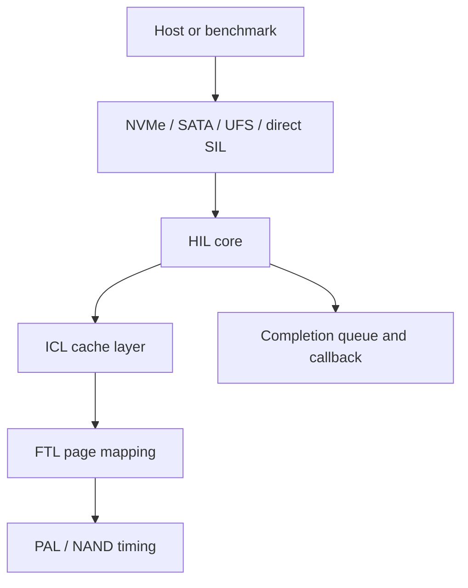

# HIL Line-by-Line Notes

> [!info] Reading target
> This note covers `simplessd/hil/`: the top-level Host Interface Layer plus the NVMe, SATA, and UFS host-protocol models. It is formatted for the Prism theme in Obsidian.

Related notes: [[ICL Line-by-Line Notes]] | [[FTL Line-by-Line Notes]]

## Quick Mental Model

HIL is the first SSD-internal layer that sees host requests. In the direct SimpleSSD path, it receives `Request` objects from the simulator interface, charges HIL CPU time, forwards work to ICL, and schedules the original completion callback for the correct simulated tick.

For NVMe, SATA, and UFS modes, this folder also models protocol-facing behavior: controller registers, queues, DMA address translation, command parsing, interrupts, and protocol-specific command wrappers. Those protocol classes eventually create the same kind of lower-level `Request` that flows to HIL/ICL/FTL.



> [!summary] Meeting wording
> "The HIL is the host-facing boundary of the SSD model. In the simple path it mainly schedules controller CPU work and hands requests to ICL; in the protocol paths it also models NVMe, SATA, or UFS registers, queues, DMA, and command decoding."

## File Map

| File | Lines | Role |
|---|---:|---|
| `hil/hil.hh` | 78 | Declares the top-level `HIL` class and its stats/completion state. |
| `hil/hil.cc` | 288 | Implements read/write/flush/trim/format handoff to ICL and completion scheduling. |
| `hil/nvme/*.hh`, `hil/nvme/*.cc` | 9,461 | NVMe controller, queues, namespace commands, DMA helpers, and Open-Channel SSD commands. |
| `hil/sata/*.hh`, `hil/sata/*.cc` | 2,492 | AHCI/SATA HBA, SATA device, command FIS handling, PRDT DMA, and ATA commands. |
| `hil/ufs/*.hh`, `hil/ufs/*.cc` | 3,198 | UFS host controller, UFS device, UPIU packet structures, SCSI/query commands, and PRDT DMA. |

## Core HIL Flow

```text
read/write/flush/trim/format request
  -> execute(CPU::HIL, operation, lambda, copied Request)
  -> lambda runs at beginAt tick
  -> assign reqID
  -> call pICL->read/write/flush/trim/format
  -> set finishedAt
  -> push into completionQueue
  -> schedule completionEvent
  -> completion() calls original request callback
```

### `hil/hil.hh`

#### Lines 1-27

Code role: license, include guard, and imports.

What it means: `hil.hh` depends on `icl/icl.hh`, DMA/event types, and common SimpleSSD utility types. The include guard prevents duplicate declarations during compilation.

Meeting wording: "The header shows HIL depends directly on ICL, not FTL."

#### Lines 29-33

Code role: opens `SimpleSSD::HIL` and declares `class HIL : public StatObject`.

What it means: HIL is both an SSD layer and a statistics provider. Because it inherits `StatObject`, it exposes stat list/value/reset functions.

#### Lines 34-49

Code role: private state.

What it means: HIL stores the global config reference, owns `ICL::ICL *pICL`, counts requests, tracks the next scheduled completion event, and keeps a priority queue of completed requests waiting for their callback tick.

```cpp
ICL::ICL *pICL;
std::priority_queue<Request, std::vector<Request>, Request> completionQueue;
```

#### Lines 51-53

Code role: internal helpers.

What it means: `updateBusyTime` accumulates non-overlapping busy intervals, `updateCompletion` schedules the next completion event, and `completion` drains ready callbacks.

#### Lines 55-71

Code role: public HIL API.

What it means: upper layers can submit reads, writes, flushes, trims, and formats; ask for LPN geometry; ask how many pages are mapped; and collect statistics.

### `hil/hil.cc`

#### Lines 1-24

Code role: license, includes, namespaces.

What it means: the implementation pulls in `hil/hil.hh` and `util/algorithm.hh`, then enters `SimpleSSD::HIL`.

#### Lines 28-34: `HIL::HIL`

Code role: constructor.

What it means: creates the ICL layer, zeroes statistics, and allocates a simulator event that will call `completion()`.

Meeting wording: "Constructing HIL constructs the lower internal stack starting with ICL."

#### Lines 36-38: `HIL::~HIL`

Code role: destructor.

What it means: deletes the owned ICL object.

#### Lines 40-70: `HIL::read`

Code role: schedules a HIL CPU read job.

What it means: the outer function does not immediately read. It builds a `DMAFunction` lambda, copies the request, and calls `execute(CPU::HIL, CPU::READ, ...)`. Inside the lambda, it assigns a request id, logs the request, converts to `ICL::Request`, calls `pICL->read`, updates read stats and busy time, pushes the completed request into `completionQueue`, and schedules completion.

Meeting wording: "A HIL read is asynchronous in simulated time. HIL charges controller CPU time, then ICL determines cache or flash work."

#### Lines 72-102: `HIL::write`

Code role: schedules a HIL CPU write job.

What it means: same shape as read, but calls `pICL->write`, updates write request count and write byte stats, and charges `CPU::WRITE`.

Meeting wording: "A write enters HIL, then ICL may cache it or push it down to FTL depending on cache policy and write size."

#### Lines 104-124: `HIL::flush`

Code role: schedules cache flush work.

What it means: assigns a request id, logs a logical range, calls `pICL->flush`, then completes through the same HIL completion queue.

#### Lines 126-146: `HIL::trim`

Code role: schedules trim/discard work.

What it means: calls `pICL->trim` for the range. It uses `CPU::FLUSH` in the `execute` call, so in this code path trim is grouped with the flush-like HIL CPU class.

#### Lines 148-171: `HIL::format`

Code role: schedules format or trim for a range.

What it means: if `erase` is true, it calls `pICL->format`; otherwise it calls `pICL->trim`. This lets callers choose whether the format should force physical erase-like behavior or only invalidate logical mappings.

> [!warning] Small oddity
> The `debugprint` format string in `format` names `LCA` fields but passes `pReq->reqID` before the range fields. Read this line carefully before using it as a logging reference.

#### Lines 173-179: geometry helpers

Code role: proxy methods.

What it means: HIL asks ICL for logical page count/size and mapped page count. HIL does not compute geometry itself.

#### Lines 181-194: `updateBusyTime`

Code role: non-overlapping busy-time accounting.

What it means: if a new busy interval overlaps the last accounted interval, only the new tail is counted. This avoids double-counting overlapping HIL work.

#### Lines 196-203: `updateCompletion`

Code role: schedule the next completion event.

What it means: if the top request in the priority queue has a different `finishedAt` tick than the last scheduled tick, it schedules `completionEvent` at that tick.

#### Lines 205-222: `completion`

Code role: callback drain.

What it means: at the current simulator tick, HIL pops all requests whose `finishedAt <= tick` and calls each original completion function.

Meeting wording: "HIL separates internal work completion from host-visible completion by using a priority queue of finished requests."

#### Lines 224-264: `getStatList`

Code role: declares HIL stats.

What it means: exposes read/write request counts, bandwidth-like byte totals, busy times, and lower-layer stats by delegating to ICL.

#### Lines 266-278: `getStatValues`

Code role: emits current values in the same order as `getStatList`.

What it means: stat consumers must preserve list/value order.

#### Lines 280-286: `resetStatValues`

Code role: reset stats.

What it means: clears HIL counters and asks ICL to clear its lower-layer counters.

## NVMe Protocol Model

> [!tip] How to read this section
> NVMe code is not the same as the simple HIL wrapper. It models the host-visible NVMe controller side: registers, queues, DMA address formats, namespaces, and admin/NVM commands.

### NVMe file map

| File | Lines | Role |
|---|---:|---|
| `nvme/config.hh` / `config.cc` | 94 / 284 | Parses NVMe configuration keys and exposes typed reads. |
| `nvme/def.hh` | 327 | NVMe constants, command opcodes, status codes, and log/feature identifiers. |
| `nvme/interface.hh` | 52 | DMA interrupt interface from controller back to host simulation. |
| `nvme/dma.hh` / `dma.cc` | 151 / 543 | PRP and SGL data movement helpers. |
| `nvme/queue.hh` / `queue.cc` | 163 / 187 | Submission/completion queue entries and queue pointer state. |
| `nvme/controller.hh` / `controller.cc` | 161 / 1840 | NVMe controller registers, doorbells, queue management, interrupt handling, and completion posting. |
| `nvme/abstract_subsystem.hh` / `.cc` | 57 / 39 | Base subsystem interface. |
| `nvme/subsystem.hh` / `.cc` | 93 / 1320 | Standard NVMe subsystem, namespace/admin commands, and NVM command routing. |
| `nvme/namespace.hh` / `.cc` | 144 / 689 | Per-namespace read/write/flush/compare/dataset management handling. |
| `nvme/ocssd.hh` / `.cc` | 206 / 2537 | Open-Channel SSD 1.2 and 2.0 command handling. |

### `nvme/config.hh` and `nvme/config.cc`

#### Header lines 1-94

Code role: NVMe config key enum and `Config` class declaration.

What it means: the header declares which settings belong to NVMe, such as controller counts, queue sizes, DMA behavior, and namespace/Open-Channel options.

#### Implementation lines 49-66: `Config::Config`

What it means: sets default values for the NVMe config table.

#### Lines 68-176: `setConfig`

What it means: maps text config keys to internal indexes and stores parsed values.

#### Lines 177-280: `update` and typed readers

What it means: validates/normalizes config after parsing, then serves values through `readInt`, `readUint`, `readString`, and `readBoolean`.

### `nvme/def.hh`

#### Lines 1-327

Code role: protocol definition file.

What it means: holds NVMe enums/unions for registers, admin commands, NVM commands, status types, feature IDs, log pages, arbitration, and health info. It is mostly declarative, so study it as a vocabulary sheet rather than execution flow.

Meeting wording: "The definition file is the dictionary for the NVMe protocol layer."

### `nvme/interface.hh`

#### Lines 1-52

Code role: declares a thin `Interface` derived from `SimpleSSD::DMAInterface`.

What it means: the controller uses this interface to signal interrupts and DMA completions back to the simulator host side.

### `nvme/dma.hh` and `nvme/dma.cc`

#### Header lines 1-151

Code role: declares PRP/SGL data structures and DMA helpers.

What it means: NVMe commands describe host buffers through PRP lists or SGL descriptors. These classes turn those descriptions into simulated DMA reads/writes.

#### Lines 31-52: `DMAInterface`

What it means: stores config, callback, and context; `commonDMAHandler` bridges scheduled DMA completion back to the user-provided function.

#### Lines 54-125: PRP constructors

What it means: simple PRP entries hold address/size; `PRPList` constructors parse either command PRP fields or an existing base/size form.

#### Lines 127-202: PRP parsing

What it means: builds a list of memory chunks from PRP1/PRP2 and possible PRP-list pages, respecting page boundaries.

#### Lines 204-300: PRP read/write

What it means: splits a logical transfer across PRP chunks and performs host-memory DMA through the simulator.

#### Lines 302-422: SGL parsing

What it means: constructs SGL chunk lists, follows segment descriptors, and handles ignored/valid chunks.

#### Lines 424-539: SGL read/write

What it means: same purpose as PRP read/write, but driven by SGL descriptors.

### `nvme/queue.hh` and `nvme/queue.cc`

#### Header lines 35-101

Code role: `SQEntry`, `CQEntry`, and wrapper structs.

What it means: these mirror NVMe command/completion queue entry layouts and add simulator metadata such as SQ/CQ IDs.

#### Header lines 103-157

Code role: `Queue`, `CQueue`, and `SQueue` declarations.

What it means: queue classes track IDs, size, head/tail, DMA base, interrupt vectors, and priority.

#### Implementation lines 28-65

What it means: constructors zero queue entries and `makeStatus` packs NVMe completion status fields.

#### Lines 67-103

What it means: base queue accessors for id, count, head, tail, size, and DMA base.

#### Lines 106-152

What it means: completion queue stores entries into host memory and updates head/interrupt metadata.

#### Lines 154-183

What it means: submission queue exposes CQ binding, tail updates, DMA command fetching, and priority.

### `nvme/controller.hh` and `nvme/controller.cc`

#### Header lines 42-70

Code role: register table and controller config data.

What it means: models NVMe MMIO registers and controller-level geometry/capability settings.

#### Header lines 72-155

Code role: `Controller` declaration.

What it means: owns register state, queue maps, subsystem pointer, DMA/interrupt interface, work/completion events, and statistics.

#### Implementation lines 41-153: constructor/destructor setup

What it means: initializes registers, config data, queues, controller capabilities, subsystem mode, and events.

#### Lines 175-423: register read/write

What it means: implements host MMIO access. Register writes drive enable/disable behavior, admin queue setup, doorbell processing, and controller state transitions.

#### Lines 425-481: doorbells and interrupts

What it means: CQ head doorbells free completion entries; SQ tail doorbells announce new host commands; interrupt helpers clear or post interrupt vectors.

#### Lines 483-626: queue create/delete

What it means: validates queue IDs/sizes, creates completion/submission queues, and removes them when admin commands request deletion.

#### Lines 628-658: abort

What it means: searches a queue for a command ID and reports whether abort succeeded.

#### Lines 660-1333: identify

What it means: fills large NVMe identify controller data structures: serial/model strings, command support, namespace limits, queue capabilities, optional features, and status fields.

#### Lines 1335-1375: interrupt coalescing config

What it means: stores and reads coalescing time/threshold and enables/disables coalescing per vector.

#### Lines 1377-1542: submission queue collection

What it means: issues DMA reads from host submission queues so pending commands can be pulled into simulator memory.

#### Lines 1544-1617: controller work loop

What it means: scans queues, checks enabled controller state, and schedules command handling.

#### Lines 1619-1656: queue checking

What it means: determines whether a submission queue has new entries to fetch and prepares DMA contexts.

#### Lines 1658-1822: completion submission

What it means: writes completion queue entries, schedules completion events, advances CQ tail, and raises interrupts when needed.

#### Lines 1824-1838: stats

What it means: delegates or exposes protocol stats.

### `nvme/abstract_subsystem.hh` and `.cc`

#### Header lines 1-57 and implementation lines 30-33

Code role: base class for NVMe subsystem implementations.

What it means: stores the controller pointer and config data. Standard NVMe and Open-Channel variants share this interface.

### `nvme/subsystem.hh` and `nvme/subsystem.cc`

#### Header lines 32-87

Code role: declares standard NVMe `Subsystem`.

What it means: owns namespaces and handles admin/NVM command routing.

#### Lines 48-104: construction and initialization

What it means: creates namespace structures from config and prepares NVM capacity data.

#### Lines 106-135: `convertUnit`

What it means: converts NVMe LBA/nblock fields into SimpleSSD logical page range and byte offsets.

#### Lines 137-315: namespace create/destroy/identify fill

What it means: manages namespace metadata and fills identify namespace buffers for the host.

#### Lines 317-424: `submitCommand`

What it means: decodes command opcodes and dispatches to admin command handlers or namespace command handlers.

#### Lines 426-493: capacity and lower HIL operations

What it means: exposes capacity and wraps read/write/flush/trim calls toward the SSD internal request path.

#### Lines 495-694: queue admin commands

What it means: implements create/delete SQ/CQ commands through controller methods.

#### Lines 696-943: identify, abort, set/get features, async event

What it means: handles common NVMe admin commands and returns proper completion status.

#### Lines 950-1195: namespace management and attachment

What it means: creates, deletes, attaches, and detaches namespaces based on admin command fields.

#### Lines 1197-1292: format NVM

What it means: interprets format scope and asks namespaces/internal layers to trim or format data.

#### Lines 1294-1316: stats

What it means: forwards statistics to namespaces/subcomponents.

### `nvme/namespace.hh` and `nvme/namespace.cc`

#### Header lines 40-79

Code role: dataset range and request context declarations.

What it means: wraps NVMe command state so completions can return after lower-layer work.

#### Header lines 81-138

Code role: `Namespace` declaration.

What it means: stores namespace identity, attachment state, data size, and command handlers.

#### Lines 31-45: construction/destruction

What it means: binds namespace to subsystem and config.

#### Lines 47-106: `submitCommand`

What it means: decodes NVM command opcode and dispatches to flush, write, read, compare, or dataset management.

#### Lines 108-173: metadata helpers

What it means: sets namespace information, toggles attachment, returns NSID, formats, and reports state.

#### Lines 175-238: get log page

What it means: returns namespace-related log information.

#### Lines 240-283: flush

What it means: creates completion context and asks subsystem to flush this namespace.

#### Lines 285-469: write and read

What it means: parses command LBA/count, sets up PRP/SGL DMA, and calls subsystem read/write. Write receives host data before internal write; read fetches internal data before host DMA writeback.

#### Lines 471-574: compare

What it means: models compare command structure and completion behavior.

#### Lines 576-685: dataset management

What it means: parses dataset management ranges and uses them for trim/deallocate-style behavior.

### `nvme/ocssd.hh` and `nvme/ocssd.cc`

#### Header lines 35-101

Code role: Open-Channel metadata structs.

What it means: describes chunks, block data, chunk descriptors, and vector command context.

#### Header lines 103-154

Code role: Open-Channel SSD 1.2 class.

What it means: extends standard subsystem behavior with physical page/block commands.

#### Header lines 156-200

Code role: Open-Channel SSD 2.0 class.

What it means: adds chunk geometry and vector chunk commands.

#### Lines 37-60: small constructors/destructors

What it means: initializes Open-Channel helper structs and subsystem base state.

#### Lines 62-183: OCSSD 1.2 init

What it means: builds namespace/open-channel geometry and metadata tables.

#### Lines 185-285: OCSSD 1.2 command dispatch

What it means: routes Open-Channel opcodes to identify, bad-block table, physical erase, physical write, and physical read handlers.

#### Lines 287-350: capacity, PPA parsing, and merge helpers

What it means: converts physical page addresses into simulator units and groups requests for parallelism.

#### Lines 352-384: OCSSD 1.2 completion queue

What it means: schedules and drains Open-Channel command completions.

#### Lines 386-764: identify and bad block table

What it means: fills device-identification data and reads/writes bad-block metadata.

#### Lines 766-1129: physical erase/write/read

What it means: translates Open-Channel physical commands into lower physical operations and DMA movement.

#### Lines 1131-1170: OCSSD 1.2 stats

What it means: exposes physical command counters and related stats.

#### Lines 1172-1189: OCSSD 2.0 setup

What it means: initializes the 2.0 subclass.

#### Lines 1183-1303: OCSSD 2.0 init

What it means: builds chunk descriptors and geometry for Open-Channel 2.0.

#### Lines 1305-1407: OCSSD 2.0 command dispatch

What it means: routes 2.0 opcodes to geometry, read/write, dataset management, and vector chunk commands.

#### Lines 1409-1488: LBA/chunk conversion

What it means: converts between group/parallel-unit/chunk/sector fields and linear LBAs.

#### Lines 1490-1789: internal read/write/erase

What it means: merges LBA lists, updates chunk state, performs data movement, and schedules lower operations.

#### Lines 1792-1933: log page and geometry

What it means: returns Open-Channel 2.0 log and geometry structures.

#### Lines 1935-2103: read and write

What it means: parses vector/chunk commands, performs DMA, and calls internal read/write helpers.

#### Lines 2105-2203: dataset management

What it means: handles deallocate/reset-like chunk management.

#### Lines 2205-2472: vector chunk read/write/reset

What it means: performs multi-address chunk operations and completion reporting.

#### Lines 2474-2533: OCSSD 2.0 stats

What it means: exposes counters for vector and chunk operations.

## SATA Protocol Model

### SATA file map

| File | Lines | Role |
|---|---:|---|
| `sata/config.hh` / `.cc` | 80 / 238 | SATA configuration parser and typed readers. |
| `sata/def.hh` | 381 | AHCI/SATA/ATA constants and FIS layouts. |
| `sata/interface.hh` | 51 | DMA interface for SATA HBA. |
| `sata/hba.hh` / `.cc` | 120 / 532 | AHCI HBA registers, command issue, response, interrupts. |
| `sata/device.hh` / `.cc` | 159 / 931 | ATA device commands and data DMA. |

### `sata/config.hh` and `.cc`

#### Header lines 1-80

What it means: declares SATA config keys and `Config` typed reader class.

#### Implementation lines 44-237

What it means: constructor sets defaults, `setConfig` parses text values, `update` validates/normalizes, and typed readers expose config values.

### `sata/def.hh`

#### Lines 1-381

What it means: declarative SATA/AHCI vocabulary: register fields, FIS structures, ATA opcodes, status bits, command headers, PRDT entries, and identify data fields.

### `sata/interface.hh`

#### Lines 1-51

What it means: declares the HBA-facing DMA interface used to move host buffers and signal completion.

### `sata/hba.hh` and `sata/hba.cc`

#### Header lines 39-61

What it means: `Completion` and `RequestContext` wrap callbacks and pending host/DMA work.

#### Header lines 63-114

What it means: `HBA` owns the device, AHCI registers, command queues, response queues, events, and stats.

#### Lines 32-111: constructors/destructor

What it means: initializes completion wrappers, creates device, allocates events, and cleans up.

#### Lines 113-319: init and AHCI register access

What it means: initializes HBA register state and handles host reads/writes to AHCI MMIO registers. Command issue writes trigger command processing.

#### Lines 321-382: interrupt and command issue

What it means: updates interrupt state, processes command issue bits, schedules work, and turns command slots into device requests.

#### Lines 384-495: response submission

What it means: sends FIS responses or signals, handles completed device work, updates interrupt/status bits, and invokes callbacks.

#### Lines 497-528: interrupt clear

What it means: clears HBA interrupt state after host acknowledgement.

### `sata/device.hh` and `sata/device.cc`

#### Header lines 34-95

What it means: command, I/O, and NCQ contexts store ATA command fields, buffers, and callbacks.

#### Header lines 96-153

What it means: `Device` owns HIL access, DMA interface, identify data, and ATA command handlers.

#### Lines 58-135: construction and init

What it means: builds identify data, creates HIL-facing device state, and initializes mode/capability state.

#### Lines 137-207: PRDT read/write

What it means: moves data through AHCI physical region descriptor tables.

#### Lines 209-267: convert/read/write/flush

What it means: converts ATA LBA/count into SimpleSSD request ranges, then calls the internal read/write/flush path.

#### Lines 283-396: DMA setup/completion helpers

What it means: schedules host DMA before or after internal media work and packages responses.

#### Lines 398-535: identify and mode commands

What it means: responds to ATA identify and set-feature/mode commands without touching NAND.

#### Lines 536-639: read verify and DMA read

What it means: validates read ranges and schedules read data movement from internal SSD to host.

#### Lines 640-796: NCQ and write commands

What it means: parses queued/nonqueued writes, DMA reads host data, writes through internal SSD, and returns FIS completion.

#### Lines 797-927: flush and submit command

What it means: flushes internal cache/media state and dispatches ATA opcodes to the right handler.

## UFS Protocol Model

### UFS file map

| File | Lines | Role |
|---|---:|---|
| `ufs/config.hh` / `.cc` | 78 / 220 | UFS configuration parser and typed readers. |
| `ufs/def.hh` / `.cc` | 416 / 573 | UFS HCI registers, UPIU packet types, serialization/deserialization. |
| `ufs/interface.hh` | 50 | DMA interface for UFS host. |
| `ufs/host.hh` / `.cc` | 120 / 658 | UFS host controller registers and request processing. |
| `ufs/device.hh` / `.cc` | 114 / 969 | UFS device, LUNs, query/SCSI command handling, and internal I/O calls. |

### `ufs/config.hh` and `.cc`

#### Header lines 1-78

What it means: declares UFS config keys and typed reader API.

#### Implementation lines 43-219

What it means: sets defaults, parses text config, updates normalized values, and returns typed UFS settings.

### `ufs/def.hh` and `ufs/def.cc`

#### Header lines 1-214

What it means: defines UFS HCI registers, DME commands/errors, link states, UTP transfer command types, and UPIU opcodes.

#### Header lines 215-342

What it means: declares UPIU packet structures: base header, command, response, query request/response, data out, data in, and ready-to-transfer.

#### Header lines 344-416

What it means: defines query opcodes, descriptor identifiers, SCSI commands, well-known LUNs, and string descriptor IDs.

#### Implementation lines 21-88

What it means: initializes UFS HCI register defaults and base UPIU serialization helpers.

#### Lines 90-200

What it means: serializes/deserializes UPIU command and response packets, including payload lengths.

#### Lines 202-376

What it means: handles query request/response packet memory and serialization.

#### Lines 378-571

What it means: handles data-out, data-in, and ready-to-transfer UPIU packets.

### `ufs/interface.hh`

#### Lines 1-50

What it means: declares the host-facing DMA interface used by the UFS host controller.

### `ufs/host.hh` and `ufs/host.cc`

#### Header lines 39-52

What it means: `Completion` stores UTP response metadata and callback context.

#### Header lines 54-114

What it means: `Host` owns the UFS register set, device, request queues, events, and stats.

#### Lines 39-124: construction/destruction

What it means: creates device, initializes registers/events, and frees owned structures.

#### Lines 126-180: UIC and UTP task/transfer entry points

What it means: handles link/control commands and transfer request list processing.

#### Lines 182-378: `processUTPCommand`

What it means: reads UTP descriptors, decodes UPIU command/query/data packets, and dispatches to device operations.

#### Lines 380-495: register read/write

What it means: models host access to UFS HCI registers and triggers command processing when control bits change.

#### Lines 497-535: completion

What it means: posts transfer completions, updates interrupts, and calls callbacks.

#### Lines 537-625: work and request handling

What it means: schedules UTP work, pulls request descriptors, and sends commands to the device.

#### Lines 627-654: stats

What it means: exposes and resets UFS host stats.

### `ufs/device.hh` and `ufs/device.cc`

#### Header lines 37-45

What it means: `LUN` stores whether a logical unit is well-known and its id/name/config-derived state.

#### Header lines 47-108

What it means: `Device` owns LUN metadata, descriptor strings, HIL/DMA pointers, and UFS command handlers.

#### Lines 50-116: LUN construction

What it means: builds logical unit metadata from configuration.

#### Lines 118-287: device construction/destruction

What it means: initializes descriptors, strings, LUNs, HIL/internal links, and capability state.

#### Lines 289-395: query commands

What it means: handles UFS descriptor/attribute/flag query requests and fills query responses.

#### Lines 397-804: SCSI/UTP command processing

What it means: decodes SCSI command opcodes, handles inquiry/capacity/test-unit style commands, and routes read/write/flush to internal SSD operations.

#### Lines 806-876: PRDT read/write

What it means: moves command data through UFS PRDT entries.

#### Lines 878-937: convert/read/write/flush

What it means: converts UFS LBA/count into SimpleSSD requests and calls internal read/write/flush.

#### Lines 953-965: stats

What it means: exposes and resets device statistics.

## Important Structs And Classes

| Name | Where | Meaning |
|---|---|---|
| `HIL` | `hil.hh` | Core direct host-interface layer that owns ICL and completion scheduling. |
| `Request` | common utility type | Carries logical range, offset, length, callback, and timing. |
| `Controller` | `nvme/controller.hh` | NVMe MMIO/register/queue/interrupt model. |
| `Namespace` | `nvme/namespace.hh` | Per-namespace command handler. |
| `PRPList`, `SGL` | `nvme/dma.hh` | NVMe host buffer translators. |
| `HBA` | `sata/hba.hh` | AHCI host bus adapter model. |
| `Device` | `sata/device.hh`, `ufs/device.hh` | Protocol device command executor. |
| `UPIU` | `ufs/def.hh` | UFS packet structure family. |

## Common Meeting Questions

> [!question] What is the simplest HIL responsibility?
> It receives host-level requests, charges HIL CPU latency, calls ICL, and schedules host-visible completion.

> [!question] Does HIL map logical pages to flash pages?
> No. HIL passes logical requests downward. FTL performs logical-to-physical mapping.

> [!question] Why are NVMe/SATA/UFS files in HIL?
> They are host interface protocols. They model how host commands, registers, queues, and DMA become internal SSD requests.

> [!question] What is the difference between HIL core and protocol files?
> `hil.cc` is the simple internal handoff layer. Protocol files are detailed host-controller models that decode real storage protocol behavior.

## Monday Meeting Script

```text
The HIL folder has two levels of meaning.

First, hil.cc/hh is the core internal Host Interface Layer. It owns ICL,
receives read/write/flush/trim/format requests, runs HIL CPU work through
execute(), and uses a completion priority queue to call the original callback
at the right simulated time.

Second, the nvme, sata, and ufs subfolders model real host protocols. They
decode host-visible commands through registers, queues, FIS/UPIU packets, PRP,
SGL, or PRDT DMA structures. After decoding, the useful storage operation is
converted into the same internal read/write/flush/trim path.

So HIL is not the mapping layer and not the cache layer. It is the host-facing
entry point and protocol translation boundary before ICL and FTL.
```

## Reading Checklist

| Done | Item |
|---|---|
| [ ] | Explain `HIL::read` and `HIL::write` from request copy to completion callback. |
| [ ] | Explain why HIL owns `ICL::ICL *pICL`. |
| [ ] | Explain `completionQueue` and `finishedAt`. |
| [ ] | Describe what NVMe queues and doorbells do at a high level. |
| [ ] | Describe how SATA PRDT or UFS PRDT performs host data movement. |
| [ ] | Say clearly that FTL, not HIL, performs logical-to-physical mapping. |
