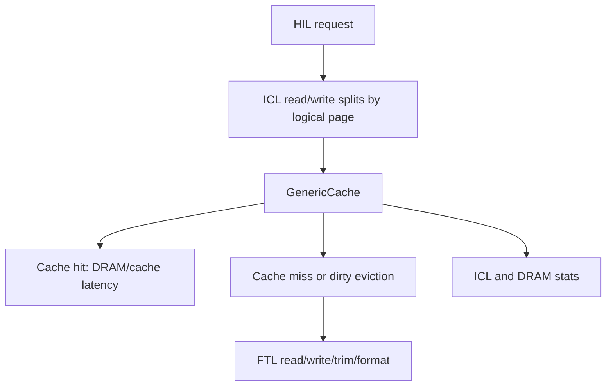

# ICL Line-by-Line Notes

> [!info] Reading target
> This note covers `simplessd/icl/`: the Internal Cache Layer wrapper, cache abstraction, generic cache implementation, and ICL configuration.

Related notes: [[HIL Line-by-Line Notes]] | [[FTL Line-by-Line Notes]]

## Quick Mental Model

ICL sits between HIL and FTL. It decides whether reads and writes can be handled by the SSD's internal cache model, whether data must be fetched from FTL, and whether dirty cached data must be written back. It also splits a host request across logical pages before each page-sized operation enters the cache.



> [!summary] Meeting wording
> "ICL is the SSD-internal cache layer. It models read caching, write buffering, prefetching, dirty eviction, and DRAM/cache latency before requests reach the FTL."

## File Map

| File | Lines | Role |
|---|---:|---|
| `icl.hh` | 66 | Declares the ICL wrapper class. |
| `icl.cc` | 200 | Creates DRAM, FTL, cache, splits requests, and delegates stats. |
| `abstract_cache.hh` | 64 | Declares cache-line metadata and the cache interface. |
| `abstract_cache.cc` | 40 | Implements small constructors for `Line` and `AbstractCache`. |
| `generic_cache.hh` | 115 | Declares the concrete set-associative cache model. |
| `generic_cache.cc` | 877 | Implements read/write cache behavior, prefetch, eviction, flush, trim, and format. |
| `config.hh` | 87 | Declares ICL config keys and typed reader API. |
| `config.cc` | 178 | Parses and exposes ICL configuration. |

## Core ICL Flow

```text
HIL passes Request with range.slpn, range.nlp, offset, length
  -> ICL splits it into one Request per logical page/cache line
  -> GenericCache handles hit/miss/insert/evict
  -> dirty evictions call FTL::write
  -> read misses call FTL::read
  -> trim/format invalidate cache lines and call FTL
  -> ICL applies CPU::ICL latency
```

## `icl.hh`

#### Lines 1-27

Code role: license, include guard, dependencies.

What it means: ICL needs DRAM, FTL, abstract cache definitions, and common SimpleSSD types.

#### Lines 30-32

Code role: opens `SimpleSSD::ICL` and declares `class ICL : public StatObject`.

What it means: ICL is a statistics-producing layer.

#### Lines 33-43

Code role: private state.

What it means: ICL owns `pFTL`, `pDRAM`, and `pCache`, stores config, and caches the exposed logical page count/size.

#### Lines 45-62

Code role: public API.

What it means: HIL can call read/write/flush/trim/format, request logical page geometry, ask used page count, and collect stats.

## `icl.cc`

#### Lines 1-27

Code role: license, includes, namespace setup.

What it means: the implementation imports Simple DRAM, GenericCache, and utility helpers.

#### Lines 31-58: `ICL::ICL`

Code role: constructor.

What it means: chooses a DRAM model from config, creates `FTL::FTL`, asks FTL for geometry, adjusts logical page count/size when random I/O tweak is enabled, then creates `GenericCache`.

Meeting wording: "ICL constructs the layers below it: DRAM, FTL, and the cache."

#### Lines 60-64: `ICL::~ICL`

Code role: destructor.

What it means: deletes cache, FTL, and DRAM in reverse ownership order.

#### Lines 66-96: `ICL::read`

Code role: split and process read.

What it means: a potentially multi-page host request is split into one internal request per logical page. Each subrequest carries `reqSubID`, one `slpn`, length clipped to the page boundary, and offset. ICL calls `pCache->read` for each subrequest, keeps the maximum finish tick, logs the total interval, and applies ICL read CPU latency.

#### Lines 98-128: `ICL::write`

Code role: split and process write.

What it means: same split pattern as read, but calls `pCache->write` and applies write CPU latency.

#### Lines 130-141: `ICL::flush`

Code role: flush a logical page range.

What it means: tells cache to write back dirty lines in the range, logs timing, then applies ICL flush latency.

#### Lines 143-154: `ICL::trim`

Code role: discard a logical page range.

What it means: asks cache to invalidate matching entries and forward trim to FTL, then applies trim latency.

#### Lines 156-167: `ICL::format`

Code role: format a logical range.

What it means: asks cache to invalidate matching entries and then calls FTL format through the cache layer.

#### Lines 169-177: geometry and mapped-page helpers

What it means: reports total logical pages and logical page size. `getUsedPageCount` converts ICL logical cache-address range to FTL page range using `ioUnitInPage`.

#### Lines 180-198: stats

What it means: stat functions delegate to cache, DRAM, and FTL so a caller above ICL sees the whole lower stack.

## `abstract_cache.hh` and `abstract_cache.cc`

#### Header lines 1-29

Code role: license, guard, dependencies, namespace.

What it means: this file introduces cache abstractions used by concrete cache implementations.

#### Header lines 31-40: `Line`

Code role: cache-line metadata.

What it means: each line tracks tag, insertion time, last access time, valid bit, and dirty bit.

```cpp
uint64_t tag;
uint64_t insertedAt;
uint64_t lastAccessed;
bool valid;
bool dirty;
```

#### Header lines 42-60: `AbstractCache`

Code role: cache interface.

What it means: all cache implementations must support read, write, flush, trim, and format.

#### Implementation lines 26-30: `Line` constructors

What it means: default construction creates an invalid clean line; tagged construction creates a valid line with optional dirty state.

#### Implementation lines 32-38: `AbstractCache` constructor/destructor

What it means: stores config, FTL pointer, and DRAM pointer for concrete subclasses.

## `generic_cache.hh`

#### Lines 1-31

Code role: license, guard, dependencies.

What it means: the concrete cache needs FTL, DRAM, config, random policy, and cache abstractions.

#### Lines 33-51: class declaration and policy functions

What it means: `GenericCache` derives from `AbstractCache` and stores function objects for eviction selection and victim comparison.

#### Lines 52-58: `SequentialDetect`

What it means: tracks consecutive read/write patterns so the cache can enable prefetch when sequential access is detected.

#### Lines 60-89: cache geometry and behavior state

What it means: stores set/way sizes, line size, parallelism, prefetch controls, caching booleans, random I/O tweak state, and cache data arrays.

#### Lines 90-101: stats

What it means: tracks read/write request counts and cache hit counts.

#### Lines 103-110: public API

What it means: exposes constructor/destructor, cache operations, and stats.

## `generic_cache.cc`

### Construction, Geometry, And Policy

#### Lines 32-99: `GenericCache::GenericCache` setup

Code role: constructor setup.

What it means: reads cache parameters, checks whether random I/O tweak is compatible with line size, disables cache when both read and write caching are off, allocates set/way cache arrays, allocates eviction helper arrays, initializes prefetch state, and reads eviction/prefetch modes.

#### Lines 102-199: eviction policy selection

Code role: builds eviction lambdas.

What it means: config chooses random, FIFO, or LRU. Each policy creates both an index selector for one set and a comparison function for global/superpage eviction.

Meeting wording: "The cache policy is configured at construction by installing small function objects for victim selection."

#### Lines 201-213: destructor

What it means: frees cache arrays unless cache was disabled.

#### Lines 215-220: `getCacheLatency`

What it means: returns cache latency divided by configured ICL core count, or zero when core count is zero.

#### Lines 222-231: index/position helpers

What it means: maps a logical cache address to a set index and to a row/column inside an eviction batch.

#### Lines 233-253: `getEmptyWay`

What it means: searches a set for an invalid line. If more than one invalid line exists, it picks the one with the oldest insertion time.

#### Lines 255-272: `getValidWay`

What it means: searches a set for a valid line with a matching tag and updates access timing.

#### Lines 274-303: `checkSequential`

What it means: detects sequential access by comparing current request position to the last request. After enough hits and a configured ratio threshold, it enables prefetch.

### Eviction

#### Lines 305-346: `evictCache`

Code role: write back dirty eviction candidates.

What it means: walks `evictData`, and for each valid dirty line, creates an FTL write request. If `flush` is true, it invalidates the line; otherwise it marks the line clean and refreshes timestamps. This is where cached dirty data becomes FTL traffic.

Meeting wording: "Dirty cache eviction is an internal write amplification source above the FTL."

### Read Path

#### Lines 348-544: `GenericCache::read`

Code role: cache-aware read.

What it means: if read caching is enabled, the cache checks for hits first. Hits update timing and stats. Misses may trigger prefetch logic, select empty or victim ways, collect dirty evictions, call `evictCache`, issue FTL reads for missing lines, and install fetched lines. If read caching is disabled, it passes the read directly to FTL. The return value indicates whether the request hit fully in cache.

```text
read request
  -> if read cache disabled: FTL read
  -> check cache lines
  -> hit: cache latency only
  -> miss: evict dirty victims if needed
  -> FTL read missing data
  -> insert clean lines
```

#### Important read details

Code role: prefetch trigger.

What it means: sequential detection can request extra future lines. The note to remember is that prefetch still costs lower-layer work; it only shifts when that work happens.

### Write Path

#### Lines 548-751: `GenericCache::write`

Code role: cache-aware write.

What it means: small or partial writes can be cached and marked dirty. Full-line writes may either update cache state or bypass/write through depending on config and line state. If a victim is dirty, the cache writes it back to FTL. The function updates write hits and returns whether the write was served as a cache hit.

```text
write request
  -> if write cache disabled: FTL write
  -> check existing line
  -> hit: update dirty line
  -> miss: select victim or empty way
  -> dirty victim: FTL writeback
  -> install/update dirty cache line or write through
```

#### Lines 559-565: partial-write guard

What it means: if a write is smaller than a cache line, it may require careful handling so the final line contents are correct.

#### Lines 645-700: victim collection

What it means: when no easy empty way exists, it scans sets/ways and chooses victims according to the configured eviction granularity and policy.

#### Lines 730-731: dirty writeback

What it means: a dirty line leaving the cache calls `pFTL->write`.

### Flush, Trim, Format

#### Lines 755-786: `flush`

What it means: scans cache lines in the requested range and writes dirty matching lines back to FTL.

#### Lines 788-816: `trim`

What it means: invalidates cache entries in the range and calls `pFTL->trim` for the corresponding lines.

#### Lines 818-842: `format`

What it means: invalidates cached lines in the formatted range and calls `pFTL->format`.

### Stats

#### Lines 844-875: stats methods

What it means: exposes request counts and hit counts, emits values in the same order, and clears counters.

## `config.hh` and `config.cc`

#### Header lines 29-55

Code role: ICL enums.

What it means: declares cache mode, cache policy, prefetch mode, and eviction mode.

#### Header lines 57-83

Code role: `Config` class declaration.

What it means: exposes `setConfig`, `update`, and typed read functions.

#### Implementation lines 41-54: constructor

What it means: initializes default ICL config values.

#### Lines 55-97: `setConfig`

What it means: parses text config keys into internal config indexes.

#### Lines 98-176: update and typed readers

What it means: normalizes config and returns requested values as int, unsigned, float, or boolean.

## Important Concepts

| Concept | Meaning |
|---|---|
| Cache line | The unit stored in `GenericCache`; represented by `Line`. |
| Dirty line | Cached data that must be written to FTL before eviction or flush. |
| Read hit | Read served from ICL cache without FTL read. |
| Write hit | Write updates an existing cached line. |
| Prefetch | Sequential-read optimization that fetches future lines early. |
| Eviction | Selecting cache line(s) to remove when space is needed. |
| Random I/O tweak | Config mode that exposes smaller logical units to upper layers. |

## Common Meeting Questions

> [!question] Why does ICL split requests?
> Because cache/FTL operations are expressed in logical page or cache-line-sized units. A single host request may cross boundaries.

> [!question] What happens on a cache miss?
> ICL may evict dirty lines, write them back to FTL, issue an FTL read/write for the requested line, and install/update cache metadata.

> [!question] What does flush do?
> It writes dirty cached lines in the requested range to FTL so lower layers have the current data.

> [!question] What does trim do in ICL?
> It invalidates matching cache lines and forwards trim to FTL so mappings can be invalidated.

## Monday Meeting Script

```text
ICL is the internal SSD cache layer. The wrapper creates DRAM, FTL, and the
GenericCache. For reads and writes, ICL splits a host request across logical
pages, sends each subrequest into the cache, and then applies ICL CPU latency.

GenericCache is where the important behavior lives. It tracks valid and dirty
cache lines, detects sequential access for prefetch, chooses victims using
random/FIFO/LRU policy, and writes dirty evictions back to FTL.

So ICL can hide FTL/PAL work on cache hits, but it can also create extra FTL
writes when dirty lines are evicted or flushed.
```

## Reading Checklist

| Done | Item |
|---|---|
| [ ] | Explain why `ICL::read` loops over `req.range.nlp`. |
| [ ] | Explain how `logicalPageSize` is derived from FTL geometry. |
| [ ] | Explain valid vs dirty cache line. |
| [ ] | Explain read hit, read miss, write hit, and dirty eviction. |
| [ ] | Point to `pFTL->write` inside `evictCache`. |
| [ ] | Explain prefetch as a sequential-access optimization. |
