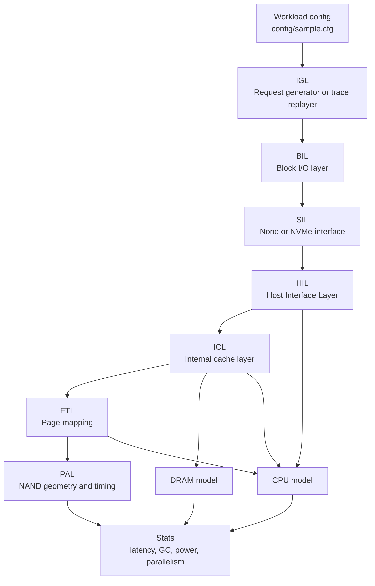
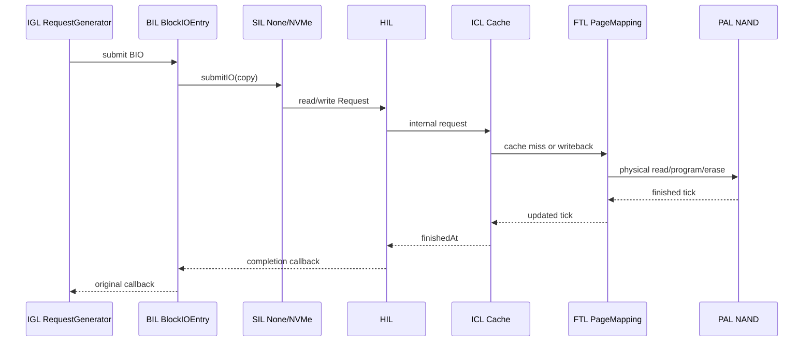
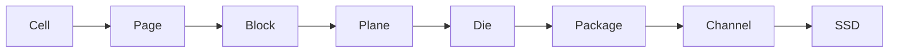
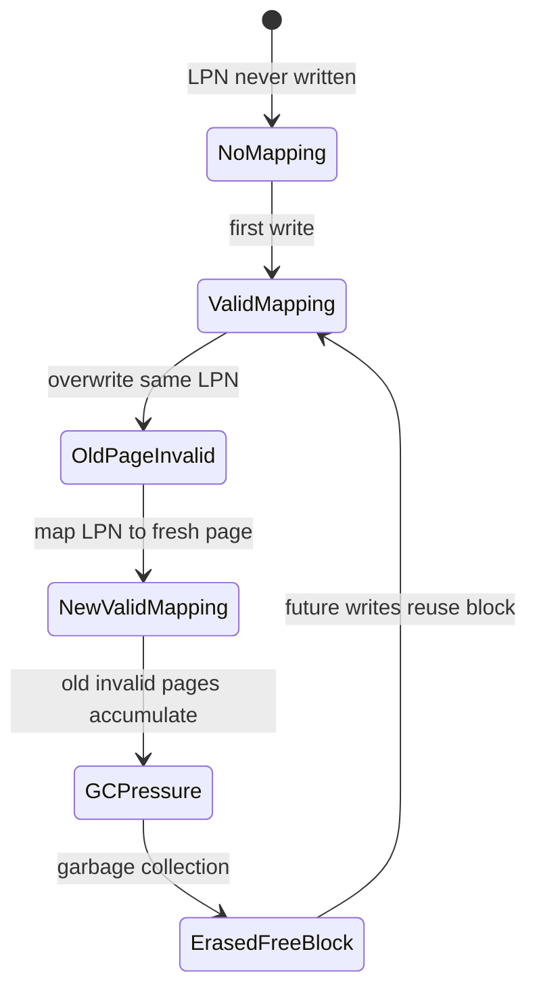
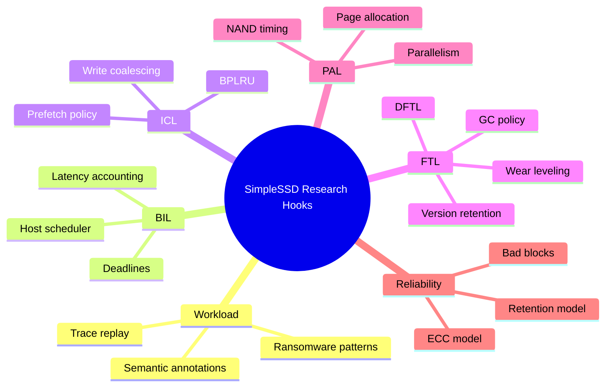

# SimpleSSD Standalone: Living Study Guide


> [!abstract] What this note is
> This is a project-specific study guide for `SimpleSSD-Standalone`. It is meant to be read in Obsidian as a living notebook: part architecture map, part SSD refresher, part code-reading trail, part research launchpad.
>
> It assumes you are building from your existing notes on persistence, file systems, flash, FTLs, garbage collection, wear leveling, bad blocks, parallelism, and SSD research.

> [!tip] How to read this without drowning
> Read this note in passes.
>
> - First pass: sections 1-5, 27, 30.
> - Second pass: sections 6-20.
> - Research pass: sections 31-43.
> - Implementation pass: keep sections 25, 39, and 40 open while reading code.

> [!quote] The north star
> You are not learning a pile of C++ files. You are learning how a block request becomes simulated time, NAND activity, metadata movement, garbage collection pressure, and research evidence.

## Reading Dashboard

| If you want to... | Start with | Then read | Code to keep open |
|---|---:|---:|---|
| Understand the simulator loop | 1 | 4, 10, 27 | `sim/main.cc`, `sim/engine.cc` |
| Understand request flow | 3 | 7, 8, 11, 12, 40 | `igl/request/request_generator.cc`, `bil/entry.cc` |
| Understand SSD internals | 6 | 14-18, 33-36 | `hil.cc`, `generic_cache.cc`, `page_mapping.cc`, `pal.cc` |
| Run experiments | 5 | 21-24, 42 | `config/sample.cfg`, `simplessd/config/sample.cfg` |
| Find research hooks | 31 | 32, 39, 41, 43 | depends on idea |

> [!warning] Obsidian note style
> This guide intentionally avoids backlinks and horizontal rules. It uses callouts, tables, task lists, Mermaid diagrams, footnotes, highlights, tags, and collapsible sections.

## One-Screen Map



## Study Checklist

- [ ] I can explain the difference between host time and simulated time.
- [ ] I can trace one generated read from `RequestGenerator` to `PAL`.
- [ ] I can trace one generated write through cache, FTL mapping, and PAL program.
- [ ] I can explain why read-only empty-SSD runs may show `pal.read.count = 0`.
- [ ] I can identify which config file controls the workload and which controls the SSD.
- [ ] I can derive approximate WAF from simulator stats.
- [ ] I can name at least three things this simulator does not model faithfully.
- [ ] I can point to where I would implement a new GC policy.
- [ ] I can point to where I would add semantic/ransomware-defense metadata.

## Short Version

```text
This repo is a standalone executable that drives the SimpleSSD simulator.

It generates or replays block I/O requests, sends them into a simulated SSD,
advances a simulated clock in picoseconds, and reports latency, throughput,
cache behavior, flash behavior, DRAM behavior, CPU cost, and power/energy stats.
```

The main executable is:

```bash
./simplessd-standalone config/sample.cfg simplessd/config/sample.cfg /tmp
```

The three arguments are:

```text
1. config/sample.cfg              Workload and standalone simulator config
2. simplessd/config/sample.cfg    SSD device model config
3. /tmp                           Output directory for logs, if configured
```


## 1. What Kind Of Simulator Is This?

This is a discrete-event simulator.

That phrase matters. A normal program runs according to real wall-clock time. If a real SSD read takes 80 microseconds, a real device actually waits. A simulator does not need to wait. Instead, it keeps a variable called simulated time, usually called a tick.

In this project, the tick unit is picoseconds.

```text
1 second      = 1,000,000,000,000 ps
1 millisecond = 1,000,000,000 ps
1 microsecond = 1,000,000 ps
1 nanosecond  = 1,000 ps
```

The event engine has a queue of future events:

```text
tick 0                 start simulation
tick 1,492,500         submit first read into HIL
tick 7,094,420         cache/NAND/DRAM action finishes
tick 9,874,420         request completion callback
...
```

The simulator jumps directly from event to event. It does not waste host time waiting for simulated time to pass.

The core event engine is here:

```text
sim/engine.hh
sim/engine.cc
```

Important methods:

```cpp
SimpleSSD::Event allocateEvent(SimpleSSD::EventFunction)
void scheduleEvent(SimpleSSD::Event, uint64_t tick)
void descheduleEvent(SimpleSSD::Event)
bool doNextEvent()
uint64_t getCurrentTick()
```

The central loop in `sim/main.cc` is:

```cpp
while (engine.doNextEvent())
  ;
```

This means: keep taking the earliest scheduled event, move simulated time to that event's tick, run its callback, and repeat until there are no more events or the simulation is stopped.

> [!important] The simulator's magic trick
> The simulator does not make NAND faster. It makes time symbolic. A 3.5 ms erase becomes "schedule a completion event 3,500,000,000 ps later" rather than "make your real CPU sleep for 3.5 ms."

> [!example] Tiny event story
> Imagine an I/O arrives at tick `1000`.
>
> 1. HIL CPU work finishes at tick `3500`.
> 2. Cache lookup finishes at tick `4200`.
> 3. NAND read finishes at tick `64,200,000`.
> 4. Completion callback fires at tick `64,205,000`.
>
> The simulator jumps across those times. The jump is the whole point.

<details>
<summary>Why picoseconds?</summary>

Picoseconds let the model combine very different timing scales without floating point everywhere:

| Event type | Typical scale | In ps |
|---|---:|---:|
| CPU clock tick | ns | thousands |
| DRAM access | ns | thousands to tens of thousands |
| NAND read | us | tens of millions |
| NAND program | hundreds of us to ms | hundreds of millions to billions |
| NAND erase | ms | billions |

The unit is small enough to represent all of these with integers.

</details>


## 2. Top-Level Repository Structure

The repository has two broad parts:

```text
.
|-- sim/          Standalone simulator program and event engine
|-- config/       Standalone workload config
|-- igl/          I/O generation layer
|-- bil/          Block I/O layer
|-- sil/          Simulator interface layer
|-- util/         Small standalone helper utilities
|-- simplessd/    The actual SimpleSSD device model
|-- lib/          External libraries used by the standalone wrapper
```

The standalone wrapper creates workloads and pushes requests into SimpleSSD.

The `simplessd/` directory models the SSD itself.

Important standalone files:

```text
sim/main.cc                         Program entry point
sim/engine.cc                       Discrete-event engine
sim/cfg_reader.cc                   Reads config/sample.cfg
sim/global_config.cc                Global standalone config defaults/parsing
igl/request/request_generator.cc    Synthetic workload generator
igl/trace/trace_replayer.cc         Trace replay mode
bil/entry.cc                        Block I/O submission, completion, latency stats
bil/noop_scheduler.cc               No-op scheduler
sil/none/none.cc                    Direct interface to SimpleSSD HIL
sil/nvme/nvme.cc                    Simulated NVMe host-side driver
```

Important SimpleSSD files:

```text
simplessd/util/simplessd.cc         Initializes SimpleSSD with simulator/log/config
simplessd/hil/hil.cc                Host Interface Layer
simplessd/icl/icl.cc                Internal Cache Layer wrapper
simplessd/icl/generic_cache.cc      Cache, prefetch, write buffering, eviction
simplessd/ftl/ftl.cc                FTL wrapper
simplessd/ftl/page_mapping.cc       Page-level FTL implementation
simplessd/pal/pal.cc               Parallelism Abstraction Layer wrapper
simplessd/pal/pal_old.cc           NAND timing and parallelism implementation
simplessd/dram/simple.cc           Simple DRAM timing/power model
simplessd/cpu/cpu.cc               Controller CPU latency and stats
simplessd/config/sample.cfg         SSD hardware and firmware config
```


## 3. The Big Mental Model

Think of the simulator as a pipeline.

```text
Workload
  |
  v
IGL: I/O Generation Layer
  |
  v
BIL: Block I/O Layer
  |
  v
SIL: Simulator Interface Layer
  |
  v
HIL: Host Interface Layer inside SSD
  |
  v
ICL: Internal Cache Layer
  |
  v
FTL: Flash Translation Layer
  |
  v
PAL: Parallelism Abstraction Layer
  |
  v
NAND timing, channel/die/plane activity, completion
```

Each layer adds something:

```text
IGL  decides what I/O requests exist
BIL  wraps requests and measures latency
SIL  converts standalone requests into SSD-facing requests
HIL  receives requests inside the SSD firmware model
ICL  handles read/write cache and DRAM interactions
FTL  maps logical pages to physical flash pages
PAL  models NAND geometry, parallelism, and timing
CPU  charges firmware execution latency
DRAM charges DRAM access latency and energy
```

> [!note] A useful phrase
> ==Every layer either transforms the request, delays it, records statistics, or schedules the next event.== When reading any file, ask which of those four jobs it is doing.



> [!question] The debugging question
> When a stat looks surprising, ask: "Which layer could have hidden the lower layer?" Cache can hide PAL. The direct interface can hide NVMe. An empty mapping table can hide NAND reads. The event engine can hide real time.


## 4. Program Startup Flow

Start in:

```text
sim/main.cc
```

The executable expects exactly 3 arguments:

```text
simplessd-standalone <Simulation configuration file> <SimpleSSD configuration file> <Output directory>
```

The startup sequence is:

```text
1. Print banner
2. Validate argument count
3. Install signal handler
4. Read standalone simulation config
5. Configure log streams
6. Initialize SimpleSSD engine
7. Create selected host interface
8. Create Block I/O Entry
9. Create I/O generator or trace replayer
10. Register periodic statistics event, if enabled
11. Initialize interface
12. Begin simulation
13. Repeatedly call engine.doNextEvent()
14. Cleanup and print final statistics
```

The call:

```cpp
auto ssdConfig = initSimpleSSDEngine(&engine, pDebugLog, pDebugLog, argv[2]);
```

does several key things:

```text
1. Gives SimpleSSD a pointer to the event simulator.
2. Initializes SimpleSSD logging.
3. Reads simplessd/config/sample.cfg.
4. Initializes the simulated SSD controller CPU.
```

That implementation is in:

```text
simplessd/util/simplessd.cc
```


## 5. The Two Config Files

There are two configs because there are two conceptual worlds:

```text
config/sample.cfg
  Describes the experiment: workload, interface, logging, trace mode, queue depth.

simplessd/config/sample.cfg
  Describes the SSD: CPU, NVMe, SATA, UFS, NAND geometry, FTL, cache, DRAM.
```

> [!tip] Rule of thumb
> If you are changing the question, edit `config/sample.cfg`.
>
> If you are changing the device being questioned, edit `simplessd/config/sample.cfg`.

| You want to change... | File | Section | Example knob |
|---|---|---|---|
| Sequential vs random | `config/sample.cfg` | `[generator]` | `readwrite = randread` |
| Queue depth | `config/sample.cfg` | `[generator]` | `iodepth = 32` |
| Direct vs NVMe path | `config/sample.cfg` | `[global]` | `Interface = 0/1` |
| NAND geometry | `simplessd/config/sample.cfg` | `[pal]` | `Channel`, `Die`, `Plane` |
| FTL policy | `simplessd/config/sample.cfg` | `[ftl]` | `EvictPolicy`, `GCThreshold` |
| Cache behavior | `simplessd/config/sample.cfg` | `[icl]` | `EnableReadCache` |
| DRAM timing | `simplessd/config/sample.cfg` | `[dram]` | `tRCD`, `tCL`, `BusWidth` |

> [!danger] Easy mistake
> Do not interpret a single run as "the SSD's truth." Interpret it as "this model, with these two config files, predicted this behavior."

### 5.1 Standalone Simulation Config

File:

```text
config/sample.cfg
```

Sections:

```text
[global]      Whole simulation behavior
[generator]   Synthetic workload generation
[trace]       Trace replay parsing and timing
```

Important global options:

```ini
[global]
Mode = 0
LogPeriod = 10
LogFile = STDOUT
DebugLogFile = STDERR
LatencyLogFile =
ProgressPeriod = 0
Interface = 0
Scheduler = 0
SubmissionLatency = 5us
CompletionLatency = 5us
```

Meaning:

```text
Mode = 0
  Use synthetic request generator.

Mode = 1
  Use trace replayer.

LogPeriod = 10
  Print periodic stats every 10 ms of simulated time.

LogFile = STDOUT
  Print stats to terminal.

DebugLogFile = STDERR
  Print detailed debug logs to terminal. This is extremely verbose.

Interface = 0
  Use direct interface, bypassing protocol details.

Interface = 1
  Use simulated NVMe.

Scheduler = 0
  Use no-op block scheduler.

SubmissionLatency = 5us
  Simulated host/software delay before issuing another request.

CompletionLatency = 5us
  Simulated host/software delay after completion.
```

Request generator options:

```ini
[generator]
io_size = 16M
readwrite = read
rwmixread = 0.5
blocksize = 4K
blockalign =
iomode = async
iodepth = 32
offset = 0
size =
thinktime = 0
randseed = 13245
time_based = 0
runtime = 10s
```

Important meanings:

```text
io_size
  Total amount of I/O to issue when time_based = false.

readwrite
  Workload type. Values include read, write, randread, randwrite, readwrite,
  and randrw.

rwmixread
  For mixed workloads, fraction of reads.

blocksize
  Size of each generated I/O.

blockalign
  Address alignment. If empty, defaults to blocksize.

iomode
  sync or async. In code, sync is converted to async with iodepth = 1.

iodepth
  Maximum number of outstanding I/Os.

offset
  Starting byte offset.

size
  Working-set size. Empty means from offset to end of SSD.

thinktime
  Declared in config, but the current request generator does not visibly use it
  in the main scheduling path.

time_based
  If false, stop after io_size. If true, stop after runtime.
```

Trace replay options:

```ini
[trace]
File = ./test.txt
TimingMode = 0
QueueDepth = 32
IOLimit = 0
Regex = "..."
Operation = 3
LBAOffset = 4
LBALength = 5
Second = 1
Nanosecond = 2
LBASize = 512
UseHexadecimal = 0
```

Trace mode uses a regular expression to parse external trace files. The config maps regex capture groups to fields like operation, offset, length, and timestamp.

### 5.2 SSD Config

File:

```text
simplessd/config/sample.cfg
```

Sections:

```text
[cpu]    SSD controller CPU model
[nvme]   NVMe protocol/interface model
[ufs]    UFS protocol/interface model
[sata]   SATA protocol/interface model
[pal]    NAND geometry and timing
[ftl]    Flash translation layer behavior
[icl]    Internal cache layer behavior
[dram]   DRAM timing and power behavior
```

The most important sections for learning are `[pal]`, `[ftl]`, `[icl]`, and `[dram]`.


## 6. SSD Concepts You Need

### 6.1 Logical vs Physical

The host sees logical addresses.

The SSD stores data at physical NAND locations.

The host might say:

```text
read 4096 bytes at byte offset 8192
```

Inside the SSD, that becomes something like:

```text
logical page number -> physical block/page/plane/die/channel
```

The FTL is responsible for this mapping.

### 6.2 NAND Cannot Overwrite In Place

This is one of the most important SSD ideas.

Hard disks can overwrite a sector directly. NAND flash cannot normally do that. NAND works like this:

```text
Read page      Fine-grained
Program page   Fine-grained, but only into an erased page
Erase block    Coarse-grained, erases many pages at once
```

Because of this, when a logical page is overwritten:

```text
1. SSD writes the new data to a fresh physical page.
2. SSD marks the old physical page invalid.
3. Later, garbage collection erases blocks with many invalid pages.
```

### 6.3 Blocks, Pages, Planes, Dies, Packages, Channels

From the sample SSD config:

```ini
[pal]
Channel = 8
Package = 4
Die = 2
Plane = 2
Block = 512
Page = 512
PageSize = 16384
```

Raw structure:

```text
8 channels
4 packages per channel
2 dies per package
2 planes per die
512 blocks per plane
512 pages per block
16 KiB per page
```

Total raw physical page count, before superpage abstraction:

```text
8 * 4 * 2 * 2 * 512 * 512 pages
```

Total raw block count:

```text
8 * 4 * 2 * 2 * 512 = 65536 physical blocks
```

The simulator then creates a superblock/superpage abstraction. With the sample:

```ini
EnableMultiPlaneOperation = 1
SuperblockSize = C
PageAllocation = CWDP
```

The sample run printed:

```text
Page size 16384 -> 262144
Total block count 65536 -> 4096
```

So the PAL groups physical structure into larger logical units:

```text
Physical NAND page size: 16 KiB
Superpage size:          256 KiB
Physical blocks:         65536
Superblocks:             4096
```

The ICL may further expose a smaller logical page when random I/O tweak is enabled.



> [!info] Simulator twist
> The physical hierarchy is real SSD vocabulary, but `superpage` and `superblock` are simulator/modeling abstractions. They let the model express "this operation spans parallel NAND units" without making every upper layer juggle channel/package/die/plane coordinates directly.

### 6.4 Over-Provisioning

In the FTL config:

```ini
OverProvisioningRatio = 0.25
```

The FTL computes:

```cpp
param.totalPhysicalBlocks = palparam->superBlock;
param.totalLogicalBlocks =
    palparam->superBlock * (1 - OverProvisioningRatio);
```

With the sample:

```text
Total physical superblocks: 4096
Total logical superblocks:  3072
Hidden spare blocks:        1024
```

Those spare blocks are not wasted. They are necessary for writes, garbage collection, and wear leveling.

### 6.5 Garbage Collection

Garbage collection happens when free-block ratio drops below:

```ini
GCThreshold = 0.05
```

When GC triggers, `PageMapping`:

```text
1. Selects victim blocks.
2. Finds still-valid pages in those blocks.
3. Reads valid pages.
4. Writes those valid pages elsewhere.
5. Erases the victim block.
6. Returns erased block to free list if it is not worn out.
```

The implementation is mainly in:

```text
simplessd/ftl/page_mapping.cc
  selectVictimBlock()
  doGarbageCollection()
  eraseInternal()
```

Victim policy is configured here:

```ini
EvictPolicy = 0
```

Available policies:

```text
0 Greedy
1 Cost-Benefit
2 Random
3 D-CHOICE
```

### 6.6 Read Cache, Write Cache, Prefetch

The ICL config includes:

```ini
[icl]
CacheSize = 536870912
CacheWaySize = 8
EnableReadCache = 1
EnableReadPrefetch = 1
EnableWriteCache = 1
EvictPolicy = 2
```

The cache implementation is:

```text
simplessd/icl/generic_cache.cc
```

Important behaviors:

```text
Read hit:
  Data is served from SSD DRAM cache.

Read miss:
  Data is fetched from FTL/PAL and inserted into cache.

Sequential read detection:
  If reads look sequential, prefetch may fetch ahead.

Write cache:
  Small/partial writes may become dirty cache lines.

Eviction:
  Dirty lines are written back to FTL before being discarded.
```

The sample run showed many cache hits:

```text
icl.generic_cache.read.request_count     4096
icl.generic_cache.read.from_cache        4094
```

This means almost all reads were served by the internal cache/prefetch model.


## 7. The Main Code Path For A Generated Read

Assume this config:

```ini
[global]
Mode = 0
Interface = 0

[generator]
readwrite = read
blocksize = 4K
iomode = async
iodepth = 32
```

The read path is:

```text
RequestGenerator::_submitIO()
  creates BIL::BIO

BlockIOEntry::submitIO()
  records submit time and forwards to scheduler

NoopScheduler::submitIO()
  forwards directly to selected interface

SIL::None::Driver::submitIO()
  converts BIL::BIO to SimpleSSD::HIL::Request

HIL::read()
  schedules HIL CPU work, then calls ICL

ICL::read()
  splits request into logical pages and calls cache

GenericCache::read()
  handles cache hit/miss/prefetch and may call FTL

FTL::read()
  applies FTL CPU latency and calls PageMapping

PageMapping::readInternal()
  looks up LPN -> physical block/page mapping
  reads mapping metadata from DRAM
  sends physical read to PAL if mapping exists

PAL::read()
  models NAND timing and parallelism

HIL completion queue
  schedules completion callback

BlockIOEntry::completion()
  computes latency and calls original I/O callback

RequestGenerator::_iocallback()
  reduces outstanding depth and maybe schedules more I/O
```

For a read from an unmapped logical page, `PageMapping::readInternal()` may find no mapping. In that case there is no actual NAND read. This is one reason sample read-only runs can show `pal.read.count = 0`.

If you want to see NAND activity clearly, use writes or warm up the FTL with a nonzero fill ratio.


## 8. The Main Code Path For A Generated Write

A write starts similarly:

```text
RequestGenerator::_submitIO()
BlockIOEntry::submitIO()
NoopScheduler::submitIO()
SIL::None::Driver::submitIO()
HIL::write()
ICL::write()
GenericCache::write()
FTL::write()
PageMapping::writeInternal()
PAL::write()
completion callback
```

Inside `PageMapping::writeInternal()`:

```text
1. Check whether the LPN already has a mapping.
2. If it does, invalidate the old physical page.
3. If it does not, create a new mapping entry.
4. Find the current free block.
5. Choose the next writable page.
6. Update mapping table.
7. Send program operation to PAL.
8. If free blocks are below threshold, trigger garbage collection.
```

This is the core SSD behavior.

The host thinks:

```text
write logical page 100
```

The SSD actually does:

```text
write logical page 100 to some new physical page
remember the mapping
invalidate the old physical page if one existed
```



> [!success] If this diagram clicks
> You understand the center of SSD behavior: writes create future cleanup work.


## 9. The Main Code Path For Trace Replay

Trace mode is configured with:

```ini
[global]
Mode = 1
```

Then `sim/main.cc` creates:

```cpp
new IGL::TraceReplayer(...)
```

The trace replayer:

```text
1. Opens the trace file.
2. Compiles the configured regex.
3. Reads lines until one matches.
4. Extracts timestamp, operation, offset, length.
5. Converts LBA to bytes if needed.
6. Submits BIL::BIO.
7. Schedules the next submission according to TimingMode.
```

Relevant code:

```text
igl/trace/trace_replayer.cc
  parseLine()
  mergeTime()
  getType()
  submitIO()
  iocallback()
  rescheduleSubmit()
```

Timing modes:

```text
0 MODE_SYNC
  Submit one request, wait for completion, then submit next.

1 MODE_ASYNC
  Submit requests asynchronously up to QueueDepth.

2 MODE_STRICT
  Submit requests at exact timestamps from trace.
```


## 10. How The Event Engine Works Internally

File:

```text
sim/engine.cc
```

The engine stores:

```cpp
uint64_t simTick;
SimpleSSD::Event counter;
std::unordered_map<Event, EventFunction> eventList;
std::list<std::pair<Event, uint64_t>> eventQueue;
```

Conceptually:

```text
eventList:
  event id -> function to call

eventQueue:
  sorted list of event id + scheduled tick
```

When code calls:

```cpp
engine.scheduleEvent(eventId, tick);
```

the engine inserts that event into the queue sorted by tick.

When code calls:

```cpp
engine.doNextEvent();
```

the engine:

```text
1. Takes the first event in eventQueue.
2. Sets simTick to that event's scheduled tick.
3. Finds the function in eventList.
4. Runs the function.
5. Increments eventHandled.
```

This design makes every simulated operation explicit. Nothing "just happens"; some callback schedules another callback.


## 11. Request Generator Details

File:

```text
igl/request/request_generator.cc
```

The generator keeps:

```text
io_size          target bytes to submit
io_submitted     bytes already submitted
type             read/write/randread/randwrite/etc.
mode             sync/async
iodepth          max outstanding I/Os
io_count         total I/O count
read_count       read count
offset           start offset
size             active address range
blocksize        I/O size
blockalign       alignment
randseed         random seed
time_based       byte-count mode or runtime mode
runtime          runtime if time_based
io_depth         current outstanding I/O count
```

Address generation:

```text
Sequential workload:
  off = io_count * blockalign
  wraps around if it reaches configured size

Random workload:
  off = random number in [offset, offset + size)
  align down to blockalign
```

Read/write choice:

```text
read:
  always read

write:
  always write

readwrite/randrw:
  compare current read ratio to rwmixread
```

Submission behavior:

```text
_submitIO()
  create BIO
  increment counters
  submit to BIL
  increase io_depth
  maybe schedule next submit event

_iocallback()
  decrease io_depth
  maybe schedule next submit event
  maybe end simulation
```

Why async matters:

```text
iodepth = 1
  Next request mostly waits for previous completion.

iodepth = 32
  Up to 32 requests can be in flight.
  This can expose SSD internal parallelism.
```


## 12. Block I/O Layer Details

Files:

```text
bil/entry.hh
bil/entry.cc
bil/scheduler.hh
bil/noop_scheduler.cc
bil/interface.hh
```

The central structure is:

```cpp
typedef struct _BIO {
  uint64_t id;
  BIO_TYPE type;
  uint64_t offset;
  uint64_t length;
  std::function<void(uint64_t)> callback;
  uint64_t submittedAt;
} BIO;
```

This is a simple block I/O request.

`BlockIOEntry::submitIO()`:

```text
1. Increments I/O count.
2. Stores current simulation tick as submittedAt.
3. Pushes request into ioQueue.
4. Replaces callback with BIL completion callback.
5. Sends request to scheduler.
```

`BlockIOEntry::completion()`:

```text
1. Looks up completed request by id.
2. Computes latency = current tick - submittedAt.
3. Updates min/max/sum latency stats.
4. Updates progress stats.
5. Writes latency log if configured.
6. Calls original request callback.
7. Removes request from ioQueue.
```

This is why BIL is the right place to measure user-visible I/O latency.


## 13. SIL: None Interface vs NVMe Interface

SIL means Simulator Interface Layer.

It adapts the standalone simulator's `BIL::BIO` into SimpleSSD requests.

### 13.1 None Interface

File:

```text
sil/none/none.cc
```

Configured by:

```ini
Interface = 0
```

This is the simplest mode. It skips host protocol details and sends requests directly into:

```text
SimpleSSD::HIL::HIL
```

This is the best mode for learning FTL, cache, NAND, and basic SSD timing.

`None::Driver::submitIO()` converts:

```text
BIL::BIO offset/length
```

into:

```text
HIL::Request range.slpn/range.nlp/offset/length
```

Then it calls:

```cpp
pHIL->read(req);
pHIL->write(req);
pHIL->flush(req);
pHIL->trim(req);
```

### 13.2 NVMe Interface

File:

```text
sil/nvme/nvme.cc
```

Configured by:

```ini
Interface = 1
```

This mode simulates more host protocol behavior:

```text
NVMe registers
Admin submission/completion queues
I/O submission/completion queues
Identify commands
Set Features
Create I/O queues
PRP memory buffers
PCIe transfer timing
Doorbells and completions
```

Use this when you care about NVMe protocol overhead. Use `Interface = 0` when you want to understand SSD internals first.


## 14. HIL: Host Interface Layer

File:

```text
simplessd/hil/hil.cc
```

HIL is the first layer inside the SSD model.

It owns:

```cpp
ICL::ICL *pICL;
```

For reads:

```cpp
void HIL::read(Request &req)
```

It creates a CPU job:

```cpp
execute(CPU::HIL, CPU::READ, doRead, new Request(req));
```

That means HIL work is not free. It consumes simulated controller CPU time.

Inside the HIL read job:

```text
1. Assign internal request id.
2. Print debug trace.
3. Convert HIL request into ICL request.
4. Call pICL->read().
5. Update HIL stats.
6. Push finished request into completion queue.
7. Schedule completion event.
```

Completion is delayed until the request's `finishedAt` tick. Then HIL calls the original callback.


## 15. ICL: Internal Cache Layer

Files:

```text
simplessd/icl/icl.cc
simplessd/icl/generic_cache.cc
```

ICL owns:

```cpp
DRAM::AbstractDRAM *pDRAM;
FTL::FTL *pFTL;
AbstractCache *pCache;
```

In the constructor:

```text
1. Create DRAM model.
2. Create FTL.
3. Ask FTL for logical page parameters.
4. Create GenericCache.
```

ICL is where request splitting happens.

For a read:

```cpp
for each logical page covered by the request:
  pCache->read(reqInternal, beginAt);
finishedAt = max(finishedAt, beginAt);
tick = finishedAt;
tick += applyLatency(CPU::ICL, CPU::READ);
```

This means a single host I/O can become multiple internal page operations.


## 16. Generic Cache Details

File:

```text
simplessd/icl/generic_cache.cc
```

The cache supports:

```text
read caching
read prefetch
write caching
dirty cache lines
FIFO/LRU/random eviction
cache metadata latency
DRAM read/write latency
```

Key config:

```ini
CacheSize = 536870912
CacheWaySize = 8
EnableReadCache = 1
EnableReadPrefetch = 1
EnableWriteCache = 1
EvictPolicy = 2
EvictMode = 1
CacheLatency = 10
```

Cache organization:

```text
CacheSize      total bytes
lineSize       derived from FTL page/superpage settings
waySize        associativity
setSize        number of sets
```

With sample output:

```text
Set size 2048
Way size 8
Line size 32768
Capacity 536870912
```

That means:

```text
2048 sets * 8 ways * 32768 bytes = 512 MiB
```

Read path:

```text
1. Check if read cache is enabled.
2. Check sequential pattern for prefetch.
3. Look for valid cache line.
4. On hit:
     wait until cache line is valid
     update last accessed
     read from DRAM
5. On miss:
     find empty way or evict a line
     read data from FTL
     write data into DRAM cache
6. Apply cache CPU latency.
```

Write path:

```text
1. Decide whether write is full line or partial.
2. Full line may be sent to FTL immediately.
3. Partial write may become dirty cache data.
4. Update existing cache line if present.
5. Otherwise allocate cache line.
6. If full, evict selected dirty lines.
7. Apply cache CPU latency.
```

Important: cache behavior can hide NAND behavior in simple runs. If data is served by cache, PAL read/program stats may stay low or zero.


## 17. FTL: Flash Translation Layer

Files:

```text
simplessd/ftl/ftl.cc
simplessd/ftl/page_mapping.cc
```

The FTL wrapper creates:

```cpp
pPAL = new PAL::PAL(conf);
pFTL = new PageMapping(conf, param, pPAL, pDRAM);
```

The FTL parameter setup:

```cpp
param.totalPhysicalBlocks = palparam->superBlock;
param.totalLogicalBlocks =
    palparam->superBlock * (1 - OverProvisioningRatio);
param.pagesInBlock = palparam->page;
param.pageSize = palparam->superPageSize;
param.ioUnitInPage = palparam->pageInSuperPage;
param.pageCountToMaxPerf = palparam->superBlock / palparam->block;
```

For the sample:

```text
Total physical blocks: 4096
Total logical blocks:  3072
Logical page size:     262144 bytes at FTL superpage level
```

### 17.1 Page Mapping

Page-level mapping means the FTL maps each logical page to a physical block/page location.

The page mapping FTL stores:

```text
table
  logical page number -> physical block/page mapping

freeBlocks
  erased blocks available for future writes

blocks
  blocks currently in use

lastFreeBlock
  current write frontier
```

Page mapping is flexible and performs well, but in real SSDs it requires memory for the mapping table. This simulator uses DRAM accesses to model some mapping-table cost.

### 17.2 Read Behavior

`PageMapping::readInternal()`:

```text
1. Look up LPN in mapping table.
2. If mapping exists:
     read mapping metadata from DRAM
     build PAL request
     ask block metadata to record read
     call pPAL->read()
3. If mapping does not exist:
     no NAND read is issued
```

An unmapped read can be interpreted as reading never-written logical space.

### 17.3 Write Behavior

`PageMapping::writeInternal()`:

```text
1. Find existing mapping for LPN.
2. If old mapping exists, invalidate old physical page.
3. If no mapping exists, create mapping entry.
4. Choose a free block/page.
5. Update mapping table in DRAM.
6. Send program request to PAL.
7. If free block ratio is below threshold, trigger GC.
```

This models out-of-place writes.

### 17.4 Trim Behavior

`PageMapping::trimInternal()`:

```text
1. Find mapping.
2. Read mapping metadata from DRAM.
3. Invalidate physical page.
4. Remove mapping table entry.
```

Trim tells the SSD that a logical region no longer contains useful data.


## 18. PAL: Parallelism Abstraction Layer

Files:

```text
simplessd/pal/pal.cc
simplessd/pal/pal_old.cc
simplessd/pal/old/*
```

PAL models the physical NAND organization and timing.

Config:

```ini
[pal]
Channel = 8
Package = 4
Die = 2
Plane = 2
Block = 512
Page = 512
PageSize = 16384
EnableMultiPlaneOperation = 1
NANDType = 1
LSBRead = 40000000
LSBWrite = 500000000
MSBRead = 65000000
MSBWrite = 1300000000
Erase = 3500000000
DMASpeed = 400
DMAWidth = 8
SuperblockSize = C
PageAllocation = CWDP
```

Important timing values are in picoseconds:

```text
LSBRead  = 40,000,000 ps = 40 us
MSBRead  = 65,000,000 ps = 65 us
LSBWrite = 500,000,000 ps = 500 us
MSBWrite = 1,300,000,000 ps = 1.3 ms
Erase    = 3,500,000,000 ps = 3.5 ms
```

PAL answers questions like:

```text
Can these two page reads happen at the same time?
Which channel is busy?
Which die is busy?
How long does NAND read/program/erase take?
How much DMA transfer time is needed?
```

This is where SSD internal parallelism becomes visible.


## 19. DRAM Model

File:

```text
simplessd/dram/simple.cc
```

DRAM is used for:

```text
cache data
cache metadata
FTL mapping table accesses
possibly other SSD metadata
```

The simple DRAM model computes:

```text
page fetch latency
interface bandwidth
read latency
write latency
refresh events
DRAM energy/power through DRAMPower
```

Important method:

```cpp
uint64_t SimpleDRAM::updateDelay(uint64_t latency, uint64_t &tick)
```

It models queueing at DRAM:

```text
If DRAM is free at tick:
  access starts at tick.

If DRAM is still busy:
  access starts when previous access finishes.
```

Stats include:

```text
dram.energy
dram.power
dram.read.request_count
dram.read.bytes
dram.write.request_count
dram.write.bytes
```


## 20. CPU Model

File:

```text
simplessd/cpu/cpu.cc
```

The SSD controller has simulated CPU cores:

```ini
[cpu]
ClockSpeed = 400000000
HILCoreCount = 1
ICLCoreCount = 1
FTLCoreCount = 1
```

The CPU model is not executing real firmware instructions. Instead, it uses precomputed instruction counts for different operations.

Each operation has instruction categories:

```text
branch
load
store
arithmetic
floating point
other
```

The CPU applies latency based on:

```text
instruction count * clock period
```

For example:

```text
400 MHz clock
clock period = 1 / 400,000,000 s
             = 2.5 ns
             = 2500 ps
```

Stats include:

```text
cpu.hil0.busy
cpu.hil0.insts.branch
cpu.icl0.busy
cpu.ftl0.busy
...
```

This lets the simulator model firmware overhead separately from NAND latency.


## 21. Understanding The Sample Output

Your `my.txt` contains periodic simulation stats. A final run produced lines like:

```text
I/O (bytes): 16777216
I/O (counts): 4096 (Read: 4096, Write: 0)
Latency (ns): min=4972.58, max=9874.42, avg=4975.267344
Simulation Tick (ps): 61298946200
Event handled: 12294
```

How to interpret common fields:

```text
read.request_count
  Number of host-level read requests completed inside HIL.

read.bytes
  Total read bytes handled.

read.busy
  Simulated device busy time attributed to reads.

icl.generic_cache.read.request_count
  Number of read requests seen by cache.

icl.generic_cache.read.from_cache
  Number served from cache.

dram.energy
  DRAM energy in picojoules.

ftl.page_mapping.gc.count
  Number of garbage collection events.

pal.read.count
  Number of NAND read operations.

pal.program.count
  Number of NAND program/write operations.

pal.erase.count
  Number of NAND erase operations.

cpu.*.busy
  Time spent by simulated SSD controller CPU cores.
```

Why can `pal.read.count` be zero during a read workload?

Possible reasons in this project:

```text
1. Reads target unmapped logical pages, so FTL does not issue NAND reads.
2. Internal cache/prefetch serves most requests.
3. The SSD was not pre-filled before the read workload.
```

To force more NAND-visible behavior, use writes or configure FTL warmup:

```ini
[ftl]
FillRatio = 0.5
InvalidPageRatio = 0.1
```


## 22. How To Run Cleaner Experiments

The default sample is noisy because:

```ini
DebugLogFile = STDERR
```

For cleaner output, change:

```ini
DebugLogFile =
```

Or send logs to files:

```ini
LogFile = stats.log
DebugLogFile = debug.log
LatencyLogFile = latency.csv
```

Then run:

```bash
mkdir -p out
./simplessd-standalone config/sample.cfg simplessd/config/sample.cfg out
```

Outputs will be under:

```text
out/stats.log
out/debug.log
out/latency.csv
```

The latency CSV format is:

```text
id, offset, length, latency
```

Latency is in picoseconds.


## 23. Suggested Learning Experiments

Do these one at a time. Change only one variable so you can understand cause and effect.

### Experiment 1: Queue Depth

Use the same workload and compare:

```ini
iodepth = 1
```

then:

```ini
iodepth = 32
```

Look at:

```text
I/O throughput
average latency
event count
pal channel/die active time
```

Expected idea:

```text
Higher queue depth can improve throughput by exposing parallelism,
but may also increase queueing latency.
```

### Experiment 2: Sequential Read vs Random Read

Compare:

```ini
readwrite = read
```

with:

```ini
readwrite = randread
```

Look at:

```text
cache hit rate
prefetch behavior
latency
throughput
```

Expected idea:

```text
Sequential reads benefit more from prefetch.
Random reads reduce prefetch usefulness.
```

### Experiment 3: Write Behavior

Try:

```ini
readwrite = write
```

then:

```ini
readwrite = randwrite
```

Look at:

```text
pal.program.count
pal.program.bytes
ftl.page_mapping.gc.count
dram writes
cpu.ftl0.busy
```

Expected idea:

```text
Writes exercise the FTL much more clearly than reads from an empty SSD.
```

### Experiment 4: Warm SSD

In `simplessd/config/sample.cfg`:

```ini
[ftl]
FillRatio = 0.5
InvalidPageRatio = 0.1
```

Then run random writes.

Look at:

```text
GC count
reclaimed blocks
page copies
erase count
latency spikes
```

Expected idea:

```text
A fuller SSD has less free space, so garbage collection becomes more likely.
```

### Experiment 5: Disable Cache

In `[icl]`:

```ini
EnableReadCache = 0
EnableReadPrefetch = 0
EnableWriteCache = 0
```

Compare against cache enabled.

Look at:

```text
cache hits
DRAM accesses
PAL reads/programs
latency
```

Expected idea:

```text
Cache hides lower-level latency. Disabling it makes FTL/PAL behavior easier to see.
```

### Experiment 6: NAND Timing

In `[pal]`, change:

```ini
LSBRead
MSBRead
LSBWrite
MSBWrite
Erase
```

Look at:

```text
latency
PAL operation times
throughput
```

Expected idea:

```text
NAND program and erase are much slower than read.
```


## 24. Important Gotchas

### 24.1 Debug Output Can Be Misleadingly Huge

`DebugLogFile = STDERR` prints detailed per-request traces. This is useful for learning but painful for larger runs.

Use:

```ini
DebugLogFile =
```

for normal experiments.

### 24.2 Read-Only Empty SSD Runs Do Not Stress NAND

If you only read from addresses that have never been written, there may be no physical NAND mapping. That is why `pal.read.count` can be zero.

Use writes or FTL fill ratio to see NAND operations.

### 24.3 Simulated Time Is Not Host Time

The final output has both:

```text
Simulation Tick (ps)
Host time duration (sec)
```

These are different.

```text
Simulation tick:
  Time inside the simulated SSD universe.

Host time:
  How long your real computer spent running the simulator.
```

### 24.4 Throughput Is Based On Simulated Time

When the output says:

```text
273695015 B/s
```

that means simulated SSD throughput, not how fast your laptop wrote data.

### 24.5 Some Interfaces Are Listed But Not Built In Standalone

The config comments list:

```text
0 None
1 NVMe
2 SATA
3 UFS
```

But the top-level CMake currently compiles:

```text
sil/none
sil/nvme
```

So standalone currently supports direct and NVMe paths in the wrapper.


## 25. Code Reading Path

If you are brand new, read in this order:

### Phase 1: How The Program Runs

```text
1. README.md
2. config/sample.cfg
3. sim/main.cc
4. sim/engine.hh
5. sim/engine.cc
```

Goal:

```text
Understand command-line arguments, config loading, and event scheduling.
```

### Phase 2: How Workloads Become I/O

```text
1. igl/io_gen.hh
2. igl/request/request_generator.hh
3. igl/request/request_generator.cc
4. bil/entry.hh
5. bil/entry.cc
6. bil/noop_scheduler.cc
```

Goal:

```text
Understand BIO creation, queue depth, callbacks, and latency measurement.
```

### Phase 3: How Requests Enter SimpleSSD

```text
1. bil/interface.hh
2. sil/none/none.hh
3. sil/none/none.cc
4. simplessd/hil/hil.hh
5. simplessd/hil/hil.cc
```

Goal:

```text
Understand conversion from byte offsets to logical page ranges.
```

### Phase 4: Cache And FTL

```text
1. simplessd/icl/icl.cc
2. simplessd/icl/generic_cache.hh
3. simplessd/icl/generic_cache.cc
4. simplessd/ftl/ftl.cc
5. simplessd/ftl/page_mapping.hh
6. simplessd/ftl/page_mapping.cc
```

Goal:

```text
Understand cache hits/misses, logical-to-physical mapping, writes, invalidation,
and garbage collection.
```

### Phase 5: Device Timing

```text
1. simplessd/pal/pal.cc
2. simplessd/pal/pal_old.cc
3. simplessd/dram/simple.cc
4. simplessd/cpu/cpu.cc
```

Goal:

```text
Understand where simulated latency and power come from.
```

### Phase 6: NVMe

```text
1. sil/nvme/nvme.cc
2. sil/nvme/queue.cc
3. sil/nvme/prp.cc
4. simplessd/hil/nvme/controller.cc
5. simplessd/hil/nvme/subsystem.cc
6. simplessd/hil/nvme/namespace.cc
```

Goal:

```text
Understand protocol overhead after you already understand direct mode.
```

> [!todo] Code-reading exercise
> Pick one request ID from `my.txt` and follow it through the debug output.
>
> - [ ] Find the HIL line for that request.
> - [ ] Find the ICL cache line for it.
> - [ ] Decide whether it hit or missed cache.
> - [ ] Check whether FTL or PAL did real NAND work.
> - [ ] Compare the printed request timing with BIL's final latency.

<details>
<summary>What to do when you get lost in the code</summary>

Look for one of these things:

| You see... | Meaning |
|---|---|
| `tick` passed by reference | The function is adding simulated delay |
| `schedule(...)` | Future event is being created |
| `callback` or `function` | Completion path is being wired |
| `getStatList` / `getStatValues` | Stats output source |
| `applyLatency(CPU::...)` | Firmware CPU cost is being charged |
| `pDRAM->read/write` | Metadata or cache data cost is being charged |
| `pPAL->read/write/erase` | Physical NAND activity is being modeled |

</details>


## 26. Glossary

```text
BIO
  Block I/O request used by the standalone simulator.

Callback
  Function called when a simulated request completes.

Discrete-event simulation
  Simulation style where time jumps from event to event.

FTL
  Flash Translation Layer. Maps logical pages to physical NAND pages.

GC
  Garbage collection. Reclaims blocks with invalid pages.

HIL
  Host Interface Layer. Entry point inside SimpleSSD.

ICL
  Internal Cache Layer. Models SSD DRAM cache and prefetch.

LBA
  Logical Block Address. Host-visible block address.

LPN
  Logical Page Number. Logical page used by the SSD model.

NAND program
  Flash write operation.

NAND erase
  Block-level erase operation required before pages can be programmed again.

Over-provisioning
  Extra physical flash reserved by the SSD, hidden from host capacity.

PAL
  Parallelism Abstraction Layer. Models NAND geometry and timing.

Page mapping
  FTL strategy mapping logical pages individually to physical pages.

Queue depth
  Number of outstanding I/O requests.

Superpage
  A simulator abstraction grouping pages across internal parallel units.

Tick
  Simulated time unit. Here, one tick is one picosecond.
```


## 27. One Concrete Walkthrough

For the sample config:

```ini
Mode = 0
Interface = 0
readwrite = read
blocksize = 4K
iodepth = 32
io_size = 16M
```

What happens:

```text
1. main() creates Engine.
2. main() reads config/sample.cfg.
3. main() initializes SimpleSSD with simplessd/config/sample.cfg.
4. SimpleSSD builds CPU, DRAM, PAL, FTL, ICL, HIL.
5. main() creates SIL::None::Driver.
6. main() creates BIL::BlockIOEntry.
7. main() creates IGL::RequestGenerator.
8. Interface init schedules begin callback at tick 0.
9. Event engine runs tick 0 callback.
10. RequestGenerator submits first 4 KiB read at offset 0.
11. BIL records submit time.
12. None driver converts offset 0, length 4096 into HIL logical page range.
13. HIL charges CPU work and calls ICL.
14. ICL asks GenericCache for the data.
15. Cache misses first, fills/prefetches data.
16. Completion propagates back through callbacks.
17. RequestGenerator keeps more requests in flight up to iodepth.
18. Periodic stats event prints every LogPeriod.
19. Once 16 MiB has been submitted and completed, RequestGenerator stops engine.
20. cleanup() prints final stats.
```

That is the whole simulator in one run.


## 28. What To Focus On First

If your goal is to learn simulation:

```text
Focus on sim/engine.cc and how callbacks schedule callbacks.
```

If your goal is to learn SSD internals:

```text
Focus on ICL -> FTL -> PAL.
```

If your goal is to run experiments:

```text
Focus on config/sample.cfg and simplessd/config/sample.cfg.
```

If your goal is to modify behavior:

```text
Workload changes:
  igl/request/request_generator.cc

Scheduling changes:
  bil/scheduler.hh and a new scheduler implementation

Cache changes:
  simplessd/icl/generic_cache.cc

FTL changes:
  simplessd/ftl/page_mapping.cc

NAND timing/geometry:
  simplessd/config/sample.cfg and simplessd/pal/*
```


## 29. Minimal Commands

Build:

```bash
cmake .
make
```

Run sample:

```bash
./simplessd-standalone config/sample.cfg simplessd/config/sample.cfg /tmp
```

Run with output directory:

```bash
mkdir -p out
./simplessd-standalone config/sample.cfg simplessd/config/sample.cfg out
```

Reduce debug noise:

```ini
DebugLogFile =
```

Most useful first stats to watch:

```text
I/O bytes
I/O counts
Block I/O latency
icl.generic_cache.read.from_cache
ftl.page_mapping.gc.count
pal.read.count
pal.program.count
pal.erase.count
dram.energy
cpu.*.busy
```


## 30. Final Mental Picture

This simulator is not storing real user data by default. It is modeling timing, structure, metadata, queues, and behavior.

A request is not important because of its payload. It is important because it causes simulated work:

```text
host submission latency
controller CPU work
cache metadata lookup
DRAM access
FTL mapping lookup
NAND read/program/erase
garbage collection
completion latency
statistics updates
```

That is the mindset shift for simulation:

```text
You are not asking, "Did my file get written?"

You are asking, "If this workload hit an SSD with these internal parameters,
what timing, contention, parallelism, cache behavior, garbage collection,
and energy behavior would the model predict?"
```


## 31. Connecting This Guide To Your Reading Notes

Your reading notes already cover much more than the absolute basics. Based on the files in your Obsidian reading folder, you have seen:

```text
OS I/O path:
  persistence, device interfaces, registers, interrupts, DMA, page cache,
  file descriptors, VFS, file-system layout, fsync, rename atomicity.

Classic storage:
  HDD structure, seek time, rotational delay, transfer time, sequential vs random.

Flash and SSD fundamentals:
  floating-gate cells, SLC/MLC/TLC/QLC, page/block hierarchy,
  read/program/erase, erase-before-write, TRIM.

FTL internals:
  page/block/hybrid mapping, log blocks, FAST, LAST, DFTL, superblocks.

Maintenance mechanisms:
  garbage collection, write amplification, wear leveling, bad block management.

Parallelism:
  channel striping, chip/package pipelining, die interleaving, plane sharing,
  page allocation order.

Research direction:
  host schedulers, real-time FTLs, lazy real-time GC, BPLRU, GC-aware striping,
  programmable SSDs, reliability mechanisms, SrFTL/ransomware defense.
```

So the useful next step is not "what is an SSD?" The useful next step is:

```text
Which of those concepts are implemented in this simulator?
Where are they implemented?
How faithful is the model?
What is missing?
What knobs can you vary to test a hypothesis?
Where would you modify code for research?
```

The rest of this added section treats your notes as background and goes deeper into the simulator as a research artifact.


## 32. The Semantic Gap: File System Meaning vs Block I/O vs FTL State

Your OS/file-system notes talk about rich operations:

```text
open()
read()
write()
fsync()
rename()
unlink()
directory updates
journal commits
page-cache writeback
```

This simulator does not receive those operations directly. The standalone workload layer emits block requests:

```cpp
BIO_READ
BIO_WRITE
BIO_FLUSH
BIO_TRIM
```

with:

```text
offset
length
id
callback
```

That means the simulator operates below the file-system semantic layer.

The semantic loss looks like this:

```text
Application intent:
  "rename temp file over database file atomically"

File system actions:
  update directory entry, update inode metadata, write journal, fsync ordering

Block layer view:
  write these LBAs, flush, write those LBAs, maybe trim old extents

SSD FTL view:
  update these logical pages, invalidate old mappings, maybe perform GC
```

In this repo, by the time a request reaches `BIL::BlockIOEntry`, the simulator no longer knows:

```text
which file is being modified
whether the write is data or metadata
whether it is journal traffic
whether it is ransomware encryption
whether it is a database checkpoint
whether it is user-visible content or temporary scratch data
```

This matters for papers like SrFTL. SrFTL-style defense depends on recovering or receiving higher-level storage semantics. In this codebase, the natural places to add that kind of information would be:

```text
Option A: Extend BIL::BIO
  Add semantic fields such as file id, process id, operation class, entropy,
  overwrite pattern, or security tag.

Option B: Extend trace replay
  Use a trace format that includes semantic fields, not only offset/length/op.

Option C: Add an FTL-side detector
  Infer suspicious behavior from block-level patterns only: overwrite intensity,
  sequential file-like rewrites, entropy hints if payload modeling exists,
  trim/write/rename-like sequences if trace has enough ordering information.

Option D: Add a host-SSD side channel
  Model a secure channel or trusted annotation path, similar to SrFTL's idea.
```

The current simulator is strongest at:

```text
timing
queueing
mapping
cache effects
GC effects
parallelism effects
power/energy estimates
```

It is weaker at:

```text
file-level semantics
payload contents
security context
real OS page-cache behavior
multi-tenant process attribution
crash-consistency semantics
```

That does not make it useless for semantic research. It tells you what you must add or approximate.


## 33. Mapping Schemes: What Your Notes Cover vs What This Simulator Implements

Your address-mapping notes cover:

```text
page-level mapping
block-level mapping
hybrid mapping
log-block mapping
BAST
FAST
LAST
DFTL
superblocks
```

This simulator's active FTL implementation is much narrower:

```ini
[ftl]
MappingMode = 0
```

The code currently supports:

```text
0: Page level mapping
```

Implementation:

```text
simplessd/ftl/ftl.cc
simplessd/ftl/page_mapping.cc
```

The wrapper chooses the mapping implementation:

```cpp
switch (conf.readInt(CONFIG_FTL, FTL_MAPPING_MODE)) {
  case PAGE_MAPPING:
    pFTL = new PageMapping(conf, param, pPAL, pDRAM);
    break;
}
```

There is no block-level mapping implementation in this standalone tree, no FAST/LAST implementation, and no DFTL implementation.

That is important. When you run experiments here, you are mostly studying:

```text
page-level mapping + cache + PAL timing + GC policy
```

not the full mapping-design landscape.

### 33.1 How Page Mapping Appears In Code

`PageMapping` stores a table:

```cpp
table.reserve(param.totalLogicalBlocks * param.pagesInBlock);
```

Conceptually:

```text
LPN -> physical block index + physical page index
```

With random I/O tweak enabled, one logical page may have multiple subpage mappings:

```text
LPN -> vector of physical locations for pieces of a superpage
```

The table value is:

```cpp
std::vector<std::pair<uint32_t, uint32_t>>
```

where:

```text
first  = physical block index
second = page index inside that block
```

This matches your page-level mapping notes:

```text
Pros:
  Flexible placement.
  Good random write behavior.
  Fine-grained invalidation.

Cons:
  Large mapping table.
  More DRAM pressure.
```

The simulator models some of that DRAM pressure using calls like:

```cpp
pDRAM->read(&(*mappingList), 8 * req.ioFlag.count(), tick);
pDRAM->write(&(*mappingList), 8 * req.ioFlag.count(), tick);
```

So the mapping table is not just a zero-cost C++ map. The simulator charges DRAM time for mapping metadata access.

### 33.2 Where A DFTL-Style Research Extension Would Go

DFTL keeps only part of the mapping table cached in SRAM/DRAM and fetches translation pages on demand.

This simulator does not implement that. To add a DFTL-like model, you would likely modify or replace:

```text
simplessd/ftl/page_mapping.hh
simplessd/ftl/page_mapping.cc
```

You would add:

```text
cached mapping table entries
translation-page cache
translation-page read/write latency
dirty translation page eviction
extra stats:
  translation cache hit rate
  translation page reads
  translation page writes
  mapping-cache eviction count
```

You would need to be careful to separate:

```text
data-page reads/writes
translation-page reads/writes
```

because both consume NAND/DRAM resources but mean different things.

### 33.3 Where Hybrid Mapping Would Go

Hybrid schemes distinguish data blocks and log blocks. This simulator's `PageMapping` does not have that concept.

To model BAST/FAST/LAST-style FTLs, you would probably create a new class:

```text
simplessd/ftl/hybrid_mapping.hh
simplessd/ftl/hybrid_mapping.cc
```

then extend:

```text
simplessd/ftl/config.hh
simplessd/ftl/config.cc
simplessd/ftl/ftl.cc
```

with:

```ini
MappingMode = 1
```

You would need new structures:

```text
data blocks
log blocks
block-level map
page-level log-block map
merge policy
switch merge
partial merge
full merge
```

The existing `PageMapping` GC machinery would be useful as a reference, but hybrid mapping would not be a tiny patch. It is a real new FTL.


## 34. Garbage Collection: The Exact Model In This Repo

Your GC notes cover:

```text
why GC exists
copy valid pages
erase block
write amplification
greedy
FIFO
windowed GC
d-choice
GC vs wear leveling
```

This simulator implements on-demand GC inside:

```text
simplessd/ftl/page_mapping.cc
```

The trigger is in `writeInternal()`:

```cpp
if (freeBlockRatio() < gcThreshold) {
  selectVictimBlock(list, beginAt);
  doGarbageCollection(list, beginAt);
}
```

Configured by:

```ini
[ftl]
GCThreshold = 0.05
GCMode = 0
GCReclaimBlocks = 1
GCReclaimThreshold = 0.1
EvictPolicy = 0
DChoiceParam = 3
```

### 34.1 Trigger Condition

The trigger is:

```text
freeBlockRatio() < GCThreshold
```

where:

```cpp
float PageMapping::freeBlockRatio() {
  return (float)nFreeBlocks / param.totalPhysicalBlocks;
}
```

With the sample config:

```text
total physical superblocks = 4096
GCThreshold = 0.05
```

GC starts when free blocks drop below approximately:

```text
4096 * 0.05 = 204.8 blocks
```

So around 204 free blocks remaining.

### 34.2 GC Reclaim Modes

Mode 0:

```ini
GCMode = 0
GCReclaimBlocks = 1
```

Meaning:

```text
When GC is triggered, reclaim a fixed number of blocks.
```

Mode 1:

```ini
GCMode = 1
GCReclaimThreshold = 0.1
```

Meaning:

```text
When GC is triggered, reclaim enough blocks to raise free-block ratio
up toward GCReclaimThreshold.
```

This distinction maps to your notes about:

```text
reactive GC:
  clean a little when needed

batch/background-like GC:
  clean more aggressively to restore a healthier free block pool
```

This simulator's GC is still on-demand in the write path. It does not model a separate background GC thread that works during idle time unless you add one.

### 34.3 Victim Selection Policies

The code supports:

```text
POLICY_GREEDY
POLICY_COST_BENEFIT
POLICY_RANDOM
POLICY_DCHOICE
```

In config:

```ini
EvictPolicy = 0
```

Maps to greedy.

The victim weight logic:

```text
Greedy:
  weight = valid page count
  choose lowest weight

Cost-benefit:
  weight = utilization / ((1 - utilization) * age)
  choose lowest weight

Random:
  randomly choose candidates

D-CHOICE:
  sample d * n candidates, then choose best among sample
```

This directly connects to your GC reading. Greedy minimizes immediate copy cost, because fewer valid pages means fewer pages must be moved before erase.

But greedy can conflict with wear leveling:

```text
Greedy picks blocks with many invalid pages.
It does not necessarily pick blocks that need wear balancing.
```

### 34.4 GC Work Performed

`doGarbageCollection()` does this:

```text
for each victim block:
  for each page:
    if page has valid data:
      find a free destination page
      issue PAL read for old valid page
      update mapping table
      issue PAL write to new location
      invalidate old page
  issue PAL erase for victim block
```

The implementation intentionally collects read/write/erase requests first and then issues them in phases:

```text
1. issue all GC reads
2. issue all GC writes
3. issue all GC erases
```

This is a modeling decision. It lets PAL handle timing/parallelism but does not fully model every possible firmware scheduling interleaving between foreground and GC traffic.

### 34.5 Write Amplification In This Simulator

Your notes define write amplification factor as:[^waf]

```text
WAF = physical writes / logical writes
```

The simulator does not directly print a single `WAF` stat, but you can derive an approximation.

Useful counters:

```text
Host/user writes:
  write.bytes

NAND programs:
  pal.program.bytes

GC copies:
  ftl.page_mapping.gc.page_copies
  ftl.page_mapping.gc.superpage_copies
```

Approximate byte-level WAF:

```text
WAF ~= pal.program.bytes / write.bytes
```

This is most meaningful when:

```text
write.bytes > 0
cache is understood
you know whether pal.program.bytes includes all user + GC programs
```

If write cache absorbs or delays writes, interpret WAF carefully. You may want to disable write cache for a clean first experiment:

```ini
[icl]
EnableWriteCache = 0
```

[^waf]: The simulator reports enough pieces to estimate WAF, but a perfect WAF metric depends on exactly what you count as host writes, cache-delayed writes, user programs, GC programs, and metadata programs. Be explicit in any report.

### 34.6 Why GC Might Not Appear In Your First Runs

GC count can stay zero because:

```text
1. Workload is read-only.
2. SSD starts empty.
3. io_size is too small.
4. Over-provisioning is high enough.
5. FillRatio and InvalidPageRatio are zero.
6. Write cache changes when physical programs happen.
```

To force GC:

```ini
[generator]
readwrite = randwrite
io_size = 2G
blocksize = 4K

[ftl]
FillRatio = 0.8
InvalidPageRatio = 0.1
GCThreshold = 0.05
```

Then watch:

```text
ftl.page_mapping.gc.count
ftl.page_mapping.gc.reclaimed_blocks
ftl.page_mapping.gc.page_copies
pal.program.count
pal.erase.count
latency spikes
```


## 35. Wear Leveling And Bad Blocks: What Is Modeled, What Is Not

Your notes distinguish:

```text
dynamic wear leveling
static wear leveling
GC victim selection
bad block recognition
reserved block replacement
ECC-driven failure detection
```

This simulator has partial support for wear/bad-block concepts, but it is not a full reliability simulator.

### 35.1 Erase Counts

Each block tracks erase count through the `Block` abstraction:

```text
simplessd/ftl/common/block.hh
simplessd/ftl/common/block.cc
```

When GC erases a block:

```cpp
block->second.erase();
```

Then `eraseInternal()` checks:

```cpp
uint32_t erasedCount = block->second.getEraseCount();

if (erasedCount < threshold) {
  freeBlocks.emplace(...);
  nFreeBlocks++;
}
```

The threshold comes from:

```ini
[ftl]
EraseThreshold = 100000
```

Meaning:

```text
If a block's erase count reaches the threshold, it is not returned
to the free block pool.
```

This is a simplified bad-block retirement model.

### 35.2 Bad Block Management Is Simplified

Your bad-block notes discuss:

```text
factory bad blocks
grown bad blocks
bad block markers
ECC failure
skip block method
reserved block area
replacement policies
```

This simulator's page-mapping FTL does not appear to model:

```text
factory bad block markers
ECC correction strength
read disturb
retention errors
program disturb
probabilistic page failure
explicit reserved-block remapping table
bad block discovery during read/program failure
```

Instead, the practical model is:

```text
blocks age by erase count
blocks above EraseThreshold stop returning to the free pool
```

That is enough to study some lifetime pressure, but not enough for detailed reliability papers.

### 35.3 Wear-Leveling Metric

The simulator reports:

```text
ftl.page_mapping.wear_leveling
```

The code computes:

```cpp
return (float)totalEraseCnt * totalEraseCnt /
       (numOfBlocks * sumOfSquaredEraseCnt);
```

This is similar in shape to Jain's fairness index:

```text
(sum xi)^2 / (n * sum xi^2)
```

Interpretation:

```text
near 1:
  erase counts are evenly distributed

lower:
  erases are concentrated on fewer blocks

-1:
  no meaningful wear yet because there have been no erases
```

Your sample output showed:

```text
ftl.page_mapping.wear_leveling = -1
```

That means the run had no erase activity, so wear leveling cannot be evaluated.

### 35.4 Dynamic vs Static Wear Leveling In This Code

The current page-mapping FTL mostly has:

```text
GC-driven block recycling
victim selection policy
erase-count-sorted free block insertion
wear-leveling metric
erase threshold retirement
```

It does not have an explicit static wear-leveling algorithm that periodically moves cold data out of low-erase blocks just to balance wear.

That is a major research-extension opportunity.

A static wear-leveling addition would need:

```text
1. Track hot and cold data.
2. Track erase distribution.
3. Periodically select cold blocks with low erase count.
4. Migrate cold valid pages.
5. Free those low-wear blocks so future hot writes use them.
6. Balance lifetime improvement against extra write amplification.
```

Natural implementation locations:

```text
simplessd/ftl/page_mapping.cc
  selectVictimBlock()
  doGarbageCollection()
  writeInternal()

simplessd/ftl/config.hh
simplessd/ftl/config.cc
  add wear-leveling policy knobs
```

Potential new stats:

```text
ftl.page_mapping.wl.count
ftl.page_mapping.wl.cold_page_moves
ftl.page_mapping.wl.extra_programs
ftl.page_mapping.wl.erase_count_min
ftl.page_mapping.wl.erase_count_max
ftl.page_mapping.wl.erase_count_stddev
```


## 36. Parallelism And Page Allocation: How Your Notes Map To PAL

Your parallelism notes cover:

```text
channel striping
flash-chip pipelining
die interleaving
plane sharing
page allocation order
```

This simulator exposes those ideas mainly through:

```text
simplessd/config/sample.cfg
simplessd/pal/config.cc
simplessd/pal/pal.cc
simplessd/pal/pal_old.cc
```

### 36.1 Geometry Knobs

The geometry knobs:

```ini
[pal]
Channel = 8
Package = 4
Die = 2
Plane = 2
Block = 512
Page = 512
PageSize = 16384
```

Map to:

```text
Channel:
  independent paths between controller and NAND packages.

Package:
  chip/package count per channel. Often called way-level parallelism.

Die:
  independently operable unit inside package.

Plane:
  sub-die parallel unit. Multi-plane operations can access matching pages
  across planes.

Block/Page/PageSize:
  physical NAND organization inside each plane.
```

### 36.2 SuperblockSize

Config:

```ini
SuperblockSize = C
EnableMultiPlaneOperation = 1
```

In `pal.cc`, the simulator builds a superpage/superblock abstraction.

If an index is included in `SuperblockSize`, it multiplies superpage size instead of multiplying total block count.

Simplified:

```text
If Channel is in SuperblockSize:
  one superpage spans channels
  superpage size grows
  total superblock count shrinks

If Channel is not in SuperblockSize:
  channels contribute separate blocks
  total block count grows
```

With sample config, the run printed:

```text
Superblock multiplier:
  x8 Channel
  x2 Plane
Page size 16384 -> 262144
Total block count 65536 -> 4096
```

Why x2 Plane if `SuperblockSize = C`?

Because:

```cpp
if (EnableMultiPlaneOperation || superblock includes plane) {
  param.superPageSize *= param.plane;
}
```

So multi-plane mode automatically folds plane count into the superpage.

Calculation:

```text
16 KiB physical page
* 8 channels
* 2 planes
= 256 KiB superpage
```

### 36.3 PageAllocation

Config:

```ini
PageAllocation = CWDP
```

The parser accepts:

```text
C = Channel
W = Package / Way
D = Die
P = Plane
```

This controls how a linear page/block index is decomposed across the NAND hierarchy.

The parser is in:

```text
simplessd/pal/config.cc
```

The address decomposition is in:

```text
simplessd/pal/pal_old.cc
```

Conceptually, different allocation orders change which dimension varies fastest.

Example intuition:

```text
CWDP:
  spread consecutive pages across channels first, then packages, dies, planes.

PCDW or PDCW:
  would emphasize plane/die locality differently.
```

The performance effect depends on workload:

```text
Sequential large I/O:
  Usually benefits from spreading across channels/ways/planes.

Small random I/O:
  May not fill a full superpage, so random-I/O tweak and cache behavior matter.

Write-heavy workload:
  Allocation order affects which blocks wear and how GC sees valid pages.
```

### 36.4 What To Measure For Parallelism

Stats to watch:

```text
pal.read.time.total
pal.program.time.total
pal.erase.time.total
pal.channel.time.active
pal.die.time.active
pal.read.count
pal.program.count
pal.erase.count
latency avg/max
throughput
```

Experiments:

```text
Change Channel 8 -> 4 -> 2 -> 1
Change Package 4 -> 2 -> 1
Change EnableMultiPlaneOperation 1 -> 0
Change SuperblockSize C -> CW -> CWD, if config parser accepts it
Change PageAllocation CWDP -> WCDP -> DCWP
```

Be careful: geometry changes also change capacity and superpage size. When comparing, keep workload size and working set meaningful relative to device capacity.


## 37. Host Interface, DMA, Interrupts, And NVMe: Where The Simulator Draws The Line

Your first reading note spends a lot of time on:

```text
device registers
polling
interrupts
MSI
DMA
IOMMU
PIO vs DMA
```

In direct mode:

```ini
Interface = 0
```

most of that is intentionally skipped.

The path is:

```text
BIL::BIO -> SIL::None::Driver -> HIL
```

This is good for internal SSD studies because protocol noise is removed.

In NVMe mode:

```ini
Interface = 1
```

the simulator models much more of the host/device interface:

```text
controller registers
admin queue setup
I/O submission queues
I/O completion queues
Identify commands
Set Features
Create I/O Completion Queue
Create I/O Submission Queue
PRP buffers
PCIe generation/lane bandwidth
DMA read/write completion events
```

Standalone NVMe host-side code:

```text
sil/nvme/nvme.cc
sil/nvme/queue.cc
sil/nvme/prp.cc
```

SimpleSSD NVMe device-side code:

```text
simplessd/hil/nvme/controller.cc
simplessd/hil/nvme/subsystem.cc
simplessd/hil/nvme/namespace.cc
simplessd/hil/nvme/queue.cc
simplessd/hil/nvme/dma.cc
```

However, even NVMe mode is still a model. It is not your actual Linux kernel NVMe driver and not your real PCIe controller.

It models protocol timing enough to study:

```text
queue depth
PCIe bandwidth
controller work interval
command processing overhead
DMA transfer timing
NVMe queue behavior
```

It is less suited for:

```text
real kernel interrupt moderation behavior
real IOMMU mapping cost
real system-call overhead
real page-cache writeback timing
real CPU scheduler interference
```

That distinction is important when choosing research claims.


## 38. File-System Concepts And What You Can Actually Test Here

Your file-system notes cover:

```text
inodes
directories
page cache
write buffering
journaling
fsync
rename atomicity
free-space management
VFS
```

The standalone SimpleSSD simulator does not mount a file system. It sees block I/O.

That means:

```text
You cannot directly test ext4 rename atomicity inside this simulator.
You can test the block I/O pattern that ext4 rename would generate, if you
feed such a trace into the simulator.
```

There are two ways to bridge file-system knowledge into this simulator:

### 38.1 Trace-Based Bridge

Use a real system to collect block traces:

```text
fio workload
file-system benchmark
database workload
ransomware-like overwrite workload
application trace
```

Then replay using:

```ini
[global]
Mode = 1

[trace]
File = ...
Regex = ...
```

This lets you ask:

```text
Given this block trace, how does the simulated SSD behave?
```

But semantic labels are mostly lost unless the trace includes them.

### 38.2 Synthetic Semantic Approximation

Modify the request generator to create patterns that approximate file-system behavior:

```text
append-only writes
overwrite-in-place database pages
journal write + flush + metadata write
small random metadata updates
large sequential file writes
trim after delete
ransomware-like read-old/write-new or overwrite-many-files pattern
```

Natural files:

```text
igl/request/request_generator.hh
igl/request/request_generator.cc
```

Potential new workload types:

```text
journaled_write
append_fsync
metadata_random
delete_trim
ransomware_overwrite
hot_cold_mix
```

This is less realistic than trace replay, but much easier to control experimentally.


## 39. Research-Idea Map: Where To Implement Things From Your Notes

This table maps concepts from your readings to likely modification points.



> [!hint] Research taste test
> A good first project is one where you can answer all three:
>
> - What code path do I modify?
> - What metric proves it helped?
> - What workload stresses the mechanism?

```text
Concept: Host Interface I/O Scheduler
Where:
  bil/scheduler.hh
  bil/noop_scheduler.cc
  create bil/<new_scheduler>.cc
Why:
  BIL sees host block requests before they enter SSD interface.
Possible stats:
  queue wait time, reordering count, fairness, deadline misses.
```

```text
Concept: NVMe-aware scheduling
Where:
  sil/nvme/nvme.cc
  simplessd/hil/nvme/controller.cc
Why:
  NVMe mode has submission/completion queues and command handling.
Possible stats:
  SQ occupancy, CQ occupancy, doorbell frequency, DMA wait.
```

```text
Concept: BPLRU / write buffer management
Where:
  simplessd/icl/generic_cache.cc
Why:
  GenericCache already handles dirty lines and eviction.
Possible stats:
  dirty eviction count, write coalescing, full-line write ratio, WAF.
```

```text
Concept: DFTL
Where:
  simplessd/ftl/page_mapping.cc
  or new simplessd/ftl/dftl.cc
Why:
  Mapping table behavior is inside FTL.
Possible stats:
  translation cache hit ratio, translation page reads/writes.
```

```text
Concept: New GC policy
Where:
  PageMapping::calculateVictimWeight()
  PageMapping::selectVictimBlock()
Why:
  Current victim policy is isolated there.
Possible stats:
  valid page copies, latency tail, WAF, erase distribution.
```

```text
Concept: Real-time GC / deadline-aware GC
Where:
  PageMapping::writeInternal()
  PageMapping::selectVictimBlock()
  RequestGenerator or TraceReplayer for deadline metadata
Why:
  Current GC is blocking/on-demand. Deadlines require request metadata.
Possible stats:
  deadline misses, max latency, GC pause duration.
```

```text
Concept: Static wear leveling
Where:
  PageMapping::writeInternal()
  PageMapping::doGarbageCollection()
  new periodic event in FTL or simulator
Why:
  Current model has erase counts but no explicit static WL.
Possible stats:
  wear fairness, extra page migrations, lifetime extension, WAF.
```

```text
Concept: Bad block management / reliability
Where:
  simplessd/ftl/common/block.*
  PageMapping::eraseInternal()
  PAL read/program/erase paths
Why:
  Current bad-block model is erase-threshold retirement only.
Possible stats:
  retired blocks, failed reads, ECC corrections, spare block use.
```

```text
Concept: GC-aware striping / page allocation
Where:
  simplessd/pal/config.cc
  simplessd/pal/pal_old.cc
  FTL block allocation logic
Why:
  Page allocation order and free block selection determine parallelism and GC locality.
Possible stats:
  channel imbalance, die imbalance, GC copy parallelism.
```

```text
Concept: SrFTL / ransomware defense
Where:
  BIL::BIO semantic extension
  TraceReplayer semantic trace parser
  PageMapping write/trim hooks
  new security metadata in FTL
Why:
  Ransomware defense needs semantic or behavioral signals.
Possible stats:
  detection latency, protected versions, recovery space, false positives.
```

```text
Concept: Programmable SSD / Willow-like idea
Where:
  HIL or FTL extension points
  custom request type
  custom trace/generator fields
Why:
  Need a way to execute user logic near data.
Possible stats:
  device CPU busy, host traffic reduction, latency impact.
```


## 40. A More Precise Call Graph For One 4 KiB Write

This is a detailed mental trace. Assume:

```ini
Interface = 0
readwrite = write
blocksize = 4K
EnableWriteCache = 1
EnableRandomIOTweak = 1
```

Path:

```text
RequestGenerator::_submitIO
  creates BIO:
    id = io_count
    type = BIO_WRITE
    offset = generated byte offset
    length = 4096
    callback = RequestGenerator::_iocallback

BlockIOEntry::submitIO
  records submittedAt = engine.getCurrentTick()
  stores original BIO in ioQueue
  replaces callback with BlockIOEntry::completion
  sends copy to scheduler

NoopScheduler::submitIO
  immediately calls pInterface->submitIO()

SIL::None::Driver::submitIO
  converts byte range:
    slpn = offset / logicalPageSize
    nlp = ceil(length / logicalPageSize)
    offset = offset % logicalPageSize
    length = length
  calls pHIL->write()

HIL::write
  schedules HIL CPU job using execute(CPU::HIL, CPU::WRITE, ...)

HIL write job runs
  assigns internal reqID
  creates ICL::Request
  calls pICL->write()

ICL::write
  splits request across logical pages if needed
  for each logical page:
    calls GenericCache::write()
  sets tick to max completion time across internal pieces
  applies ICL CPU latency

GenericCache::write
  determines if write is partial or full cache line
  checks cache hit/miss
  may write dirty data into DRAM
  may evict dirty line to FTL
  may call pFTL->write()
  applies GenericCache CPU latency

FTL::write
  calls PageMapping::write()
  applies FTL CPU latency

PageMapping::write
  calls writeInternal()
  applies PageMapping CPU latency

PageMapping::writeInternal
  invalidates old mapping if this LPN was already written
  creates mapping entry if absent
  reads/writes mapping metadata in DRAM
  chooses current free block
  chooses next writable page
  updates mapping table
  calls pPAL->write()
  checks freeBlockRatio() and may trigger GC

PAL::write
  models NAND program timing, DMA timing, and internal parallelism

HIL completion queue
  receives finishedAt tick
  schedules completion event

BlockIOEntry::completion
  latency = current tick - submittedAt
  updates min/max/sum latency
  writes latency log if enabled
  calls RequestGenerator::_iocallback

RequestGenerator::_iocallback
  decrements io_depth
  schedules another submit event if workload not done
  calls endCallback if all I/O complete
```

This trace is worth internalizing. Most simulator changes are just modifications to one segment of this chain.


## 41. Model Fidelity: What Claims Are Safe?

Simulation is useful, but every simulator has boundaries.

Safe claims for this repo:

```text
Under this model and config, changing queue depth changes latency/throughput.
Under this model and config, this GC policy copies fewer/more valid pages.
Under this model and config, this cache policy changes hit rate and DRAM energy.
Under this model and config, this NAND geometry changes modeled parallelism.
Under this model and config, this FTL modification changes WAF/GC/tail latency.
```

Risky claims:

```text
This exact result will happen on a real Samsung/Intel/Micron SSD.
This models Linux ext4 behavior completely.
This models real ransomware behavior from file-system semantics.
This models ECC/read disturb/retention failures accurately.
This models real PCIe/IOMMU/interrupt overhead exactly.
```

Better research wording:

```text
"We evaluate the mechanism using SimpleSSD Standalone configured with..."

"The simulator models page-level FTL, NAND timing, DRAM/cache effects, and
controller CPU overhead, but does not model file-system semantics unless
provided through our trace extensions."

"Our results show relative trends under controlled configuration changes."
```

That wording keeps you honest and makes your work stronger.


## 42. A Deeper Experiment Matrix

Here are more serious experiments aligned with your readings.

### 42.1 Mapping And Cache Interaction

Question:

```text
How much does the internal cache hide mapping-table and NAND cost?
```

Change:

```ini
EnableReadCache = 1/0
EnableWriteCache = 1/0
EnableReadPrefetch = 1/0
```

Workloads:

```text
sequential read
random read
sequential write
random write
mixed random read/write
```

Measure:

```text
cache hit rate
DRAM bytes
PAL reads/programs
latency average/max
CPU busy per layer
```

### 42.2 GC Policy Study

Question:

```text
How do victim-selection policies affect WAF and tail latency?
```

Change:

```ini
EvictPolicy = 0  # greedy
EvictPolicy = 1  # cost-benefit
EvictPolicy = 2  # random
EvictPolicy = 3  # d-choice
```

Use:

```ini
readwrite = randwrite
FillRatio = 0.8
InvalidPageRatio = 0.1
```

Measure:

```text
gc.count
gc.page_copies
gc.reclaimed_blocks
pal.program.bytes / write.bytes
max latency
wear_leveling
```

### 42.3 Over-Provisioning Study

Question:

```text
How does spare area affect write amplification and GC frequency?
```

Change:

```ini
OverProvisioningRatio = 0.10
OverProvisioningRatio = 0.25
OverProvisioningRatio = 0.40
```

Measure:

```text
logical capacity
GC frequency
WAF
latency
wear-leveling factor
```

Expected:

```text
More over-provisioning usually lowers GC pressure and WAF,
but reduces host-visible capacity.
```

### 42.4 Parallelism Study

Question:

```text
Which internal parallelism dimension matters most for this workload?
```

Change one at a time:

```ini
Channel
Package
Die
Plane
EnableMultiPlaneOperation
PageAllocation
SuperblockSize
```

Measure:

```text
throughput
latency
PAL active time
read/program total time
channel/die utilization
```

Expected:

```text
Large sequential workloads should benefit more from striping.
Small random workloads may be bottlenecked by queue depth, cache behavior,
mapping overhead, or partial-page behavior.
```

### 42.5 Ransomware/Semantic Defense Prototype

Question:

```text
Can an FTL detect or mitigate destructive overwrite patterns using block-level
or annotated semantic signals?
```

Possible workload:

```text
1. Fill device with file-like extents.
2. Perform normal random updates.
3. Perform ransomware-like sequential overwrites over many extents.
4. Optionally issue trims/deletes.
```

Implementation ideas:

```text
Add semantic fields to BIO.
Add version retention in PageMapping.
Track overwrite rate per logical region.
Track sudden entropy change if payload modeling is added.
Protect recent versions for suspicious writes.
```

Measure:

```text
detection latency
extra physical space consumed
additional WAF
recovery success
false positives under benign overwrite workloads
latency overhead
```

This connects directly to your SrFTL reading, but the simulator currently needs semantic extensions before it can model that paper faithfully.


## 43. If You Want To Turn This Into A Research Platform

A practical development plan:

```text
Step 1:
  Reproduce baseline sample runs with clean logs.

Step 2:
  Create small config variants:
    seq_read.cfg
    rand_read.cfg
    seq_write.cfg
    rand_write.cfg
    gc_stress.cfg

Step 3:
  Add derived metrics scripts:
    WAF
    cache hit rate
    average latency
    p95/p99 latency from latency log
    GC count per GiB written

Step 4:
  Choose one research axis:
    cache policy
    GC policy
    wear leveling
    semantic/ransomware defense
    parallelism/page allocation

Step 5:
  Add only the minimum code needed for that axis.

Step 6:
  Add stats before changing policy logic.
  If you cannot measure it, you cannot evaluate it.

Step 7:
  Run controlled experiments where only one variable changes.
```

The highest-value first code improvement is probably not a new FTL. It is better instrumentation:

```text
latency percentiles
WAF calculation
GC pause durations
foreground vs GC NAND operations
cache dirty eviction count
per-channel utilization
erase-count distribution
```

Once those exist, every later research idea becomes easier to evaluate.

## 44. Obsidian Reading Prompts

> [!question] After reading sections 1-12
> Can you explain how a request exists before it becomes an SSD request?
>
> Try saying it out loud:
>
> "`RequestGenerator` creates a `BIO`; `BlockIOEntry` records latency state; the scheduler forwards it; the interface translates it."

> [!question] After reading sections 14-18
> Can you explain which layer owns each kind of delay?
>
> | Delay source | Layer |
> |---|---|
> | Firmware work | CPU/HIL/ICL/FTL |
> | Cache metadata/data access | ICL + DRAM |
> | Mapping table access | FTL + DRAM |
> | NAND read/program/erase | PAL |
> | Host protocol overhead | SIL/NVMe, if enabled |

> [!question] After reading sections 31-43
> Can you describe the difference between a simulator limitation and a research opportunity?
>
> A limitation is "this model does not include X." A research opportunity is "I can add enough of X to test a controlled question."

## 45. Personal Research Scratchpad

Use this as a living checklist while you work.

### Candidate Questions

- [ ] What happens to WAF when I change GC victim policy?
- [ ] How much does internal cache hide NAND activity?
- [ ] Can I add a cleaner WAF/p99-latency statistics pipeline?
- [ ] Can I model static wear leveling on top of existing erase counts?
- [ ] Can I add semantic labels to traces for SrFTL-like experiments?
- [ ] Can I compare direct mode vs NVMe mode for the same workload?

### Evidence I Need

- [ ] Baseline config committed or saved.
- [ ] Modified config saved separately.
- [ ] Debug logs disabled for large runs.
- [ ] Latency log enabled when studying tail latency.
- [ ] Derived metrics script or spreadsheet created.
- [ ] At least three repeated runs for noisy/random workloads.
- [ ] Clear statement of what the simulator does not model.

### Tiny Wins

- [ ] Run one clean read workload.
- [ ] Run one clean write workload.
- [ ] Force at least one GC event.
- [ ] Compute approximate WAF.
- [ ] Change one PAL geometry knob and explain the result.
- [ ] Add one new stat to the codebase.

> [!success] The quiet milestone
> The moment this simulator becomes useful is when you stop asking "what does this file do?" and start asking "which layer should own this behavior?"
