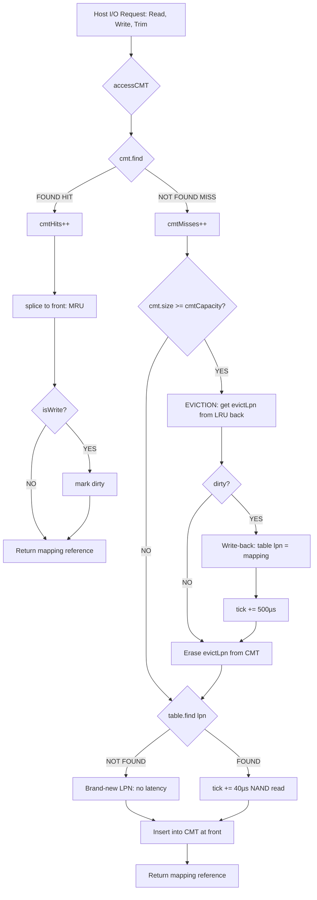

# The Cached Mapping Table (CMT): A Complete Guide

*Based on the DFTL paper (Gupta et al., ASPLOS '09) and the SimpleSSD implementation in `simplessd/ftl/page_mapping.cc`.*

---

## Table of Contents

1. [The Problem CMT Solves](#1-the-problem-cmt-solves)
2. [The GMT: What Exists Without CMT](#2-the-gmt-what-exists-without-cmt)
3. [DFTL: The Idea That Motivates CMT](#3-dftl-the-idea-that-motivates-cmt)
4. [CMT as a Hardware Cache Analogy](#4-cmt-as-a-hardware-cache-analogy)
5. [The CMT Data Structures, Explained Completely](#5-the-cmt-data-structures-explained-completely)
6. [The LRU Algorithm: Every Step, Every Case](#6-the-lru-algorithm-every-step-every-case)
7. [The accessCMT Function: A Line-by-Line Walkthrough](#7-the-accesscmt-function-a-line-by-line-walkthrough)
8. [Dirty vs. Clean: What It Means and Why It Matters](#8-dirty-vs-clean-what-it-means-and-why-it-matters)
9. [The Two Latency Penalties](#9-the-two-latency-penalties)
10. [How the I/O Paths Use the CMT](#10-how-the-io-paths-use-the-cmt)
11. [How Garbage Collection Interacts with CMT](#11-how-garbage-collection-interacts-with-cmt)
12. [The Statistics: What Each Number Tells You](#12-the-statistics-what-each-number-tells-you)
13. [CMT Capacity: How Size Affects Everything](#13-cmt-capacity-how-size-affects-everything)
14. [Edge Cases and Their Handling](#14-edge-cases-and-their-handling)
15. [Design Trade-Offs and the CMT Design Space](#15-design-trade-offs-and-the-cmt-design-space)
16. [Common Misconceptions](#16-common-misconceptions)
17. [Quick Reference: The Complete Flow Diagram](#17-quick-reference-the-complete-flow-diagram)

---

## 1. The Problem CMT Solves

You already know address translation: the FTL maintains a table that maps Logical Page Numbers (LPNs) issued by the host to Physical Page Numbers (PPNs) on NAND flash. Every single read or write from the host requires one such lookup before the actual data I/O can happen.

Now think about the size of that table.

A **128 GB SSD** with **4 KB pages** has:

$$\frac{128 \times 1024 \times 1024 \text{ KB}}{4 \text{ KB}} = 33{,}554{,}432 \text{ logical pages}$$

At 8 bytes per entry (4 bytes for LPN, 4 bytes for PPN), the full mapping table occupies:

$$33{,}554{,}432 \times 8 \text{ bytes} = 268 \text{ MB of DRAM}$$

For a 64 GB SSD it's 128 MB. For a 1 TB SSD it's over 2 GB.

> [!IMPORTANT]
> **The Core Tension in SSD Design:**
> - The FTL **must** consult the mapping table on every I/O.
> - The mapping table is **too large** to fit entirely in the small, expensive SRAM inside the SSD controller.
> - NAND flash is **where the SSD stores data** — it is slow for random accesses and cannot be overwritten in place.
> - DRAM on the SSD controller is expensive, consumes power, and is sized in the tens to hundreds of megabytes, not gigabytes.

**Three approaches exist:**

| Approach | Where the map lives | Problem |
|---|---|---|
| **Page-level mapping** (DFTL style) | NAND flash, small cache in DRAM | Cache misses are expensive (extra NAND read) |
| **Block-level mapping** | Controller DRAM | Poor performance on random writes (needs read-modify-write) |
| **Hybrid mapping** | Mixed | Complexity, inconsistent performance |

The CMT is the cache that makes **page-level mapping practical**. It holds the hot, recently used subset of the Global Mapping Table in fast controller DRAM, so most lookups are served without touching NAND.

---

## 2. The GMT: What Exists Without CMT

Before CMT exists in the picture, understand the **Global Mapping Table (GMT)**.

In SimpleSSD, the GMT is this data structure:

```cpp
std::unordered_map<uint64_t, std::vector<std::pair<uint32_t, uint32_t>>> table;
//                 ^LPN       ^per-IO-unit: (physical block index, page index)
```

In a real SSD, the GMT would be stored on NAND flash as a set of **translation pages** — special flash pages that contain nothing but mapping table entries. On a 64 GB SSD with 4 KB pages, the entire GMT would take up approximately 32,768 translation pages (128 MB / 4 KB).

> [!NOTE]
> **In SimpleSSD (the simulator)**, the GMT is kept in simulator host RAM — not because that's how a real SSD works, but because the simulator needs to track ground truth. The CMT is then overlaid on top of this simulator's GMT to model what a real SSD controller would do with its limited SRAM/DRAM translation cache.

Every time the CMT does not have a mapping (a "miss"), it consults the GMT — and on a real SSD, consulting the GMT means reading a translation page from NAND flash. This is the penalty the CMT is designed to absorb.

---

## 3. DFTL: The Idea That Motivates CMT

**DFTL** stands for **Demand-based Flash Translation Layer**, from this paper:

> Gupta, A., Kim, Y., & Urgaonkar, B. (2009). DFTL: A Flash Translation Layer Employing Demand-based Selective Caching of Page-level Address Mappings. *ASPLOS '09*.

The key insight of DFTL is simple and powerful:

> *Most workloads have a working set — a subset of logical addresses that are accessed repeatedly while the rest are rarely touched. If you cache only the mappings for the working set, you get most of the performance benefit of full DRAM mapping at a fraction of the cost.*

This is exactly the same insight as CPU caching: you do not need all of main memory in L1 cache. You just need the hot pages.

DFTL formalizes this with a demand-paged mapping cache:
- The full GMT lives on NAND flash as translation pages.
- A small cache (the CMT) in controller DRAM holds recently used entries.
- On a cache **miss**, the SSD controller reads the relevant translation page from NAND flash into the CMT (paying a NAND read latency penalty).
- On a cache **eviction** of a modified entry, the controller writes the translation page back to NAND flash (paying a NAND program latency penalty).
- On a cache **hit**, the lookup is served from DRAM at DRAM speed — effectively free compared to NAND.

This is why the DFTL miss is called a **"double read"** — the host asked for data, which requires first reading the translation page (read 1) and then reading the actual data page (read 2).

---

## 4. CMT as a Hardware Cache Analogy

The most helpful mental model for the CMT is as a hardware cache. Map every concept:

| Cache Concept | CMT Equivalent | Notes |
|---|---|---|
| Slow backing store | GMT on NAND flash | Translation pages stored in flash |
| Fast cache | CMT in controller DRAM/SRAM | Small, fast, limited capacity |
| Cache line | One mapping entry (LPN → PPN) | 8 bytes in DFTL paper |
| Cache size | `cmtCapacity` entries | Set at startup |
| Replacement policy | LRU (Least Recently Used) | Evicts the coldest entry first |
| Cache hit | `accessCMT` finds LPN in `cmt` | Zero NAND penalty |
| Cache miss | `accessCMT` does NOT find LPN | +40 µs NAND read penalty |
| Read (load) miss | Clean miss on read LPN | Load from GMT, no write-back needed |
| Write (store) miss | Miss on write LPN | Load from GMT, mark dirty |
| Dirty line | Entry modified while in cache | Needs write-back to GMT on eviction |
| Write-back policy | Dirty eviction flushes to GMT | +500 µs NAND program penalty |
| Write-through | Not used in DFTL | Would be far too expensive |
| Cold miss | LPN never seen before | No NAND penalty (nothing to load) |
| Capacity miss | CMT full, LRU victim evicted | Inevitable when working set > CMT size |
| Conflict miss | N/A | CMT is fully associative (hash map) |

> [!NOTE]
> One critical difference from CPU caches: **the CMT is fully associative**. Any LPN can be placed at any position in the CMT — there are no sets, no conflict misses. This is implemented via `std::unordered_map`, which is essentially a hash table giving O(1) lookup.

---

## 5. The CMT Data Structures, Explained Completely

### 5.1 The Entry: `CMTEntry`

```cpp
struct CMTEntry {
    std::vector<std::pair<uint32_t, uint32_t>> mapping;  // physical (block, page)
    bool dirty;  // true if modified while in cache
};
```

`mapping` is a vector of `(physical_block_index, physical_page_index)` pairs. Why a vector and not a single pair? Because of the **ioUnitInPage** feature: SimpleSSD supports sub-page I/O units (random I/O tweak), so one LPN can map to multiple physical sub-units. In the common case (`bRandomTweak = true`), this vector has one element per sub-unit. With the tweak disabled, it has exactly one element.

`dirty` is the key flag. It starts as `false` when an entry is loaded from the GMT into the CMT. It is set to `true` the moment a write operation touches this entry while it's in the cache. This flag controls whether a NAND write-back is required on eviction.

### 5.2 The LRU Ordering List: `cmtOrder`

```cpp
std::list<uint64_t> cmtOrder;  // front = MRU, back = LRU
```

This is a **doubly-linked list** of LPNs. The invariant is:

- **Front** of the list = the most recently used LPN
- **Back** of the list = the least recently used LPN (first to be evicted)

When an LPN is accessed (hit or miss), it moves to the front. When the cache is full and a new entry must be inserted, the LPN at the back is evicted.

> [!TIP]
> Why a `std::list`? Because `std::list` supports O(1) `splice` — you can move any node to the front of the list in constant time, as long as you hold an iterator to it. This is exactly what LRU requires.

### 5.3 The Cache Store: `cmt`

```cpp
std::unordered_map<uint64_t,
    std::pair<CMTEntry, std::list<uint64_t>::iterator>> cmt;
// Key: LPN
// Value: (CMTEntry with mapping + dirty flag,
//         iterator into cmtOrder pointing to this LPN's node)
```

This is the heart of the entire CMT. It maps each LPN to:
1. Its `CMTEntry` (the actual mapping data + dirty bit)
2. An **iterator into `cmtOrder`** pointing to exactly where this LPN sits in the ordering list

The iterator is the key to O(1) LRU. When an LPN gets a cache hit:
- You look it up in `cmt` — O(1) hash table lookup
- You retrieve the iterator from the value
- You call `cmtOrder.splice(cmtOrder.begin(), cmtOrder, iterator)` — O(1) move to front
- Done. No searching, no scanning.

Without storing the iterator, moving an element to the front would require O(n) list traversal to find it first.

### 5.4 Capacity Fields

```cpp
uint64_t cmtCapacity;         // max entries the cache can hold
uint64_t cmtMissLatency;      // picoseconds added to tick on a cold/warm miss
uint64_t cmtWriteBackLatency; // picoseconds added to tick on a dirty eviction
```

`cmtCapacity` is set in the constructor from config:
```cpp
float cmtRatio = conf.readFloat(CONFIG_FTL, FTL_CMT_CAPACITY_RATIO);
if (cmtRatio > 0.0f) {
    // Option 1: fraction of total logical pages
    cmtCapacity = (uint64_t)((float)status.totalLogicalPages * cmtRatio);
} else {
    // Option 2: explicit byte budget → entries = bytes / 8
    uint64_t cmtBytes = conf.readUint(CONFIG_FTL, FTL_CMT_CAPACITY_BYTES);
    cmtCapacity = cmtBytes / 8;
}
if (cmtCapacity < 16) cmtCapacity = 16;  // minimum guard
```

The division by 8 reflects the DFTL paper's model: each mapping entry is 4B LPN + 4B PPN = 8 bytes. This is the *modeled* memory size (how much DRAM the real hardware would use), not the in-simulator object size (which is much larger due to C++ overhead).

---

## 6. The LRU Algorithm: Every Step, Every Case

LRU (Least Recently Used) is the replacement policy: when the cache is full and a new entry must be added, the entry that has not been used for the longest time is evicted. Let's walk through every scenario from scratch.

### 6.1 Starting State

Imagine the CMT has capacity 4 and is currently empty:

```
cmtOrder (front → back): [ ]
cmt: { }
```

### 6.2 Cold Miss: First Access to an LPN

Host requests LPN 10 (a read). LPN 10 has never been written — it's a brand-new page.

```
cmtOrder.push_front(10) → [10]
cmt[10] = {mapping: [sentinel], dirty: false, iter: points to 10 in cmtOrder}
```

State after:
```
cmtOrder: [10]
cmt: {10: {sentinel, clean}}
```

Penalty: **zero** — there is no translation page on NAND to fetch for a brand-new LPN.

### 6.3 Miss on Existing LPN

Host requests LPN 20 (a read). LPN 20 was written before — it exists in the GMT.

```
cmtOrder.push_front(20) → [20, 10]
cmt[20] = {mapping: [block5, page3], dirty: false, iter: points to 20}
tick += cmtMissLatency  // +40 µs: had to read translation page from NAND
```

State after:
```
cmtOrder: [20, 10]   ← 20 is MRU, 10 is LRU
cmt: {10: {sentinel, clean}, 20: {block5/page3, clean}}
```

### 6.4 Cache Hit: Same LPN Accessed Again

Host requests LPN 20 again (another read).

`cmt.find(20)` succeeds. We retrieve the stored iterator. We call:
```cpp
cmtOrder.splice(cmtOrder.begin(), cmtOrder, it->second.second);
```

What `splice` does here: it detaches the node containing `20` from wherever it is in `cmtOrder` and re-inserts it at the front. The iterator `it->second.second` still points to the same node — it is not invalidated by `splice`.

State after (LPN 20 moves to front, cost: O(1)):
```
cmtOrder: [20, 10]   ← same order since 20 was already MRU
cmt: same
tick += 0  ← no NAND penalty
```

Penalty: **zero** — the entry was already in DRAM.

### 6.5 Write Hit: LPN Already in CMT, Now Written

Host writes to LPN 10. `cmt.find(10)` succeeds.

```cpp
cmtOrder.splice(cmtOrder.begin(), cmtOrder, it->second.second);
// 10 is now at front (MRU)
if (isWrite) {
    it->second.first.dirty = true;  // mark dirty
}
```

State after:
```
cmtOrder: [10, 20]   ← 10 moved to front
cmt: {10: {mapping, DIRTY}, 20: {mapping, clean}}
```

No NAND penalty. But now LPN 10's entry carries a dirty flag — meaning when this entry is eventually evicted, we must write it back to the GMT (which on real hardware costs a NAND program operation).

### 6.6 Cache Full: Insertion Requiring Eviction

The cache now has capacity 4. Let's add LPN 30, 40, 50 — filling it up:

```
cmtOrder: [50, 40, 30, 20]    ← 10 and 20 got replaced, let's say these are the current entries
cmt: {50, 40, 30, 20}
```

Actually let me use a concrete sequence. After the above, suppose we then access 30, 40, 50 in order (misses):

```
After LPN 30 miss: cmtOrder: [30, 10, 20]
After LPN 40 miss: cmtOrder: [40, 30, 10, 20]  ← cache now FULL (capacity=4)
```

Now host accesses LPN 50 (a miss). The cache is full. We must evict.

**LRU eviction: the back of cmtOrder is the victim.**

```
evictLpn = cmtOrder.back() = 20
evictIt = cmt.find(20)
```

LPN 20 is **clean** (it was a read, never written). So no write-back needed.

```
cmtOrder.pop_back()     → [40, 30, 10]
cmt.erase(evictIt)      → removes LPN 20 from cache
stat.cmtEvictions++
// No dirty eviction, no NAND program needed
```

Now we insert LPN 50:
```
cmtOrder.push_front(50) → [50, 40, 30, 10]
cmt[50] = {mapping, clean}
tick += cmtMissLatency   // +40 µs: had to read from NAND
```

State after:
```
cmtOrder: [50, 40, 30, 10]  ← LPN 20 gone, LPN 50 is new MRU
```

### 6.7 Dirty Eviction: The Expensive Case

Now suppose host writes to LPN 10 (currently at back = LRU):
```
Hit: cmtOrder → [10, 50, 40, 30]  (10 moved to front)
cmt[10].dirty = true
```

Then the host does a bunch of accesses to 11, 12, 13, 14 (new LPNs):
```
After misses for 11, 12, 13, 14:
cmtOrder: [14, 13, 12, 11, 10, 50, 40, 30]... 
```

Wait, capacity is 4. Each miss triggers an eviction. Let's trace:

**Access LPN 11 (miss, cache full):**
- Evict LRU = LPN 30 (assume clean) → no write-back, stat.cmtEvictions++
- Insert 11: `cmtOrder: [11, 10, 50, 40]`

**Access LPN 12 (miss, cache full):**
- Evict LRU = LPN 40 (assume clean) → no write-back
- Insert 12: `cmtOrder: [12, 11, 10, 50]`

**Access LPN 13 (miss, cache full):**
- Evict LRU = LPN 50 (assume clean) → no write-back
- Insert 13: `cmtOrder: [13, 12, 11, 10]`

**Access LPN 14 (miss, cache full):**
- Evict LRU = LPN 10 — **THIS ONE IS DIRTY**
- `table[10] = cmt[10].mapping` — flush the modified physical address back to GMT
- `stat.cmtDirtyEvictions++`
- `stat.cmtWritebacks++`
- `tick += cmtWriteBackLatency` — **+500 µs NAND program penalty**
- Erase LPN 10 from cmt
- Insert 14: `cmtOrder: [14, 13, 12, 11]`

> [!WARNING]
> This 500 µs penalty is the most expensive thing the CMT can do. On a real SSD, this corresponds to the controller having to:
> 1. Identify which translation page contains LPN 10's entry
> 2. Read that translation page (it can't overwrite in place — NAND)
> 3. Modify the entry for LPN 10 in a DRAM buffer
> 4. Write the updated translation page to a new physical location
> 5. Update the metadata that records where that translation page now lives
>
> That chain is expensive, which is why `cmtWriteBackLatency = 500,000,000 ps = 500 µs` — roughly the MLC NAND page program time.

---

## 7. The `accessCMT` Function: A Line-by-Line Walkthrough

This is the single most important function in the CMT implementation. All reads, writes, and trims pass through it:

```cpp
std::vector<std::pair<uint32_t, uint32_t>> &
PageMapping::accessCMT(uint64_t lpn, bool isWrite, uint64_t &tick, bool isGC)
```

Parameters:
- `lpn`: The logical page number being looked up
- `isWrite`: If true, the entry will be marked dirty (this is a write operation)
- `tick`: The simulation clock (picoseconds) — modified in place to add penalties
- `isGC`: If true, stats go to the GC counters, not user I/O counters

Returns: A **reference** to the mapping vector. This is critical — the caller gets a direct reference into the CMT's data, so any modification (like updating block/page indices during GC) immediately updates the CMT entry. No copy, no round-trip.

### Full annotated code:

```cpp
std::vector<std::pair<uint32_t, uint32_t>> &
PageMapping::accessCMT(uint64_t lpn, bool isWrite, uint64_t &tick, bool isGC) {
  auto it = cmt.find(lpn);
```
O(1) hash table lookup. `it` is either a valid iterator to the entry or `cmt.end()`.

```cpp
  // ── CACHE HIT ──
  if (it != cmt.end()) {
    if (isGC) {
      stat.cmtGCHits++;
    } else {
      stat.cmtHits++;
    }
```
We found the LPN. Increment the right counter. GC hits are separated because they aren't caused by host I/O — they're the FTL doing internal housekeeping. Mixing them into the user hit rate would make the cache look better than it is.

```cpp
    // Move to front of LRU list (most recently used)
    cmtOrder.splice(cmtOrder.begin(), cmtOrder, it->second.second);
```
`it->second.second` is the stored `std::list<uint64_t>::iterator` pointing to this LPN's node in `cmtOrder`. `splice(pos, list, iter)` moves the node at `iter` to just before `pos` (which is `cmtOrder.begin()`). Result: this LPN is now at the front. O(1).

```cpp
    // Mark dirty if this is a write
    if (isWrite) {
      it->second.first.dirty = true;
    }
```
If the caller is a write operation, this entry is now modified relative to the GMT. The dirty bit will cause a write-back penalty when this entry is eventually evicted.

```cpp
    return it->second.first.mapping;
  }
```
Return a reference to the mapping data. The caller can then use this to:
- For reads: find out which physical block/page to issue the read to
- For writes: update the physical block/page after allocating new flash space
- For GC copies: update the physical address to the new location

---

```cpp
  // ── CACHE MISS ──
  if (isGC) {
    stat.cmtGCMisses++;
  } else {
    stat.cmtMisses++;
  }
```
LPN not found. Increment the miss counter.

---

```cpp
  // Eviction: is the cache full?
  if (cmt.size() >= cmtCapacity) {
    uint64_t evictLpn = cmtOrder.back();

    auto evictIt = cmt.find(evictLpn);
    if (evictIt != cmt.end()) {
      cmtOrder.pop_back();  // safe: we confirmed the entry exists
      stat.cmtEvictions++;
```
The LRU victim is always at the back of `cmtOrder`. We find it in the map to get its `CMTEntry`, then pop it from the list.

```cpp
      if (evictIt->second.first.dirty) {
        table[evictLpn] = evictIt->second.first.mapping;
        stat.cmtDirtyEvictions++;
        stat.cmtWritebacks++;
        tick += cmtWriteBackLatency;  // +500 µs NAND program
      }
```
If the entry is dirty, flush it to GMT (`table`). This is the write-back. The `table[evictLpn] = ...` line updates the GMT with the latest physical address. On real hardware this is a NAND translation page program operation, so we pay `cmtWriteBackLatency`.

```cpp
      cmt.erase(evictIt);
    }
  }
```
Remove the evicted entry from the cache map.

---

```cpp
  // Load from GMT
  auto gmtIt = table.find(lpn);

  if (gmtIt == table.end()) {
    // Brand-new LPN: create a sentinel entry in GMT
    auto ret = table.emplace(
        lpn,
        std::vector<std::pair<uint32_t, uint32_t>>(
            bitsetSize, {param.totalPhysicalBlocks, param.pagesInBlock}));
    gmtIt = ret.first;
    // NO latency penalty — nothing on NAND to fetch
  } else {
    // Existing LPN: had to read translation page from NAND
    tick += cmtMissLatency;  // +40 µs NAND read
  }
```

Two sub-cases:
- **Brand new LPN**: `table.find(lpn)` returns `end()`. We create a sentinel entry with invalid physical addresses (`totalPhysicalBlocks` and `pagesInBlock` are out-of-range sentinel values — the actual mapping will be filled in by `writeInternal` immediately after). Zero penalty — there's no translation page on NAND yet.
- **Existing LPN**: The GMT has an entry. On real hardware, this means reading the translation page containing LPN's entry from NAND flash. We model this with `+cmtMissLatency`.

---

```cpp
  // Insert into CMT at front (MRU position)
  cmtOrder.push_front(lpn);
  auto insertResult = cmt.emplace(
      lpn,
      std::make_pair(CMTEntry{gmtIt->second, isWrite}, cmtOrder.begin()));

  return insertResult.first->second.first.mapping;
}
```

`push_front` adds the new LPN to the front of the ordering list. Then we insert into the `cmt` map, storing:
- The `CMTEntry` initialized with the GMT's mapping data and `dirty = isWrite` (if this is a write miss, the entry is immediately dirty)
- `cmtOrder.begin()` — the iterator pointing to the node we just pushed to front

Finally, return a reference to the new entry's mapping. The caller can now use this reference to update the physical address.

---

## 8. Dirty vs. Clean: What It Means and Why It Matters

The dirty bit is perhaps the most important concept in cache design. In the CMT context:

### When does an entry become dirty?

An entry becomes dirty the moment a **write operation** (either from the host or from GC) is the reason it's in the CMT. This happens in two places:

**1. Write hit** (entry already in cache):
```cpp
if (isWrite) {
    it->second.first.dirty = true;
}
```

**2. Write miss** (entry loaded from GMT during a write):
```cpp
CMTEntry{gmtIt->second, isWrite}
// if isWrite=true, dirty is set to true immediately on insertion
```

### What does dirty mean physically?

It means: **the physical address stored in the CMT is more up-to-date than what the GMT (on NAND) knows**.

Here's why: when you write to a logical page, the FTL allocates a new physical page (NAND is append-only). The old physical page is invalidated. The CMT entry is immediately updated to point to the new physical location. But the GMT — which stores the same mapping on NAND — still points to the old location.

```
Before write:
  GMT[LPN 42] = {block 10, page 5}    ← on NAND flash
  CMT[LPN 42] = {block 10, page 5}    ← in DRAM, CLEAN

After write (new physical location: block 15, page 0):
  GMT[LPN 42] = {block 10, page 5}    ← still old! NOT updated yet
  CMT[LPN 42] = {block 15, page 0}    ← new! DIRTY
```

The GMT on NAND is now **stale**. If this entry is evicted from the CMT **before** a write-back, and later a miss occurs for LPN 42, the miss would load the stale entry from the GMT and return **the wrong physical address**, causing a data corruption error.

> [!CAUTION]
> **This is why the write-back is non-negotiable.** Every dirty eviction must flush the CMT's version to the GMT before erasing the CMT entry.

### What does clean mean?

A clean entry means: the GMT and the CMT have identical data for this LPN. If a clean entry is evicted, no write-back is needed — the GMT is already authoritative.

Clean entries are created when:
- A read miss brings a mapping into the CMT (loaded from GMT → identical)
- A brand-new LPN is created (sentinel in both GMT and CMT simultaneously)

### The dirty eviction ratio: what it tells you

In the simulation output, you see `cmt.dirty_evictions / cmt.evictions`. This ratio tells you what fraction of evictions required an expensive NAND program operation.

- **Pure random read workload**: ~10% dirty evictions (only GC writes cause dirty entries)
- **Pure random write workload**: ~100% dirty evictions (every single eviction costs 500 µs)
- **Mixed 50/50 rw**: ~70% dirty evictions (writes dominate)

This is one of the most impactful characteristics of write-heavy workloads on SSD: not only are writes expensive because they allocate new flash space, they also contaminate the translation cache with dirty entries that trigger expensive write-backs on eviction.

---

## 9. The Two Latency Penalties

### 9.1 CMT Miss Latency (`cmtMissLatency = 40 µs`)

**When it fires:** When a miss occurs and the LPN **already exists** in the GMT (i.e., it was written before, so there's a translation page on NAND).

**What it models:** The SSD controller must read the translation page containing LPN's entry from NAND flash. This is a full NAND page read.

- MLC NAND LSB read: ~40–100 µs (SimpleSSD uses 40 µs)
- TLC NAND read: ~100–200 µs
- SLC NAND read: ~25–50 µs

**Why it's called a "double read":** The host asked for data. Normally that's one NAND read. With a CMT miss, you need to:
1. Read the translation page from NAND (40 µs) → to find out **where** the data is
2. Read the actual data page from NAND (~40–100 µs) → to get the data

Total: ~80 µs for what should have been a 40 µs operation. Double the cost.

**When it does NOT fire:**
- On a cache hit (mapping was already in DRAM)
- On a brand-new LPN (no translation page exists yet)

### 9.2 CMT Write-Back Latency (`cmtWriteBackLatency = 500 µs`)

**When it fires:** When a **dirty** entry is evicted from the CMT.

**What it models:** The SSD controller must write the updated translation page back to NAND flash. NAND flash program operations are much slower than reads.

- MLC NAND LSB program: ~500–800 µs (SimpleSSD uses 500 µs)
- TLC NAND program: ~1–3 ms
- SLC NAND program: ~100–300 µs

**Why it's so much more expensive than a miss:** NAND flash program operations are inherently slower than read operations. Additionally, the controller may need to read-modify-write the translation page (since it can't partially program a flash page), adding more latency.

**The compound effect:** In a write-heavy workload where the CMT is under pressure (small CMT, large working set), you can have nearly every eviction be dirty. With 726,981 dirty evictions (as seen in the `randwrite 1G cmt0.01` experiment), the total write-back overhead is:

$$726{,}981 \times 500 \text{ µs} = 363.5 \text{ seconds}$$

...worth of NAND program operations just for translation metadata — before even counting the actual data writes.

### 9.3 Where these latencies are applied in the simulation

The `tick` variable in SimpleSSD represents the simulation timestamp in picoseconds. All I/O operations advance `tick` by their latency. `accessCMT` modifies `tick` in place:

```cpp
// On existing-LPN miss:
tick += cmtMissLatency;         // 40,000,000 ps = 40 µs

// On dirty eviction:
tick += cmtWriteBackLatency;    // 500,000,000 ps = 500 µs
```

These penalties directly increase the completion time of the I/O request, which shows up as increased latency in the simulation output.

---

## 10. How the I/O Paths Use the CMT

### 10.1 Read Path (`readInternal`)

```cpp
void PageMapping::readInternal(Request &req, uint64_t &tick) {
  // Step 1: Get physical address via CMT
  auto &mappingData = accessCMT(req.lpn, false, tick);
  //                                      ^^^^^ isWrite=false → won't mark dirty
```

The read path calls `accessCMT` with `isWrite = false`. This means:
- Hit: O(1) DRAM lookup, splice to front, return reference. Zero NAND penalty.
- Miss (existing): +40 µs NAND read to load translation page.
- Miss (new LPN): Zero penalty. But a brand-new LPN has no data on flash either, so the read returns nothing meaningful.

After the CMT call:
```cpp
  // Step 2: Validate the mapping
  bool hasValidMapping = false;
  for (uint32_t idx = 0; idx < bitsetSize; idx++) {
    if (mappingData.at(idx).first < param.totalPhysicalBlocks) {
      hasValidMapping = true;
      break;
    }
  }
```

The sentinel values (`totalPhysicalBlocks`, `pagesInBlock`) are used as "unmapped" markers. If the physical block index is `>= totalPhysicalBlocks`, there's no valid mapping — this LPN was never written.

```cpp
  if (hasValidMapping) {
    // Step 3: Issue actual NAND read to PAL layer
    pPAL->read(palRequest, beginAt);
  }
```

The physical address from the CMT is used to issue the NAND read. The DRAM read for the mapping data itself is also modeled (because the mapping data in the CMT lives in controller DRAM, and reading from DRAM has a small latency too).

### 10.2 Write Path (`writeInternal`)

```cpp
void PageMapping::writeInternal(Request &req, uint64_t &tick, bool sendToPAL) {
  // Step 1: Get physical address via CMT — marks dirty immediately
  auto &mappingData = accessCMT(req.lpn, true, tick);
  //                                     ^^^^ isWrite=true → marks dirty on hit or miss
```

The write path calls with `isWrite = true`. This is critical: whether the entry was already in the cache (hit) or just loaded (miss), it is immediately marked dirty because we're about to modify the physical address.

```cpp
  // Step 2: Invalidate the old physical page (if LPN was written before)
  if (hadPreviousMapping) {
    block->second.invalidate(mapping.second, idx);
  }
```

If LPN was written before, its old physical page must be invalidated (so GC knows that page's space is reclaimable).

```cpp
  // Step 3: Allocate a new free physical page
  block = blocks.find(getLastFreeBlock(req.ioFlag));
  
  // Step 4: Update the CMT entry with the new physical address
  mapping.first = block->first;   // new block index
  mapping.second = pageIndex;     // new page index
```

Here, `mapping` is a **reference** into the CMT (returned by `accessCMT`). Assigning to `mapping.first` and `mapping.second` directly updates the CMT entry in place. No copy, no separate update step. The dirty bit was already set in step 1.

### 10.3 Trim Path (`trimInternal`)

```cpp
void PageMapping::trimInternal(Request &req, uint64_t &tick) {
  auto &mappingData = accessCMT(req.lpn, false, tick);
  // isWrite=false: trim is about invalidation, not writing new data
```

After finding the mapping and invalidating the physical page:
```cpp
  // Explicitly remove from CMT (LPN is now invalid, future lookups should miss)
  auto cmtIt = cmt.find(req.lpn);
  if (cmtIt != cmt.end()) {
    cmtOrder.erase(cmtIt->second.second);  // remove from LRU list
    cmt.erase(cmtIt);                      // remove from cache map
  }
  // Also remove from GMT
  table.erase(req.lpn);
```

Trim is different from read/write — after a trim, the LPN should no longer exist in the mapping. So unlike read/write (which just use the CMT for a lookup), trim explicitly removes the entry from both the CMT and GMT. This prevents stale hits for future accesses to the same LPN.

---

## 11. How Garbage Collection Interacts with CMT

Garbage collection (GC) is the process of reclaiming physical space by compacting valid pages from nearly-empty flash blocks and then erasing those blocks. During GC, valid pages must be **moved** to new physical locations, which means their mappings must be updated.

Before CMT, GC would update the GMT directly. With CMT, this is a problem: if a GC'd LPN is currently in the CMT, the CMT has the old physical address. If GC updates the GMT directly but leaves the CMT stale, the next host access to that LPN would get a CMT hit with the **old, now-invalid physical address**.

> [!IMPORTANT]
> **The fix is that GC also goes through `accessCMT`:**
> ```cpp
> // In doGarbageCollection:
> auto &gcMappingData = accessCMT(lpns.at(idx), true, tick, true);
> //                                              ^^^^       ^^^^ isGC=true
> //                                    isWrite=true (we're updating the physical address)
> 
> auto &mapping = gcMappingData.at(idx);
> mapping.first = newBlockIdx;    // update physical block in CMT
> mapping.second = newPageIdx;    // update physical page in CMT
> ```

By calling `accessCMT` with `isWrite=true`:
1. If the LPN is in the CMT: the CMT entry is updated directly in-place (the returned reference is used to store the new physical address). The entry is marked dirty (it now differs from the GMT). On the next eviction, the updated GMT will be written to NAND.
2. If the LPN is NOT in the CMT: it's loaded from the GMT (paying the miss latency penalty), then immediately updated. The entry is dirty from the start.

The `isGC = true` parameter routes statistics to `cmtGCHits`/`cmtGCMisses` instead of the user counters. This is important because:
- GC is not host I/O — it's internal FTL traffic
- Including GC misses in the user hit rate would make the cache look much worse than it really is for host workloads
- Real SSD performance papers separate GC overhead from host-visible latency

### Why GC can cause disproportionate CMT pressure

Think about what GC does: it touches **many different LPNs** scattered across a victim block. These LPNs are cold (they haven't been written recently — that's why they're being GC'd). Cold LPNs are very likely **not** in the CMT.

Result: GC generates a burst of CMT misses that evict hot user LPNs from the cache. After GC, the CMT's working set has been partially replaced with cold GC LPNs, degrading user-facing hit rates temporarily.

This is a known pathology in DFTL implementations and one of the active research areas in FTL design. The SimpleSSD CMT handles it correctly by tracking GC traffic separately.

---

## 12. The Statistics: What Each Number Tells You

### 12.1 `cmt.hits`

Incremented by `stat.cmtHits++` on every user-I/O-triggered CMT lookup that finds the LPN already in the cache.

**What it tells you:** How many translation lookups were served from fast DRAM without any NAND access overhead.

### 12.2 `cmt.misses`

Incremented on every user-I/O-triggered CMT lookup that does NOT find the LPN.

**What it tells you:** How many times the host was forced to wait for a translation page to be loaded from NAND. Each miss added at least 40 µs to the I/O latency.

### 12.3 `cmt.hit_rate`

```
hit_rate = cmtHits / (cmtHits + cmtMisses) × 100%
```

This is the most important single metric for evaluating CMT performance. Higher is better.

**What a low hit rate means:** The CMT is too small for the workload's working set, OR the access pattern is so random that there is no temporal locality to exploit.

> [!WARNING]
> **Critical caveat:** A high hit rate is not always meaningful. If the CMT is larger than the active working set, it will never evict anything and hit rate approaches 100%. This is "trivially high" — the cache is just not being challenged. You must also check `cmt.evictions` to confirm the cache is actually under pressure.

### 12.4 `cmt.evictions`

Total number of LRU evictions. Each eviction means the cache was full when a new entry was needed.

**What zero evictions means:** The active working set fit entirely in the CMT. The cache was never under pressure. A high hit rate in this case is trivially correct and not a reflection of good cache design.

**What many evictions means:** The working set is larger than the CMT. Evictions are happening constantly. Hit rate is genuinely meaningful.

### 12.5 `cmt.dirty_evictions`

The subset of evictions where the evicted entry was dirty (had been written to while in cache).

**What it tells you:** How many evictions required a NAND write-back (500 µs penalty). This is the primary source of CMT-related write amplification in the FTL.

**The ratio `dirty_evictions / evictions`:**
- Near 0% → mostly read workload, or CMT is large enough that dirty entries are hit again before eviction
- Near 100% → write-heavy workload, or working set much larger than CMT (dirty entries cycle through quickly)

### 12.6 `cmt.writebacks`

In the current implementation, `cmtWritebacks == cmtDirtyEvictions` — each dirty eviction triggers exactly one write-back. They are tracked separately for potential future use (e.g., if batched write-backs were implemented, writebacks could be less than dirty evictions).

### 12.7 `cmt.gc_hits` / `cmt.gc_misses`

GC-triggered CMT accesses, separated from user I/O.

**What gc_misses tells you:** How much additional NAND read latency GC is causing just to update translation mappings. High gc_misses means GC is touching many cold LPNs not currently in the cache.

### 12.8 `cmt.capacity`

The `cmtCapacity` value set at startup. Constant throughout simulation.

### 12.9 `cmt.occupancy`

`cmt.size()` at the time statistics are reported.

**What it tells you:** How full the cache is. If `occupancy < capacity`, the cache has never been full — no evictions have occurred. If `occupancy == capacity`, the cache is saturated.

### Reading a Stats Block: A Real Example

```
cmt.hits              17976        ← 17,976 lookups served from DRAM
cmt.misses           727226        ← 727,226 lookups required NAND reads
cmt.hit_rate          2.41%        ← extremely low: CMT is overwhelmed
cmt.evictions        726981        ← almost every miss triggered an eviction
cmt.dirty_evictions  726981        ← 100%: every eviction was dirty (pure write)
cmt.writebacks       726981        ← one write-back per dirty eviction
cmt.capacity            245        ← only 245 entries (1% ratio config)
cmt.occupancy           245        ← fully saturated throughout
```

**Interpretation of the above (randwrite 1G, 1% CMT):**

- 245-entry CMT trying to serve a 1 GB random write workload where unique LPNs number in the hundreds of thousands → catastrophic thrashing
- 2.41% hit rate means 97.6% of writes paid a 40 µs NAND read penalty + 500 µs write-back penalty
- Since it's pure writes, 100% of evictions are dirty
- The 500 µs write-back dominates: `726,981 × 500 µs = 363 seconds` of write-back overhead

Compare to `randread 1G, 10% CMT`:
```
cmt.hits              25481
cmt.misses           262983
cmt.hit_rate           8.83%
cmt.evictions        260526
cmt.dirty_evictions   27033     ← only 10.4%: mostly reads, few writes
cmt.capacity           2457     ← 10× larger CMT
```
Here, most evictions are clean — no write-back penalty. Hit rate is still low (8.83%) because 1 GB random reads over a large footprint still thrash even a 10% CMT. But the dirty eviction ratio is only 10.4%, so total write-back overhead is much lower.

---

## 13. CMT Capacity: How Size Affects Everything

### 13.1 The Coverage Concept

A CMT with `N` entries can hold mappings for `N × 4KB = N × 4096 bytes` worth of logical address space. For example:

| CMT Entries | Address Coverage | Required Config |
|---|---|---|
| 245 | ~1 MB | 1% ratio on small SSD |
| 2,457 | ~10 MB | 10% ratio on small SSD |
| 262,144 | ~1 GB | 2 MB `CMTCapacityBytes` |
| 2,621,440 | ~10 GB | 20 MB `CMTCapacityBytes` |

For the CMT to be effective, the **active working set** (the set of unique LPNs accessed within a typical interval) must be smaller than the CMT's coverage.

### 13.2 Three Regimes

**Regime 1: CMT >> Working Set (cache much larger than footprint)**

```
Working set: 1,000 unique LPNs
CMT capacity: 10,000 entries
```

Behavior: After initial cold misses, every access is a hit. Evictions never occur. Hit rate → 100%. Misleading: this doesn't mean the CMT design is good — it just means the CMT is oversized for this workload.

**Regime 2: CMT ≈ Working Set (cache roughly matches footprint)**

```
Working set: 10,000 unique LPNs
CMT capacity: 10,000–15,000 entries
```

Behavior: Some evictions occur, mostly for cold entries at the tail of the LRU list. Hit rate is high and meaningful (80–95%). This is the "sweet spot" the hardware designer aims for.

**Regime 3: CMT << Working Set (cache much smaller than footprint)**

```
Working set: 100,000 unique LPNs
CMT capacity: 245 entries
```

Behavior: Constant thrashing. Every new access evicts a recently-used entry. Hit rate approaches 0% (only temporal reuse within a very short window is captured). This is the worst case, but it's the realistic case for random I/O on large datasets with a small controller SRAM budget.

### 13.3 Why Real SSDs Have Small CMTs

Controller chips have limited on-chip SRAM/DRAM. A typical budget is:
- Consumer SSD: 512 KB – 4 MB SRAM for translation cache
- Enterprise SSD: 16 MB – 256 MB DRAM for translation cache

For a 2 TB enterprise SSD with 512 MB DRAM dedicated to translation:
```
CMT entries = 512 MB / 8 bytes = 67,108,864 entries
Coverage = 67,108,864 × 4 KB = 256 GB
```

So a 512 MB translation DRAM covers 256 GB of logical space out of 2 TB. That's 12.5% coverage. For sequential workloads: great. For fully random I/O over the entire 2 TB: still thrashing territory.

This is why the hit rate under random I/O with realistic CMT sizes is low (~2–30%), and why DFTL paper's key contribution was showing this is still better than block-level mapping in most practical workloads.

### 13.4 Ratio vs. Bytes Configuration

The two config modes serve different purposes:

**Ratio mode (`CMTCapacityRatio = 0.05`):**
```
cmtCapacity = totalLogicalPages × 0.05
```
Good for: Scaling experiments where you want a fixed percentage of address space cached regardless of SSD size. Makes results comparable across different drive capacities.

**Bytes mode (`CMTCapacityBytes = 2097152`):**
```
cmtCapacity = 2097152 / 8 = 262144 entries
```
Good for: Modeling a specific hardware configuration with a fixed DRAM/SRAM budget. Realistic for comparing against real SSD products.

---

## 14. Edge Cases and Their Handling

### 14.1 Brand-New LPN on First Write

**Situation:** Host writes to LPN 42 for the very first time.

**What happens in `accessCMT`:**
1. `cmt.find(42)` → miss (never been cached)
2. `table.find(42)` → also miss (never been written)
3. `table.emplace(42, sentinel)` — create GMT entry with invalid physical addresses
4. **No miss latency** — there's no translation page on NAND to read
5. CMT entry created with `dirty = true` (since `isWrite = true`)
6. Returned reference points to the sentinel mapping

**Back in `writeInternal`:**
1. `hadPreviousMapping = false` (sentinel physical address is out-of-range)
2. No invalidation step (nothing to invalidate)
3. New physical page allocated
4. CMT entry updated via reference: `mapping.first = newBlock; mapping.second = newPage`
5. CMT entry is now dirty with the real physical address

### 14.2 Read on Unmapped LPN

**Situation:** Host reads LPN 99, which was never written.

**What happens in `accessCMT`:**
Same as above — creates a sentinel CMT entry, no latency.

**Back in `readInternal`:**
```cpp
bool hasValidMapping = false;
for (uint32_t idx = 0; idx < bitsetSize; idx++) {
    if (mappingData.at(idx).first < param.totalPhysicalBlocks) {
        hasValidMapping = true;
        break;
    }
}
if (hasValidMapping) {
    // issue NAND read
}
// else: return zeros (undefined behavior in real hardware)
```

The sentinel physical block index `= totalPhysicalBlocks` is out-of-range → `hasValidMapping = false` → no NAND read is issued. The read request "succeeds" but returns nothing meaningful. On real SSDs, unwritten pages typically return all-0xFF or 0x00 depending on the NAND type.

### 14.3 Write After Trim

**Situation:** Host trims LPN 55, then writes to LPN 55.

After trim: LPN 55 is removed from both CMT and GMT.

On the subsequent write: `accessCMT(55, true, tick)`:
1. CMT miss (was erased)
2. GMT miss (was erased)
3. Creates new GMT entry (sentinel)
4. Creates new CMT entry (dirty)

Then `writeInternal` sees `hadPreviousMapping = false`, allocates a fresh physical page. Works correctly.

### 14.4 GC Touches an LPN Currently in CMT

**Situation:** LPN 77 is in the CMT (maybe recently written by host). GC selects the block containing LPN 77's physical page as a victim.

`accessCMT(77, true, tick, isGC=true)`:
1. **CMT hit** — LPN 77 found in cache
2. `stat.cmtGCHits++` (not user hits)
3. Splice to front (now MRU — prevents immediate re-eviction)
4. Mark dirty = true

Then GC updates:
```cpp
mapping.first = newBlockIdx;
mapping.second = newPageIdx;
```

The CMT entry now has the new physical address. The GMT still has the old address (LPN 77 is dirty in CMT). The next time LPN 77 is evicted from CMT (whether by more host I/O pressure or by `flushCMT()` at shutdown), the updated address will be written back to GMT.

This is correct and safe: the CMT is always the authoritative source of truth for any LPN it currently holds.

### 14.5 CMT Capacity = 16 (Minimum Guard)

```cpp
if (cmtCapacity < 16) cmtCapacity = 16;
```

Without a minimum guard, a misconfigured CMT with 0 entries would cause infinite loops (every access would trigger eviction of the entry we're about to insert, before we even insert it). The guard of 16 is arbitrary but safe.

---

## 15. Design Trade-Offs and the CMT Design Space

### 15.1 LRU vs. Other Replacement Policies

The SimpleSSD CMT uses pure LRU. Other policies exist:

| Policy | Pros | Cons |
|---|---|---|
| **LRU** | Simple, O(1) with list+map; good for temporal locality | Thrashes on sequential scan (all evicted at end) |
| **LFU (Least Frequently Used)** | Better for frequency-based patterns | Stale "old hot" entries linger; harder to implement |
| **ARC (Adaptive Replacement Cache)** | Balances recency + frequency automatically | More complex; 2× metadata overhead |
| **Clock (FIFO approximation)** | Simple, O(1) | Less precise than LRU |
| **DFTL-T (time-aware)** | Considers write-back cost in eviction | Complex; trades computation for fewer dirty evictions |

For a simulator, LRU is the right choice: it matches the majority of academic literature and hardware implementations.

### 15.2 Write-Through vs. Write-Back

**Write-through:** Every write immediately updates both CMT and GMT. Zero dirty evictions. But: every write to an LPN costs a NAND program for the translation page immediately — terrible for write performance.

**Write-back (what DFTL/SimpleSSD uses):** Updates accumulate in CMT; GMT updated only on dirty eviction. Dirty evictions are expensive (500 µs each), but far less frequent than individual writes. Much better overall throughput.

The DFTL paper shows write-back is ~3–5× better than write-through in write-heavy workloads because many writes to the same LPN will be accumulated and only one flush is needed per LPN per eviction cycle.

### 15.3 Granularity: Per-LPN vs. Per-Translation-Page

SimpleSSD's CMT caches at per-LPN granularity (one entry = one LPN). In real hardware, the unit is typically a **translation page** — one NAND page full of mapping entries.

| Granularity | Pros | Cons |
|---|---|---|
| **Per-LPN** | Minimal metadata; fine-grained | One miss = read whole translation page but only cache one entry |
| **Per-translation-page** | Spatial locality; one miss loads many entries | Wastes cache on unused entries; more complex implementation |

SimpleSSD's per-LPN model is simpler but slightly pessimistic: in reality, loading one translation page would give you ~512 LPN mappings (for 4 KB pages, 8 bytes each). The per-LPN model ignores this spatial locality benefit.

### 15.4 Unified vs. Separate User/GC Cache

SimpleSSD uses a **unified** CMT: both host I/O and GC share the same cache. An alternative is to reserve a separate partition of the CMT for GC, preventing GC from evicting hot user entries.

| Design | Pros | Cons |
|---|---|---|
| **Unified (SimpleSSD)** | Simple; natural LRU across all accesses | GC can thrash user entries |
| **Partitioned** | Protects user working set from GC bursts | Wastes capacity when GC is idle |
| **GC-bypassing** | GC writes directly to GMT, never enters CMT | CMT may have stale entries if GC moves LPNs | 

GC-bypassing is actually dangerous (potential stale hits) and requires explicit cache invalidation — essentially what the fix to `format()` did.

---

## 16. Common Misconceptions

### Misconception 1: "A high hit rate always means the CMT is working well"

**Wrong.** As established in the validation experiments, a 16 MB CMT on a workload that only touches 3.14 GB of unique LPNs achieves 83% hit rate with **zero evictions** — the cache never fills up. This is not a meaningful result.

A **meaningful** hit rate requires:
1. The CMT is smaller than the active working set
2. There are actual evictions (`cmt.evictions > 0`)
3. The cache is saturated (`cmt.occupancy == cmt.capacity`)

### Misconception 2: "CMT misses and DRAM reads are the same thing"

**Wrong.** A CMT miss incurs a **NAND read** (40 µs). The DRAM in the CMT context refers to controller DRAM where the CMT lives — accessing the CMT itself is fast (nanoseconds). The latency penalty on a miss is for reading a translation page from **NAND flash**, not from DRAM.

### Misconception 3: "The CMT and the GMT are separate databases"

**Not in SimpleSSD.** The GMT (`table`) is the ground truth. The CMT is a view into the GMT — entries are loaded from the GMT on miss and written back to the GMT on dirty eviction. When an entry is in the CMT, the CMT version is authoritative (it may be ahead of the GMT). When an entry is NOT in the CMT, the GMT version is authoritative.

### Misconception 4: "GC should bypass the CMT to avoid thrashing"

**Dangerous.** If GC bypasses the CMT and updates the GMT directly, but the LPN it moved is currently in the CMT, the CMT now has the old physical address. A subsequent host read gets a stale hit and reads from the wrong (possibly reused) physical page. This is silent data corruption.

The correct approach (used in SimpleSSD) is GC going **through** the CMT — this either updates the cached entry directly (hit) or loads and updates it (miss), always keeping the CMT authoritative.

### Misconception 5: "More CMT capacity is always better"

**Partly wrong.** Beyond a certain point, extra CMT capacity has diminishing returns (the working set fits and hit rate plateaus at ~100%). Meanwhile, more DRAM in the SSD controller costs money, consumes power, and may force other compromises. The DFTL key result is that a surprisingly small CMT (few percent of GMT) is sufficient for typical workloads with locality.

---

## 17. Quick Reference: The Complete Flow Diagram



---

## Summary: The Five Things to Always Remember

1. **The CMT is a demand-paged LRU cache on top of the GMT.** Every LPN lookup goes through it. Hits are free; misses cost a NAND read (40 µs).
2. **Writes mark entries dirty.** Dirty entries must be written back to the GMT (NAND program, 500 µs) when evicted. This is the dominant cost in write-heavy workloads.
3. **The O(1) LRU uses `list + unordered_map` with a stored iterator.** The stored iterator enables `splice` — moving any node to the front without any search.
4. **GC must go through the CMT.** Bypassing the CMT during GC causes stale hits and data corruption. GC traffic is tracked separately so it doesn't inflate user-facing hit rates.
5. **A meaningful hit rate requires the CMT to be under pressure.** If evictions are zero, the working set fits — the hit rate number tells you nothing useful. True CMT evaluation requires: CMT << working set, many evictions, and `occupancy == capacity`.

---

*See the implementation in `simplessd/ftl/page_mapping.hh` and `simplessd/ftl/page_mapping.cc`.*
