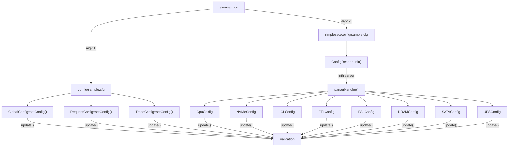
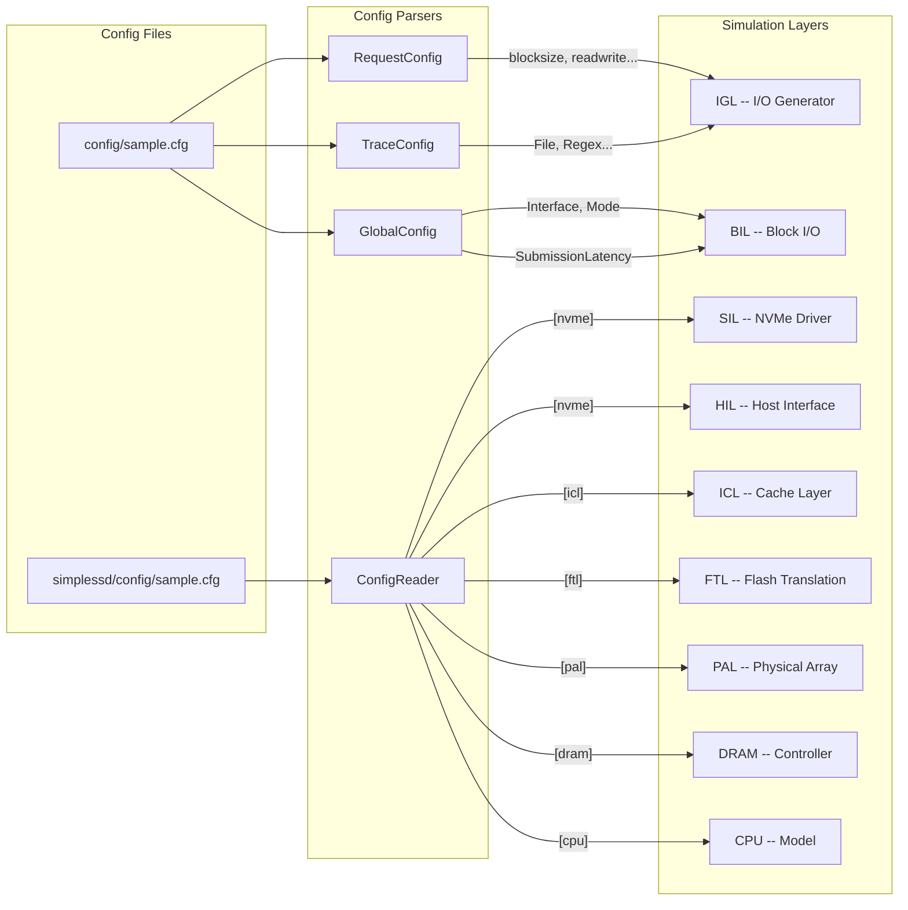

# SimpleSSD-Standalone — Complete Configuration Guide

This document explains **every single configuration parameter** in the SimpleSSD-Standalone project. For each parameter, you'll find:
- What it controls in the simulator
- Its data type, default value, and valid values
- Which C++ source file reads and uses it
- How it connects to the simulation layers

---

## Table of Contents

1. [How the Config System Works](#1-how-the-config-system-works)
2. [Standalone Config (`config/sample.cfg`)](#2-standalone-config)
   - 2.1 [`[global]` Section](#21-global-section)
   - 2.2 [`[generator]` Section](#22-generator-section)
   - 2.3 [`[trace]` Section](#23-trace-section)
3. [SimpleSSD Config (`simplessd/config/sample.cfg`)](#3-simplessd-config)
   - 3.1 [`[cpu]` Section](#31-cpu-section)
   - 3.2 [`[nvme]` Section](#32-nvme-section)
   - 3.3 [`[sata]` Section](#33-sata-section)
   - 3.4 [`[ufs]` Section](#34-ufs-section)
   - 3.5 [`[icl]` Section](#35-icl-section)
   - 3.6 [`[ftl]` Section](#36-ftl-section)
   - 3.7 [`[pal]` Section](#37-pal-section)
   - 3.8 [`[dram]` Section](#38-dram-section)
4. [Config Flow Diagram](#4-config-flow-diagram)
5. [Sample vs. Default Values](#5-sample-vs-default-values)

---

## 1. How the Config System Works

SimpleSSD uses **two separate INI config files** that are parsed at startup:

| Config File | Parsed By | Scope |
|---|---|---|
| `config/sample.cfg` | `global_config.cc`, `request_config.cc`, `trace_config.cc` | Simulation mode, I/O workload, logging |
| `simplessd/config/sample.cfg` | `config_reader.cc` | SSD hardware parameters (CPU, NVMe, ICL, FTL, PAL, DRAM) |

### Parsing Architecture



All config classes inherit from `BaseConfig` (`sim/base_config.hh`):
- `setConfig(name, value)` — called once per INI key-value pair
- `update()` — called after all parsing; validates constraints and computes derived values
- `readInt/readUint/readFloat/readString/readBoolean(idx)` — accessors used by simulator code

### Type Conventions

| Type | Format | Examples |
|------|--------|---------|
| `int` (SI integer) | Number with optional suffix: `k/m/g/t` (x10^3) or `K/M/G/T` (x2^10) | `256M` = 268,435,456; `4K` = 4,096 |
| `time` | Number in picoseconds with suffix: `s`, `ms`, `us`, `ns`, `ps` | `5us` = 5,000,000 ps |
| `bool` | `true`/`True`/`T`/`Yes`/`Y`/non-zero = true; else false | `1`, `True` |
| `float` | Standard floating point | `0.25` |
| `str` | Raw string | `STDOUT`, file paths |

---

## 2. Standalone Config

**File:** `config/sample.cfg`

This file has 3 INI sections: `[global]`, `[generator]`, and `[trace]`.

---

### 2.1 `[global]` Section

**Parsed by:** `sim/global_config.cc` (10 parameters)

These parameters control the overall simulation mode, logging, and which host interface to use.

| # | Config Key | Type | Default | Valid Values | What It Controls |
|---|-----------|------|---------|-------------|-----------------|
| 1 | `Mode` | uint | `0` | `0` = Request Generator, `1` = Trace Replayer | **Simulation mode.** Mode 0 generates synthetic I/O using `[generator]` settings. Mode 1 replays a recorded I/O trace using `[trace]` settings. |
| 2 | `LogPeriod` | uint | `0` | Any integer (ms) | **Statistics logging interval** in simulated milliseconds. `0` = no periodic stats printout. When set, the simulator dumps throughput/IOPS/latency stats at this interval. |
| 3 | `LogFile` | string | `""` | `STDOUT`, `STDERR`, file path, or empty | **Statistics output destination.** Where periodic stats and final summary are written. Empty = no output. |
| 4 | `DebugLogFile` | string | `""` | Same as LogFile | **Debug log output.** Verbose internal debug messages from all layers (tagged with `debugprint()`). Empty = disabled. |
| 5 | `LatencyLogFile` | string | `""` | File path or empty | **Per-I/O latency log.** Each completed I/O writes one line: `id, submit_tick, complete_tick, latency`. Empty = disabled. |
| 6 | `ProgressPeriod` | uint | `0` | Any integer (real seconds) | **Progress indicator interval** in wall-clock seconds. `0` = disabled. Useful for long runs to see "X% complete" messages. |
| 7 | `Interface` | uint | `1` (NVMe) | `0`=None, `1`=NVMe, `2`=SATA, `3`=UFS | **Host interface protocol.** Selects which SIL driver and HIL controller to instantiate. `0` = bypass SIL/HIL and go directly to ICL (no NVMe command overhead). |
| 8 | `Scheduler` | uint | `0` | `0`=Noop | **I/O scheduler algorithm.** Currently only Noop (pass-through, no reordering). Future: could add CFQ, deadline, etc. |
| 9 | `SubmissionLatency` | time | `0` | Time string (e.g. `5us`) | **Software stack submission overhead.** Simulates the time it takes the host OS to submit an I/O request (system call, driver overhead). Added as a flat delay before BIL processes the request. |
| 10 | `CompletionLatency` | time | `0` | Time string (e.g. `5us`) | **Software stack completion overhead.** Simulates the time for the host OS to process an I/O completion interrupt. Added as a flat delay after the SSD signals completion. |

**How `Interface` connects to the simulator:**

```
Interface=0 -> BIL -> (direct to HIL, no NVMe/SATA/UFS overhead)
Interface=1 -> BIL -> SIL::NVMe::Driver -> HIL::NVMe::Controller -> Subsystem -> HIL -> ICL -> FTL -> PAL
Interface=2 -> BIL -> SIL::SATA::Driver -> HIL::SATA::Controller -> HIL -> ICL -> FTL -> PAL
Interface=3 -> BIL -> SIL::UFS::Driver  -> HIL::UFS::Controller  -> HIL -> ICL -> FTL -> PAL
```

> [!TIP]
> Set `Interface=0` to benchmark the pure SSD internals (ICL+FTL+PAL) without any host protocol overhead.

---

### 2.2 `[generator]` Section

**Parsed by:** `igl/request/request_config.cc` (13 parameters)

These parameters control the **synthetic I/O workload generator** (used when `Mode=0`).

| # | Config Key | Type | Default | Valid Values | What It Controls |
|---|-----------|------|---------|-------------|-----------------|
| 1 | `io_size` | int | `0` | SI integer (bytes) | **Total I/O volume.** The generator stops after issuing this many bytes of I/O. Only used when `time_based=false`. Example: `256M` = generate 256 MiB of I/O. |
| 2 | `readwrite` | string | `read` | `read`, `write`, `randread`, `randwrite`, `readwrite`, `randrw` | **I/O pattern.** `read`/`write` = sequential; `randread`/`randwrite` = random; `readwrite` = mixed sequential; `randrw` = mixed random. |
| 3 | `rwmixread` | float | `0.0` | `0.0` - `1.0` | **Read ratio** for mixed I/O modes (`readwrite`/`randrw`). `0.5` = 50% reads, 50% writes. Ignored for pure read/write modes. |
| 4 | `blocksize` | int | `0` | SI integer (bytes) | **I/O request size.** Each generated I/O will be exactly this many bytes. Example: `4K` = 4 KiB requests. |
| 5 | `blockalign` | int | `0` | SI integer (bytes) | **Address alignment.** Generated offsets will be aligned to this boundary. Default = same as `blocksize`. |
| 6 | `iomode` | string | `sync` | `sync`, `async` | **I/O concurrency mode.** `sync` = one I/O at a time (iodepth forced to 1). `async` = multiple outstanding I/Os. |
| 7 | `iodepth` | int | `0` | SI integer | **Queue depth** for async mode. Maximum number of outstanding I/O requests. Forced to 1 in sync mode. Higher values stress the SSD's command queue and internal parallelism. |
| 8 | `offset` | int | `0` | SI integer (bytes) | **Starting byte offset.** The LBA range for I/O begins at this byte address. |
| 9 | `size` | int | `0` | SI integer (bytes) | **Address range size.** I/O addresses will be generated within `[offset, offset+size)`. Default (`0`) = entire SSD capacity minus offset. |
| 10 | `thinktime` | int | `0` | SI integer (ps) | **Inter-request delay.** Pause between consecutive I/O submissions. Simulates application processing time between I/Os. `0` = back-to-back requests. |
| 11 | `randseed` | int | `0` | SI integer | **Random seed** for the address/type generators. Same seed = reproducible results. |
| 12 | `time_based` | bool | `false` | Boolean | **Duration mode toggle.** If true, the test runs for `runtime` duration instead of `io_size` bytes. |
| 13 | `runtime` | time | `0` | Time string | **Test duration.** Only used when `time_based=true`. Example: `10s` = run for 10 seconds of simulated time. |

**How these connect to the simulator:**

The `RequestGenerator` class (`igl/request/request_generator.cc`) reads these at startup:
- `readwrite` -> decides `bio.type = BIO_READ` or `BIO_WRITE` in `nextIOIsRead()` using `rwmixread`
- `blocksize` -> sets `bio.length`
- `offset` + `size` -> bounds for `generateAddress()` which sets `bio.offset`
- `iomode` + `iodepth` -> controls how many BIOs can be outstanding simultaneously
- `thinktime` -> adds delay between `_submitIO()` calls via `rescheduleSubmit()`

> [!IMPORTANT]
> If `time_based=false` and `io_size=0`, the generator has nothing to do and exits immediately. Always set one of `io_size` or `time_based=true` + `runtime`.

---

### 2.3 `[trace]` Section

**Parsed by:** `igl/trace/trace_config.cc` (17 parameters)

These parameters control the **trace replayer** (used when `Mode=1`). The replayer reads an I/O trace file and replays each recorded operation.

| # | Config Key | Type | Default | Valid Values | What It Controls |
|---|-----------|------|---------|-------------|-----------------|
| 1 | `File` | string | `""` | File path | **Trace file path.** The I/O trace to replay (e.g., blktrace output). |
| 2 | `TimingMode` | uint | `0` | `0`=Sync, `1`=Async, `2`=Strict | **Replay timing mode.** `0` = sync (one I/O at a time, ignore timestamps). `1` = async (multiple outstanding, ignore timestamps). `2` = strict (replay with original timing from trace). |
| 3 | `QueueDepth` | uint | `1` | Any uint | **Async queue depth.** Used when `TimingMode=1`. Maximum outstanding I/Os. |
| 4 | `IOLimit` | uint | `0` | Any uint | **I/O count limit.** Stop after replaying this many I/Os. `0` = replay entire file. |
| 5 | `Regex` | string | `""` | ECMAScript regex | **Line parser regex.** Applied to each line of the trace file to extract fields. Must use capture groups. |
| 6 | `Operation` | uint | `0` | Regex group # | **Operation field group.** Which regex capture group contains the operation type (R=Read, W=Write, F=Flush, T=Trim, D=Discard). |
| 7 | `ByteOffset` | uint | `0` | Regex group # | **Byte offset group.** Capture group for the byte offset. Mutually exclusive with `LBAOffset`. |
| 8 | `ByteLength` | uint | `0` | Regex group # | **Byte length group.** Capture group for the byte length. |
| 9 | `LBAOffset` | uint | `0` | Regex group # | **LBA offset group.** Capture group for LBA address. Converted to bytes using `LBASize`. |
| 10 | `LBALength` | uint | `0` | Regex group # | **LBA length group.** Capture group for length in LBAs. |
| 11 | `Second` | uint | `0` | Regex group # | **Seconds group.** Capture group for timestamp seconds component. |
| 12 | `Millisecond` | uint | `0` | Regex group # | **Milliseconds group.** |
| 13 | `Microsecond` | uint | `0` | Regex group # | **Microseconds group.** |
| 14 | `Nanosecond` | uint | `0` | Regex group # | **Nanoseconds group.** |
| 15 | `Picosecond` | uint | `0` | Regex group # | **Picoseconds group.** |
| 16 | `LBASize` | uint | `512` | Any uint (bytes) | **LBA size for conversion.** When trace uses LBA addresses, multiply by this to get byte addresses. |
| 17 | `UseHexadecimal` | bool | `false` | Boolean | **Hex parsing.** If true, non-time numeric fields are parsed as hexadecimal. |

**Example trace line and regex:**
```
# blktrace format:  "8,0    1        1     0.000000001     0  D   W 12345 + 8"
Regex = "\\d+,\\d+ +\\d+ +\\d+ +(\\d+).(\\d+) +\\d+ +D +(\\w+) +(\\d+) \\+ (\\d+)"
#                                  ^(1)   ^(2)              ^(3)   ^(4)       ^(5)
Operation  = 3    # group 3 = "W"
LBAOffset  = 4    # group 4 = "12345"
LBALength  = 5    # group 5 = "8"
Second     = 1    # group 1 = "0"
Nanosecond = 2    # group 2 = "000000001"
```

---

## 3. SimpleSSD Config

**File:** `simplessd/config/sample.cfg`

**Parsed by:** `simplessd/sim/config_reader.cc`

This file configures the actual SSD hardware model. It has 8 INI sections: `[cpu]`, `[nvme]`, `[sata]`, `[ufs]`, `[icl]`, `[ftl]`, `[pal]`, `[dram]`.

---

### 3.1 `[cpu]` Section

**Parsed by:** `simplessd/cpu/config.cc` (4 parameters)

Models the **SSD controller's embedded CPU**. Every layer in the simulator calls `execute(CPU::LAYER, CPU::FUNCTION, callback, ctx)` which adds a CPU processing delay based on clock speed and core count.

| # | Config Key | Type | Default | Valid Values | What It Controls |
|---|-----------|------|---------|-------------|-----------------|
| 1 | `ClockSpeed` | uint64 | `400000000` (400 MHz) | > 0 (Hz) | **CPU clock frequency.** Higher clock -> lower per-operation latency. Each simulated CPU operation costs `cycles / ClockSpeed` seconds. |
| 2 | `HILCoreCount` | uint32 | `1` | Any uint | **HIL dedicated cores.** Number of CPU cores available for Host Interface Layer operations (NVMe command processing, DMA scheduling). More cores -> more parallelism for command handling. |
| 3 | `ICLCoreCount` | uint32 | `1` | Any uint | **ICL dedicated cores.** Cores for cache management operations (cache lookup, eviction, DRAM scheduling). |
| 4 | `FTLCoreCount` | uint32 | `1` | Any uint | **FTL dedicated cores.** Cores for flash translation (L2P mapping, GC victim selection, address translation). |

**How it connects:** When any layer calls `execute(CPU::HIL, CPU::READ, callback, ctx)`, the CPU model calculates `latency = cycles_for_READ / ClockSpeed` and schedules the callback after that delay. Multiple operations on the same core are serialized; operations on different cores run in parallel.

> [!NOTE]
> Validation: `ClockSpeed` must be > 0 or the simulator panics.

---

### 3.2 `[nvme]` Section

**Parsed by:** `simplessd/hil/nvme/config.cc` (17 parameters)

Configures the **NVMe controller hardware** — the PCIe interface, command queues, and namespace setup. Only used when `Interface=1`.

#### Host Bus Parameters

| # | Config Key | Type | Default | Valid Values | What It Controls |
|---|-----------|------|---------|-------------|-----------------|
| 1 | `PCIEGeneration` | enum | `2` (PCIe 3.x) | `0`=PCIe 1.x (2.5 GT/s), `1`=PCIe 2.x (5 GT/s), `2`=PCIe 3.x (8 GT/s) | **PCIe link speed.** Determines the per-lane bandwidth for DMA transfers between host and SSD. Used by `PCIExpress::calculateDelay()` in the SIL driver. |
| 2 | `PCIELane` | uint8 | `4` | Any uint | **Number of PCIe lanes.** Total bandwidth = generation speed x lane count. Typical: x4 for consumer SSDs, x8 for enterprise. |
| 3 | `AXIBusWidth` | enum | `2` (128-bit) | `0`=32, `1`=64, `2`=128, `3`=256, `4`=512, `5`=1024 bit | **AXI-Stream bus width.** Internal bus width between PCIe endpoint IP and NVMe controller logic. Wider = higher internal throughput. |
| 4 | `AXIClock` | uint64 | `250000000` (250 MHz) | Any uint (Hz) | **AXI bus clock.** Combined with bus width, determines internal transfer rate: `bandwidth = AXIBusWidth x AXIClock`. |

#### Controller Parameters

| # | Config Key | Type | Default | Valid Values | What It Controls |
|---|-----------|------|---------|-------------|-----------------|
| 5 | `FIFOTransferUnit` | uint64 | `4096` | <= 4096 (bytes) | **Hardware FIFO granularity.** Size of each DMA transfer chunk through the internal FIFO. Smaller values reduce latency for small I/Os but increase per-transfer overhead. |
| 6 | `WorkInterval` | uint64 | `50000` (50 ns) | Any uint (ps) | **Controller polling interval.** How often the NVMe controller checks for new commands in the submission queues. Shorter = lower command latency but higher CPU cost. |
| 7 | `MaxRequestCount` | uint64 | `4` | > 0 | **Requests per work cycle.** Maximum number of SQ entries the controller processes in one polling iteration. Higher = better throughput under heavy load. |
| 8 | `MaxIOCQueue` | uint16 | `16` | Any uint | **Max I/O completion queues.** Reported in Identify Controller; limits how many CQs the host driver can create. |
| 9 | `MaxIOSQueue` | uint16 | `16` | Any uint | **Max I/O submission queues.** Limits how many SQs the host driver can create. |
| 10 | `WRRHigh` | uint16 | `2` | Any uint | **Weighted Round Robin — high priority count.** Number of commands to process from high-priority SQs before moving to medium. |
| 11 | `WRRMedium` | uint16 | `2` | Any uint | **WRR — medium priority count.** Commands from medium-priority SQs before moving to low. |

#### Namespace & Disk Image Parameters

| # | Config Key | Type | Default | Valid Values | What It Controls |
|---|-----------|------|---------|-------------|-----------------|
| 12 | `DefaultNamespace` | uint16 | `1` | Any uint | **Number of default namespaces.** Created at init, each with equal share of total SSD capacity. |
| 13 | `LBASize` | uint64 | `512` | Power-of-2, >= 512 | **Logical block size** in bytes. Host-visible sector size. Common values: 512, 4096. Must match the LBA format used by the workload. |
| 14 | `EnableDiskImage` | bool | `false` | Boolean | **Enable disk image backing.** When true, reads/writes actually go to a file on disk (for data integrity testing). When false, data is discarded (performance-only simulation). |
| 15 | `StrictSizeCheck` | bool | `false` | Boolean | **Strict size matching.** If enabled, panics when disk image size doesn't match the simulated SSD size. |
| 16 | `DiskImageFile1` | string | `""` | File path | **Disk image path for namespace 1.** The suffix number matches the namespace ID (`DiskImageFile2` for NS 2, etc.). |
| 17 | `UseCopyOnWriteDisk` | bool | `false` | Boolean | **Copy-on-write mode.** Writes go to an in-memory overlay; the original disk image file is never modified. Useful for repeated runs with the same starting state. |

> [!WARNING]
> `LBASize` must be a power of 2 AND >= 512, or the simulator panics. `MaxRequestCount` must be > 0. `FIFOTransferUnit` must be <= 4096.

---

### 3.3 `[sata]` Section

**Parsed by:** `simplessd/hil/sata/config.cc` (12 parameters)

Configures the **SATA controller** (used when `Interface=2`). Shares many parameters with NVMe but uses SATA-specific transport.

| # | Config Key | Type | Default | Valid Values | What It Controls |
|---|-----------|------|---------|-------------|-----------------|
| 1 | `PCIEGeneration` | enum | `2` (PCIe 3.x) | `0`-`2` | PCIe link speed for the SATA HBA. |
| 2 | `PCIELane` | uint8 | `4` | Any uint | Number of PCIe lanes for the HBA. |
| 3 | `AXIBusWidth` | enum | `2` (128-bit) | `0`-`5` | Internal AXI bus width. |
| 4 | `AXIClock` | uint64 | `250000000` | Any uint (Hz) | AXI clock frequency. |
| 5 | `SATAMode` | enum | `2` (SATA 3.0) | `0`=SATA 1.0 (1.5 Gb/s), `1`=SATA 2.0 (3 Gb/s), `2`=SATA 3.0 (6 Gb/s) | **SATA link speed.** Determines the maximum throughput of the SATA interface. |
| 6 | `WorkInterval` | uint64 | `50000` | Any uint (ps) | Controller polling interval. |
| 7 | `MaxRequestCount` | uint64 | `4` | > 0 | Max requests per work cycle. |
| 8 | `LBASize` | uint64 | `512` | Power-of-2 | Logical block size. |
| 9 | `EnableDiskImage` | bool | `false` | Boolean | Enable disk image. |
| 10 | `StrictSizeCheck` | bool | `false` | Boolean | Strict size matching. |
| 11 | `DiskImageFile` | string | `""` | File path | Disk image path. |
| 12 | `UseCopyOnWriteDisk` | bool | `false` | Boolean | Copy-on-write mode. |

---

### 3.4 `[ufs]` Section

**Parsed by:** `simplessd/hil/ufs/config.cc` (11 parameters)

Configures the **UFS (Universal Flash Storage) controller** (used when `Interface=3`). UFS uses MIPI M-PHY instead of PCIe.

| # | Config Key | Type | Default | Valid Values | What It Controls |
|---|-----------|------|---------|-------------|-----------------|
| 1 | `AXIBusWidth` | enum | `1` (64-bit) | `0`-`5` | Host AXI bus width. |
| 2 | `AXIClock` | uint64 | `300000000` (300 MHz) | Any uint (Hz) | Host AXI clock. |
| 3 | `MPHYMode` | enum | `2` (HS-G3) | `0`=HS-G1, `1`=HS-G2, `2`=HS-G3, `3`=HS-G4 | **M-PHY high-speed gear.** Determines the physical layer link speed. HS-G3 = approx 5.8 Gb/s per lane. |
| 4 | `MPHYLane` | uint8 | `2` | Any uint | **Number of M-PHY lanes.** Total bandwidth = gear speed x lane count. |
| 5 | `WorkInterval` | uint64 | `50000` | Any uint (ps) | Controller polling interval. |
| 6 | `MaxRequestCount` | uint64 | `4` | > 0 | Max requests per work cycle. |
| 7 | `LBASize` | uint64 | `512` | Power-of-2, >= 512 | Logical block size (stricter validation than SATA). |
| 8 | `EnableDiskImage` | bool | `false` | Boolean | Enable disk image. |
| 9 | `StrictSizeCheck` | bool | `false` | Boolean | Strict size matching. |
| 10 | `DiskImageFile` | string | `""` | File path | Disk image path. |
| 11 | `UseCopyOnWriteDisk` | bool | `false` | Boolean | Copy-on-write mode. |

---

### 3.5 `[icl]` Section

**Parsed by:** `simplessd/icl/config.cc` (11 parameters)

Configures the **Internal Cache Layer** — the DRAM-based read/write cache inside the SSD. This is the cache that sits between the host interface and the FTL.

| # | Config Key | Type | Default | Sample | Valid Values | What It Controls |
|---|-----------|------|---------|--------|-------------|-----------------|
| 1 | `EnableReadCache` | bool | `false` | `1` | Boolean | **Read caching.** When enabled, data read from NAND is cached in DRAM. Subsequent reads to the same LPN hit the cache instead of going to NAND again. |
| 2 | `EnableWriteCache` | bool | `true` | `1` | Boolean | **Write caching.** When enabled, writes are absorbed by the DRAM cache (write-back). When disabled, every write goes directly to NAND (write-through). |
| 3 | `EnableReadPrefetch` | bool | `false` | `1` | Boolean | **Read prefetching.** When enabled, the cache detects sequential read patterns and prefetches upcoming pages into the cache before they're requested. |
| 4 | `ReadPrefetchCount` | uint64 | `1` | `3` | > 0 | **Prefetch trigger threshold.** Number of consecutive sequential I/Os that must be observed before prefetching activates. Higher = less aggressive prefetch. |
| 5 | `ReadPrefetchRatio` | float | `0.5` | `0.25` | > 0.0 | **Sequential detection ratio.** Fraction of a superpage that must be accessed sequentially to qualify as "sequential" for prefetch purposes. |
| 6 | `ReadPrefetchMode` | enum | `1` (ALL) | `1` | `0`=SUPERPAGE, `1`=ALL | **Prefetch granularity.** `SUPERPAGE` = prefetch within the same superpage only. `ALL` = prefetch across superpage boundaries. |
| 7 | `EvictPolicy` | enum | `2` (LRU) | `2` | `0`=Random, `1`=FIFO, `2`=LRU | **Cache eviction policy.** When the cache is full and a new line must be brought in, this policy selects the victim. LRU = evict the least recently accessed line. |
| 8 | `EvictMode` | enum | `1` (ALL) | `1` | `0`=SUPERPAGE, `1`=ALL | **Eviction granularity.** `SUPERPAGE` = evict within one superpage. `ALL` = consider all cache lines globally. |
| 9 | `CacheSize` | uint64 | `33554432` (32 MiB) | `536870912` (512 MiB) | Any uint (bytes) | **Total cache capacity.** The total DRAM allocated for the read/write cache. Larger cache -> more data can be kept in fast DRAM, reducing NAND accesses. |
| 10 | `CacheWaySize` | uint64 | `1` (direct-mapped) | `8` | `0`=fully-associative, `1`=direct-mapped, N=N-way | **Cache associativity.** `0` = fully associative (any line can go anywhere, expensive lookup). `1` = direct-mapped (one possible slot per line, cheap but high conflict rate). `8` = 8-way set-associative (good balance). |
| 11 | `CacheLatency` | uint64 | `10` | `10` | Any uint (Bytes/ps) | **Cache metadata lookup speed.** Models the DRAM bandwidth for tag lookups. Lower values = slower tag checking. |

**How the cache interacts with the simulator:**

```
GenericCache::read(req, tick):
  1. calcSetIndex(req.slpn)          -> which cache set
  2. getValidWay(req.slpn, tick)     -> which way (HIT or MISS)

  [HIT]  -> pDRAM->read()            -> add DRAM read latency -> done
  [MISS] -> getEmptyWay() or evict victim
           -> pFTL->read()           -> fetch from NAND
           -> pDRAM->write()         -> store in cache
```

> [!TIP]
> The sample config uses a much larger cache (512 MiB) and 8-way associativity compared to the code defaults (32 MiB, direct-mapped). The sample config is tuned for a realistic enterprise SSD.

---

### 3.6 `[ftl]` Section

**Parsed by:** `simplessd/ftl/config.cc` (13 active parameters)

Configures the **Flash Translation Layer** — address mapping, garbage collection, and pre-simulation state.

#### Address Mapping

| # | Config Key | Type | Default | Valid Values | What It Controls |
|---|-----------|------|---------|-------------|-----------------|
| 1 | `MappingMode` | enum | `0` (Page) | `0`=PAGE_MAPPING | **Address mapping granularity.** Page-level mapping: each 4KB logical page maps independently to any physical page. Finest granularity, best performance, highest RAM usage for the L2P table. |
| 2 | `OverProvisioningRatio` | float | `0.25` (25%) | Any float | **Over-provisioning ratio.** Fraction of total NAND capacity reserved for GC operations. 25% means only 75% is user-visible. Higher OP -> more free blocks for GC -> better sustained write performance, but less user capacity. |
| 3 | `EnableRandomIOTweak` | bool | `true` | Boolean | **Random I/O superpage tweak.** When enabled, random I/Os bypass the superpage grouping optimization, allowing individual page-level mapping. This reduces write amplification for random workloads. |

#### Garbage Collection

| # | Config Key | Type | Default | Valid Values | What It Controls |
|---|-----------|------|---------|-------------|-----------------|
| 4 | `GCThreshold` | float | `0.05` (5%) | Any float | **GC trigger threshold.** GC starts when the ratio of free blocks drops below this value. Lower = GC triggers later (more user writes before GC), but risks running out of free blocks. |
| 5 | `GCMode` | enum | `0` | `0`=Fixed blocks, `1`=Until threshold | **GC reclamation strategy.** Mode 0: reclaim a fixed number of blocks per GC invocation. Mode 1: keep reclaiming until free blocks reach `GCReclaimThreshold`. |
| 6 | `GCReclaimBlocks` | uint64 | `1` | > 0 (when GCMode=0) | **Blocks per GC cycle** (Mode 0 only). Number of victim blocks to erase in each GC run. |
| 7 | `GCReclaimThreshold` | float | `0.1` (10%) | > GCThreshold (when GCMode=1) | **GC stop threshold** (Mode 1 only). GC continues until free block ratio reaches this target. Must be higher than `GCThreshold`. |
| 8 | `EvictPolicy` | enum | `0` (Greedy) | `0`=Greedy, `1`=CostBenefit, `2`=Random, `3`=D-Choice | **GC victim selection algorithm.** Greedy = pick the block with the most invalid pages. CostBenefit = balance invalid count against block age (wear leveling). Random = random selection. D-Choice = sample D random blocks, pick the best. |
| 9 | `DChoiceParam` | uint64 | `3` | Any uint | **D-Choice sample size.** Only used when EvictPolicy=3. Number of random blocks to sample during D-Choice selection. Higher = closer to Greedy, but more CPU cost. |

#### Pre-Simulation Filling

| # | Config Key | Type | Default | Valid Values | What It Controls |
|---|-----------|------|---------|-------------|-----------------|
| 10 | `FillingMode` | enum | `0` | `0`, `1`, `2` | **Pre-fill pattern.** `0` = sequential fill + sequential invalidate. `1` = sequential fill + random invalidate. `2` = random fill + random invalidate. Controls how the SSD is "aged" before the actual workload begins. |
| 11 | `FillRatio` | float | `0.0` | `0.0` - `1.0` | **Fill ratio.** Fraction of total logical pages to pre-fill before the workload starts. `0.5` = fill 50% of SSD capacity. Simulates a used SSD. |
| 12 | `InvalidPageRatio` | float | `0.0` | `0.0` - `1.0` | **Invalid page ratio.** After filling, this fraction of filled pages are overwritten (creating invalid pages that GC must reclaim). `0.3` = 30% of filled pages become invalid. Simulates fragmentation. |
| 13 | `EraseThreshold` | uint64 | `100000` | Any uint | **Bad block threshold.** Number of erase cycles before a block is marked as bad. Models NAND endurance (SLC ~100K, MLC ~10K, TLC ~3K). |

**GC Flow in the Simulator:**

```
PageMapping::writeInternal():
  if (freeBlockRatio() < GCThreshold):
      victims = selectVictimBlock(EvictPolicy)  // Greedy, CostBenefit, etc.
      doGarbageCollection(victims):
          for each victim block:
              1. PAL::read()  -- read valid pages out
              2. PAL::write() -- write them to a free block
              3. PAL::erase() -- erase the victim block
          repeat until GCMode satisfied
```

> [!IMPORTANT]
> When `GCMode=1`, `GCReclaimThreshold` MUST be > `GCThreshold`, otherwise the simulator panics (GC would never stop).

---

### 3.7 `[pal]` Section

**Parsed by:** `simplessd/pal/config.cc` (28 parameters)

Configures the **Physical Array Layer** — the NAND flash geometry, timing, power, and data layout.

#### Flash Geometry

| # | Config Key | Type | Default | Sample | What It Controls |
|---|-----------|------|---------|--------|-----------------|
| 1 | `Channel` | uint32 | `8` | `8` | **Number of channels.** Independent data paths to NAND packages. More channels -> more parallelism. |
| 2 | `Package` | uint32 | `4` | `4` | **Packages per channel.** Each package is a physical chip. Also called "ways". |
| 3 | `Die` | uint32 | `2` | `2` | **Dies per package.** Each die can operate independently (die-level interleaving). |
| 4 | `Plane` | uint32 | `1` | `2` | **Planes per die.** Multi-plane operations can access all planes in a die simultaneously. |
| 5 | `Block` | uint32 | `512` | `512` | **Blocks per plane.** The unit of erase. |
| 6 | `Page` | uint32 | `512` | `512` | **Pages per block.** The unit of read/write. |
| 7 | `PageSize` | uint32 | `16384` (16 KB) | `16384` | **Page size in bytes.** Size of one NAND page. Determines the minimum read/write granularity at the flash level. |

**Total SSD Capacity** = Channel x Package x Die x Plane x Block x Page x PageSize

With defaults: 8 x 4 x 2 x 1 x 512 x 512 x 16384 = **256 GiB raw capacity**

#### Flash Type & DMA

| # | Config Key | Type | Default | Valid Values | What It Controls |
|---|-----------|------|---------|-------------|-----------------|
| 8 | `NANDType` | enum | `1` (MLC) | `0`=SLC, `1`=MLC, `2`=TLC | **NAND cell type.** SLC = 1 bit/cell (fastest, most durable). MLC = 2 bits/cell. TLC = 3 bits/cell (densest, slowest). Affects which page timings (LSB/CSB/MSB) are used. |
| 9 | `EnableMultiPlaneOperation` | bool | `true` | Boolean | **Multi-plane operations.** When enabled, read/write/erase can operate on all planes of a die simultaneously, multiplying throughput. |
| 10 | `DMASpeed` | uint32 | `400` (MT/s) | Any uint | **NAND DMA transfer rate** in megatransfers per second (ONFi bus speed). Higher = faster data transfer between controller and NAND die. |
| 11 | `DMAWidth` | uint32 | `8` (bits) | Multiple of 8 | **DMA bus width** in bits. Typically 8 (standard) or 16 (wide). Combined with DMASpeed: `bandwidth = DMASpeed x DMAWidth / 8` bytes/second. |

#### Data Layout

| # | Config Key | Type | Default | What It Controls |
|---|-----------|------|---------|-----------------|
| 12 | `SuperblockSize` | string | `""` | **Superblock composition.** A string of characters defining which dimensions are grouped into a superblock: `C`=Channel, `W`=Package (Way), `D`=Die, `P`=Plane. Example: `"CWDP"` means a superblock spans all channels, packages, dies, and planes. If multi-plane is enabled, `P` is always included. |
| 13 | `PageAllocation` | string | `""` | **Page allocation order.** A 4-character permutation of `C`, `W`, `D`, `P` defining the priority order for distributing pages across the flash array. First character = highest priority (varied first). Example: `"CWDP"` = fill across channels first, then packages, then dies, then planes. This directly controls parallelism. |

**Example with `PageAllocation = CWDP`:**
```
Page 0 -> Channel 0, Package 0, Die 0, Plane 0
Page 1 -> Channel 1, Package 0, Die 0, Plane 0   <- vary channel first
Page 2 -> Channel 2, Package 0, Die 0, Plane 0
...
Page 7 -> Channel 7, Package 0, Die 0, Plane 0
Page 8 -> Channel 0, Package 1, Die 0, Plane 0   <- then vary package
...
```

> [!TIP]
> For maximum throughput, put `C` (Channel) first in `PageAllocation` since channels are fully independent. `CWDP` is the recommended order.

#### NAND Timing

All timing values are in **picoseconds**.

| # | Config Key | Default | What It Controls |
|---|-----------|---------|-----------------|
| 14 | `LSBRead` | `40000000` (40 us) | **LSB page read latency.** Time to read the LSB (Least Significant Bit) page. Used by SLC and as the fast page in MLC/TLC. |
| 15 | `LSBWrite` | `500000000` (500 us) | **LSB page write (program) latency.** |
| 16 | `CSBRead` | `0` | **CSB page read latency.** Center Significant Bit — only used by TLC. `0` = not applicable. |
| 17 | `CSBWrite` | `0` | **CSB page write latency.** |
| 18 | `MSBRead` | `65000000` (65 us) | **MSB page read latency.** Most Significant Bit — used by MLC and TLC. Slower than LSB due to more precise voltage sensing. |
| 19 | `MSBWrite` | `1300000000` (1.3 ms) | **MSB page write latency.** Much slower than LSB due to tighter voltage margins. |
| 20 | `Erase` | `3500000000` (3.5 ms) | **Block erase latency.** Time to erase an entire block. This is the slowest NAND operation. |

**DMA Timing** is computed automatically from `DMASpeed` and `DMAWidth`:
- `tCK = 1 / (DMASpeed x 1048576) x 10^12` picoseconds per transfer
- Read DMA = `(7 cycles + PageSize) x tCK / (DMAWidth/8)`
- Write DMA = `(7 cycles + PageSize) x tCK / (DMAWidth/8)`

#### NAND Power

| # | Config Key | Default | Unit | What It Controls |
|---|-----------|---------|------|-----------------|
| 21 | `Voltage` | `3300` | mV | **NAND supply voltage.** |
| 22 | `ReadCurrent` | `25000` | uA | **Current draw during read operations.** |
| 23 | `ProgramCurrent` | `25000` | uA | **Current draw during program (write) operations.** |
| 24 | `EraseCurrent` | `25000` | uA | **Current draw during erase operations.** |
| 25 | `IdleCurrent` | `5000` | uA | **Current draw when bus is idle.** |
| 26 | `StandbyCurrent` | `10` | uA | **Current draw in standby/sleep.** |

Power is calculated as: `Energy = Voltage x Current x Time` for each operation.

---

### 3.8 `[dram]` Section

**Parsed by:** `simplessd/dram/config.cc` (34 parameters)

Configures the **SSD's internal DRAM** (used for the FTL mapping table, write cache, and read buffer). Default profile models **LPDDR3-1600 4Gbit 1x32**.

#### DRAM Model Selection

| # | Config Key | Type | Default | Valid Values | What It Controls |
|---|-----------|------|---------|-------------|-----------------|
| 1 | `Model` | enum | `0` (Simple) | `0`=SIMPLE_MODEL | **DRAM controller model.** Currently only the simple model is implemented. |

#### DRAM Structure

| # | Config Key | Type | Default | What It Controls |
|---|-----------|------|---------|-----------------|
| 2 | `Channel` | uint32 | `1` | Number of DRAM channels. |
| 3 | `Rank` | uint32 | `1` | Ranks per channel. |
| 4 | `Bank` | uint32 | `8` | Banks per rank. |
| 5 | `Chip` | uint32 | `1` | Chips per rank. |
| 6 | `BusWidth` | uint32 | `32` | Bus width per chip (bits). |
| 7 | `BurstLength` | uint32 | `8` | Burst transfer length. |
| 8 | `ChipSize` | uint64 | `536870912` (512 MB) | Size of each DRAM chip (bytes). |
| 9 | `PageSize` | uint64 | `4096` | DRAM row buffer (page) size (bytes). |

**Total DRAM Capacity** = Channel x Rank x Chip x ChipSize

#### DRAM Timing (all values in picoseconds)

| # | Config Key | Default | What It Controls |
|---|-----------|---------|-----------------|
| 10 | `tCK` | `1250` (800 MHz) | **Clock period.** DRAM clock cycle time. `1250 ps` = 800 MHz. |
| 11 | `tRCD` | `18000` (18 ns) | **RAS-to-CAS delay.** Time from row activation to column access. |
| 12 | `tCL` | `15000` (15 ns) | **CAS latency.** Time from column command to data available. |
| 13 | `tRP` | `18000` (18 ns) | **Row precharge time.** Time to close (precharge) a row. |
| 14 | `tRAS` | `42000` (42 ns) | **Row active time.** Minimum time a row must remain active. |
| 15 | `tWR` | `15000` (15 ns) | **Write recovery time.** Time after last write before precharge. |
| 16 | `tRTP` | `7500` (7.5 ns) | **Read-to-precharge delay.** |
| 17 | `tBURST` | `5000` (5 ns) | **Burst duration.** Time for one burst transfer. |
| 18 | `tCCD_L` | `0` | **CAS-to-CAS delay** (same bank group). `0` = not applicable. |
| 19 | `tRFC` | `130000` (130 ns) | **Refresh cycle time.** |
| 20 | `tREFI` | `3900` (3.9 ns) | **Refresh interval.** Time between refresh commands. |
| 21 | `tWTR` | `7500` (7.5 ns) | **Write-to-read turnaround.** |
| 22 | `tRTW` | `2500` (2.5 ns) | **Read-to-write turnaround.** |
| 23 | `tCS` | `2500` (2.5 ns) | **Rank-to-rank switching.** |
| 24 | `tRRD` | `10000` (10 ns) | **ACT-to-ACT delay** (different banks). |
| 25 | `tRRD_L` | `0` | **ACT-to-ACT delay** (same bank group). |
| 26 | `tXAW` | `50000` (50 ns) | **Activation window.** Max activations within this window. |
| 27 | `tXP` | `0` | **Power-up delay.** |
| 28 | `tXPDLL` | `0` | **Power-up delay** (DLL locked). |
| 29 | `tXS` | `0` | **Self-refresh exit latency.** |
| 30 | `tXSDLL` | `0` | **Self-refresh exit** (DLL locked). |

#### DRAM Power (current in mA, voltage in V — two values per parameter: `[0]` and `[1]`)

| # | Config Key | Default [0], [1] | What It Controls |
|---|-----------|-----------------|-----------------|
| 31 | `IDD0_0/1` | `8.0, 60.0` | Active precharge current. |
| 32 | `IDD2P0_0/1` | `0.0, 0.0` | Precharge power-down (slow). |
| 33 | `IDD2P1_0/1` | `0.8, 1.8` | Precharge power-down (fast). |
| 34 | `IDD2N_0/1` | `0.8, 26.0` | Precharge standby current. |
| 35 | `IDD3P0_0/1` | `0.0, 0.0` | Active power-down (slow). |
| 36 | `IDD3P1_0/1` | `1.4, 11.0` | Active power-down (fast). |
| 37 | `IDD3N_0/1` | `2.0, 34.0` | Active standby current. |
| 38 | `IDD4R_0/1` | `2.0, 230.0` | Read burst current. |
| 39 | `IDD4W_0/1` | `2.0, 190.0` | Write burst current. |
| 40 | `IDD5_0/1` | `28.0, 150.0` | Refresh current. |
| 41 | `IDD6_0/1` | `0.5, 1.8` | Self-refresh current. |
| 42 | `VDD_0/1` | `1.8, 1.2` | Supply voltage (V). |

> [!NOTE]
> The two values `[0]` and `[1]` correspond to two voltage domains (e.g., VDD1 and VDD2 in LPDDR3). The DRAMPower library uses these for accurate power estimation.

---

## 4. Config Flow Diagram

This shows how configuration flows from the config files through to the simulation layers:



---

## 5. Sample vs. Default Values

The sample config file ships with values that differ from the code defaults. These represent a **realistic enterprise SSD** configuration:

| Section | Parameter | Code Default | Sample Value | Why Different |
|---------|-----------|-------------|-------------|--------------|
| `[pal]` | `Plane` | `1` | `2` | Multi-plane for higher throughput |
| `[nvme]` | `FIFOTransferUnit` | `4096` | `2048` | Lower latency for small I/Os |
| `[nvme]` | `WorkInterval` | `50000` (50 ns) | `1000000` (1 us) | More realistic controller polling |
| `[nvme]` | `MaxRequestCount` | `4` | `8` | Higher throughput per cycle |
| `[icl]` | `CacheSize` | `33554432` (32 MiB) | `536870912` (512 MiB) | Enterprise-grade DRAM cache |
| `[icl]` | `CacheWaySize` | `1` (direct-mapped) | `8` (8-way) | Reduced conflict misses |
| `[icl]` | `EnableReadCache` | `false` | `true` | Read caching enabled for performance |
| `[icl]` | `EnableReadPrefetch` | `false` | `true` | Sequential read optimization |
| `[icl]` | `ReadPrefetchCount` | `1` | `3` | Less aggressive prefetch trigger |
| `[icl]` | `ReadPrefetchRatio` | `0.5` | `0.25` | More sensitive sequential detection |
| `[dram]` | `ChipSize` | `536870912` (512 MB) | `1073741824` (1 GB) | More DRAM for larger L2P table |

> [!CAUTION]
> Always use the **sample config** as your starting point, not the code defaults. The code defaults are minimal fallbacks; the sample config represents a properly tuned SSD.

---

## Quick Reference: Complete Parameter Count

| Config File | Section | Parameters |
|---|---|---|
| `config/sample.cfg` | `[global]` | 10 |
| | `[generator]` | 13 |
| | `[trace]` | 17 |
| `simplessd/config/sample.cfg` | `[cpu]` | 4 |
| | `[nvme]` | 17 |
| | `[sata]` | 12 |
| | `[ufs]` | 11 |
| | `[icl]` | 11 |
| | `[ftl]` | 13 |
| | `[pal]` | 28 |
| | `[dram]` | 34 |
| **Total** | | **170** |
